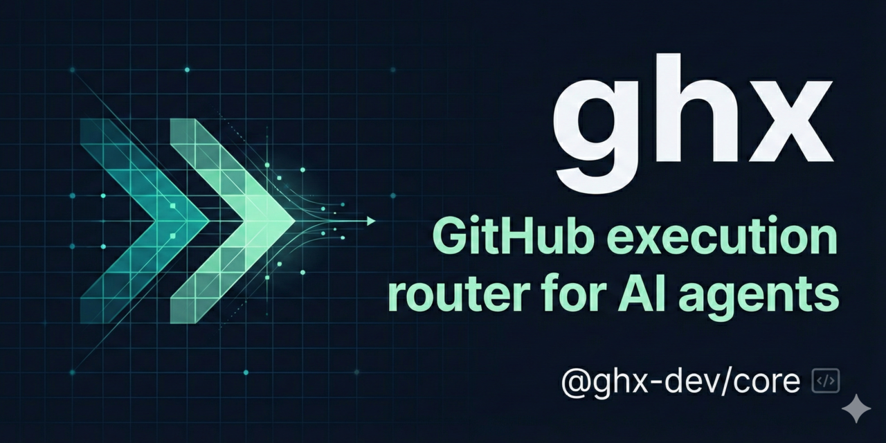

# ghx

<p align="center">
  
</p>

> GitHub execution router for AI agents.
> One typed capability interface over `gh` CLI + GraphQL.

[](https://github.com/aryeko/ghx/actions/workflows/ci-main.yml)
[](https://codecov.io/gh/aryeko/ghx)
[](https://www.npmjs.com/package/@ghx-dev/core)
[](https://opensource.org/licenses/MIT)

`ghx` helps agents execute GitHub tasks without re-discovering API surfaces on every run. Agents call stable capabilities like `repo.view` or `pr.merge.execute`; ghx handles route choice, retries, fallbacks, and normalized output.

## Why ghx

- Stable result envelope for every capability: `{ ok, data, error, meta }`
- Deterministic route plan per capability (`preferred` then ordered `fallbacks`)
- Runtime input/output validation from operation-card schemas
- Structured, normalized error taxonomy for predictable automation behavior
- Built-in capability discovery (`ghx capabilities list`, `ghx capabilities explain`)

## Why Not Direct `gh` + GraphQL Calls?

| Concern | Direct Calls | `ghx` |
| --- | --- | --- |
| Route selection | Manual per operation | Deterministic policy per capability |
| Output shape | Varies by endpoint/tool | Stable `{ ok, data, error, meta }` envelope |
| Validation | Caller-owned | Runtime schema validation from operation cards |
| Retries/fallbacks | Caller-owned | Built-in orchestration |
| Capability discovery | Ad-hoc docs lookup | `capabilities list` and `capabilities explain` |

## Who This Is For

- Agent builders who want predictable GitHub automation behavior
- Teams running repeated GitHub workflows (PRs, issues, releases, CI checks)
- Tooling maintainers who need a stable abstraction over GitHub interfaces

## 60-Second Quick Start

Requirements:

- Node.js `22+`
- `gh` CLI authenticated (`gh auth status`)
- `GITHUB_TOKEN` or `GH_TOKEN` in env

Run instantly with `npx`:

```bash
npx @ghx-dev/core capabilities list
npx @ghx-dev/core capabilities explain repo.view
npx @ghx-dev/core run repo.view --input '{"owner":"aryeko","name":"ghx"}'
```

Or install the CLI globally:

```bash
npm i -g @ghx-dev/core
ghx capabilities list
ghx run repo.view --input '{"owner":"aryeko","name":"ghx"}'
```

Agent onboarding (Claude Code skill):

```bash
npx @ghx-dev/core setup --scope project --yes
npx @ghx-dev/core setup --scope project --verify
```

## Example Output

```json
{
  "ok": true,
  "data": {
    "id": "...",
    "name": "ghx",
    "nameWithOwner": "aryeko/ghx"
  },
  "error": null,
  "meta": {
    "capability_id": "repo.view",
    "route_used": "cli",
    "reason": "CARD_PREFERRED"
  }
}
```

## Golden Workflow Example

Diagnose a PR before merging:

```bash
ghx run pr.status.checks --input '{"owner":"aryeko","name":"ghx","number":14}'
ghx run pr.checks.get_failed --input '{"owner":"aryeko","name":"ghx","number":14}'
ghx run workflow_job.logs.analyze --input '{"owner":"aryeko","name":"ghx","job_id":123456789}'
ghx run pr.merge.execute --input '{"owner":"aryeko","name":"ghx","number":14,"method":"squash"}'
```

The same flow can be run by agents through the public library API.

## Capabilities at a Glance

- Repository and issues: `repo.view`, `issue.view`, `issue.list`, `issue.comments.list`
- PR review and merge workflows: reads, checks, review submission, merge, reruns, reviewer/assignee updates
- CI diagnostics: workflow runs/jobs, check annotations, job logs and log analysis
- Issue lifecycle and dependencies: create/update/close/reopen/delete, labels/assignees/milestones, issue graph relations
- Release and workflow control: draft/publish releases, workflow dispatch/reruns/cancel/artifacts
- Projects v2 and repository metadata: project items/fields plus labels and issue types

For the full capability inventory, see https://github.com/aryeko/ghx/blob/main/packages/core/README.md and https://github.com/aryeko/ghx/tree/main/packages/core/src/core/registry/cards.

## Security and Permissions

- Use least-privilege tokens and only grant scopes needed for the capabilities you execute.
- For fast local evaluation, a classic PAT with `repo` scope is the simplest path.
- For production agents, prefer fine-grained tokens with read permissions first (`Metadata`, `Contents`, `Pull requests`, `Issues`, `Actions`, `Projects`) and add write permissions only where required.
- `ghx` reads `GITHUB_TOKEN` or `GH_TOKEN` from environment.

## Packages

- `@ghx-dev/core` (`packages/core`) - public npm package, CLI + execution engine
- `@ghx-dev/benchmark` (`packages/benchmark`) - private/internal benchmark harness for maintainers

## Documentation

Full documentation lives in [`docs/`](docs/README.md):

- **[Getting Started](docs/getting-started/README.md)** — Installation, first task, agent setup
- **[Capabilities Reference](docs/capabilities/README.md)** — All 66 capabilities by domain
- **[Guides](docs/guides/README.md)** — CLI usage, library API, agent integration, error handling
- **[Architecture](docs/architecture/README.md)** — System design, routing engine, adapters
- **[Benchmark](docs/benchmark/README.md)** — Methodology, running benchmarks, scenario authoring
- **[Contributing](docs/contributing/README.md)** — Development setup, testing, CI, publishing
- Branding assets: `assets/branding/README.md`

## Roadmap

Current roadmap priorities and capability batches are tracked in `ROADMAP.md`.

## Contributing

See `CONTRIBUTING.md` for local setup, test commands, and PR expectations.

Development from source:

Tooling notes for local development:

- `gh` CLI is required for CLI-backed execution paths (`gh auth status`).
- `opencode` CLI is only required if you run E2E suites locally (`pnpm run test:e2e`); CI installs it via `curl -fsSL https://opencode.ai/install | bash`.

```bash
git clone https://github.com/aryeko/ghx.git && cd ghx
./scripts/setup-dev-env.sh
pnpm install
pnpm run build
pnpm run ci
```

## License

MIT © Arye Kogan
