# ghx Documentation

Welcome to the ghx documentation hub. ghx is a **typed GitHub execution router for AI agents** —
deterministic routing across CLI and GraphQL, runtime schema validation, and a stable result
envelope so agents stop wasting tokens re-discovering GitHub API surfaces.

## Quick Navigation

```mermaid
%%{init: {'theme': 'base', 'themeVariables': {'primaryColor': '#4A90D9', 'primaryTextColor': '#fff', 'primaryBorderColor': '#2E6BA4', 'lineColor': '#666', 'fontSize': '13px'}}}%%
graph TD
  A["📚 Documentation Hub<br/>START HERE"]

  A --> B["🚀 Getting Started"]
  A --> C["🔧 Architecture & Design"]
  A --> D["📊 Benchmarks"]
  A --> E["🤝 Contributing"]

  B --> B1["Installation"]
  B --> B2["First Task Tutorial"]
  B --> B3["Agent Setup Guide"]
  B --> B4["How ghx Works"]

  C --> C1["System Design"]
  C --> C2["Operation Cards"]
  C --> C3["Routing Engine"]
  C --> C4["Adapters"]
  C --> C5["Agent Interface"]

  D --> D1["Benchmarking Methodology"]
  D --> D2["Running Benchmarks"]
  D --> D3["Scenario Authoring"]

  E --> E1["Code Style & Patterns"]
  E --> E2["Repository Structure"]
  E --> E3["Testing Guide"]

  style A fill:#4A90D9,color:#fff
  style B fill:#4A90D9,color:#fff
  style C fill:#9C27B0,color:#fff
  style D fill:#F5A623,color:#fff
  style E fill:#7ED321,color:#000
```



## By Use Case

### I want to use ghx in my project

Start here: **[Getting Started](getting-started/README.md)**

- [Installation guide](getting-started/installation.md) — Prerequisites and package installation
- [First task tutorial](getting-started/first-task.md) — Run your first capability
- [Agent setup guide](getting-started/setup-for-agents.md) — Configure ghx for coding agents

### I want to understand how ghx works

Read: **[Architecture Documentation](architecture/README.md)**

- [System Design](architecture/system-design.md) — Core concepts and execution flow
- [Operation Cards](architecture/operation-cards.md) — Capability definitions and schemas
- [Routing Engine](architecture/routing-engine.md) — How ghx routes requests
- [Adapters](architecture/adapters.md) — Execution adapters (CLI, GraphQL, REST)

### I want to contribute or customize ghx

See: **[Contributing Guide](contributing/README.md)**

- [Code repository structure](architecture/repository-structure.md)
- [Adding a capability](contributing/adding-a-capability.md) — Step-by-step guide

### I want to understand performance improvements

Check: **[Benchmark Documentation](benchmark/README.md)**

- [Benchmarking methodology](benchmark/methodology.md)
- [How to run benchmarks](benchmark/running-benchmarks.md)
- [Scenario authoring guide](benchmark/scenario-authoring.md)

## Key Facts

**66 Capabilities** organized by domain:

| Domain | Count | Examples |
|--------|-------|----------|
| Issues | 18 | Create, update, close, assign labels, manage relations |
| Pull Requests | 21 | View, comment, approve, merge, rerun checks |
| Workflows | 12 | List, dispatch, rerun, cancel, retrieve logs |
| Releases | 5 | List, create, publish, update drafts |
| Projects v2 | 6 | View, list items, update fields |
| Check Runs | 1 | List annotations |
| Repositories | 3 | View, list labels, list issue types |

**Three Execution Routes:**

- **CLI** (`gh` + `gh api`) — Fast, lightweight, excellent for simple operations
- **GraphQL** — Typed, powerful for complex queries and batch operations
- **REST** — Planned; stub implementation ready

**Stable Result Envelope:**

Every capability returns:

```json
{
  "ok": true,
  "data": { /* capability-specific output */ },
  "error": null,
  "meta": {
    "capability_id": "repo.view",
    "route_used": "cli",
    "reason": "CARD_PREFERRED"
  }
}
```

**Prerequisites:**

- Node.js `22+`
- `gh` CLI installed and authenticated (`gh auth status`)
- `GITHUB_TOKEN` or `GH_TOKEN` environment variable (optional for `gh` auth)

## Commands at a Glance

```bash
# List all capabilities
npx ghx capabilities list

# Explain a capability's input/output contract
npx ghx capabilities explain repo.view

# Run a capability from the CLI
npx ghx run repo.view --input '{"owner":"aryeko","name":"ghx"}'

# Install ghx skill for coding agents
npx ghx setup --scope project --yes

# Use in your Node.js code
import { executeTask, createGithubClientFromToken } from "@ghx-dev/core"
```

## Published Package

**npm:** [`@ghx-dev/core`](https://www.npmjs.com/package/@ghx-dev/core)

**Latest version:** Check [npm registry](https://www.npmjs.com/package/@ghx-dev/core)

**Repository:** [github.com/aryeko/ghx](https://github.com/aryeko/ghx)

## Design Philosophy

ghx is built on three core principles:

1. **Typed Capabilities** — JSON schemas for every input and output; no guessing
2. **Deterministic Routing** — Predictable behavior across execution modes; no surprises
3. **Stable Envelope** — Consistent `{ ok, data, error, meta }` shape across all calls

This means agents can discover, understand, and execute GitHub operations without trial-and-error.

## Performance Impact

Benchmarked across 27 runs of standard PR workflows:

| Metric | Improvement |
|--------|-------------|
| Token consumption | -37% fewer tokens |
| Latency | -32% faster |
| Tool invocations | -33% fewer calls |
| Success rate | 100% (zero regressions) |

See [Benchmark Results](benchmark/README.md) for detailed methodology and findings.

## Next Steps

- **New to ghx?** → Start with [Getting Started](getting-started/README.md)
- **Building agents?** → Read [Agent Setup Guide](getting-started/setup-for-agents.md)
- **Need API docs?** → Check [Operation Cards](architecture/operation-cards.md)
- **Contributing?** → See [Contributing Guide](contributing/README.md)

---

**Questions?** Open an issue on [GitHub](https://github.com/aryeko/ghx/issues) or check
the [FAQ](contributing/README.md#faq) in the contributing guide.
