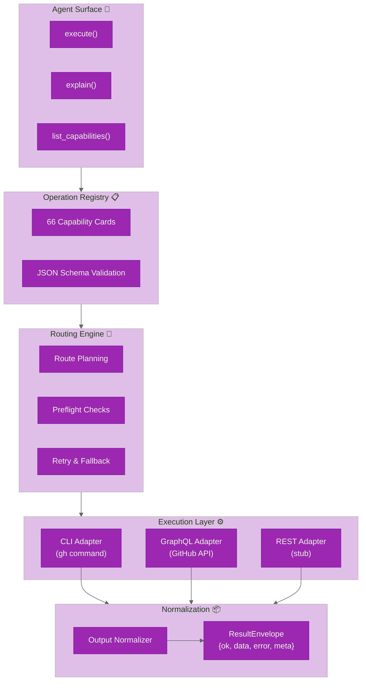

# Architecture Hub

Welcome to the `ghx` architecture documentation. This is your guide to understanding how the GitHub execution router works — from agent surface to normalized result envelopes.

## System Overview

`ghx` routes capability requests from agents or scripts through a deterministic runtime engine. Requests are validated against operation card schemas, routed through preflight checks, executed via CLI or GraphQL adapters, and normalized to a stable `ResultEnvelope` contract.

## Architecture Documentation

| Document | Purpose |
|----------|---------|
| **[README.md](README.md)** | You are here — architecture hub and system overview |
| **[system-design.md](system-design.md)** | Design rationale, goals, and core runtime models |
| **[routing-engine.md](routing-engine.md)** | Route planning rules, preflight evaluation, fallback logic, and reason codes |
| **[operation-cards.md](operation-cards.md)** | Capability card registry, schema, current capabilities, and adding new ones |
| **[adapters.md](adapters.md)** | CLI, GraphQL, and REST adapters — how capabilities are executed |
| **[agent-interface.md](agent-interface.md)** | Agent-facing tools (execute, explain, list_capabilities) and main-skill text |
| **[Result Envelope Guide](../guides/result-envelope.md)** | Stable ResultEnvelope parsing, fields, and response handling |
| **[Error Handling Guide](../guides/error-handling.md)** | Error taxonomy, retryability semantics, and debugging strategies |
| **[repository-structure.md](repository-structure.md)** | Package layout, module organization, directory tree, and reading paths |
| **[telemetry.md](telemetry.md)** | Structured telemetry events, redaction, and how to enable output |

## Quick Navigation

**Getting Started?**
- Start with [system-design.md](system-design.md) for design goals and runtime model
- Then read [operation-cards.md](operation-cards.md) to understand the capability surface
- Finally check [routing-engine.md](routing-engine.md) for routing policy

**Understanding How Requests Flow?**
- [routing-engine.md](routing-engine.md) → [adapters.md](adapters.md) → [Result Envelope](../guides/result-envelope.md)

**Adding or Modifying Capabilities?**
- [operation-cards.md](operation-cards.md) → [routing-engine.md](routing-engine.md) → [adapters.md](adapters.md)

**Debugging an Error?**
- [Error Handling](../guides/error-handling.md) → [routing-engine.md](routing-engine.md)

**Understanding the Codebase?**
- [repository-structure.md](repository-structure.md) for file layout and modules

## Key Principles

1. **Contracts First** — operation cards define capability contracts; schemas are enforced at boundaries.
2. **Deterministic Routing** — route selection follows card policy + preflight evaluation in a predictable order.
3. **Normalized Output** — all adapters normalize to `ResultEnvelope` regardless of source.
4. **Bounded Retry** — failures are retried per-route, then fallback proceeds in card order.
5. **Safe Defaults** — CLI commands execute via safe spawn; timeouts and output size limits are enforced.

## Entry Points

- **Library Consumer** — `packages/core/src/index.ts`
- **Agent Tools** — `packages/core/src/agent.ts`
- **CLI User** — `packages/core/src/cli/index.ts` (executable: `ghx`)
- **Benchmark** — `packages/benchmark/src/cli/benchmark.ts`

## Related Documentation

- **[docs/benchmark/](../benchmark/)** — methodology, harness design, metrics, and reporting
- **[docs/guides/](../guides/)** — CLI usage, library API, agent integration, error handling
- **[docs/contributing/](../contributing/)** — development setup, testing, publishing
