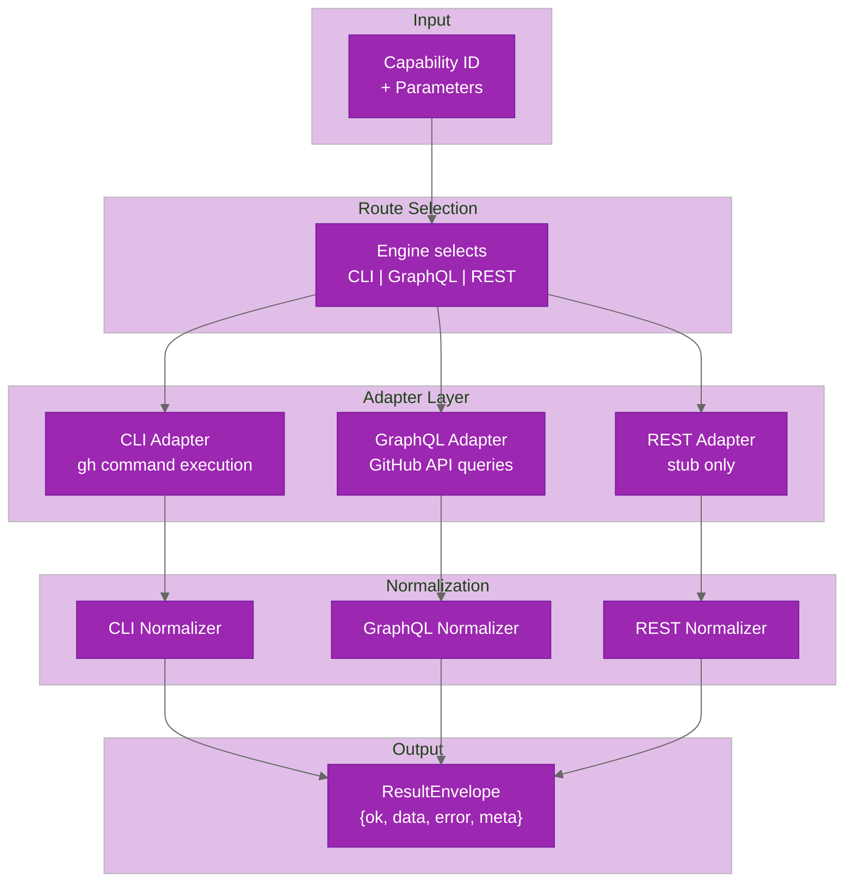
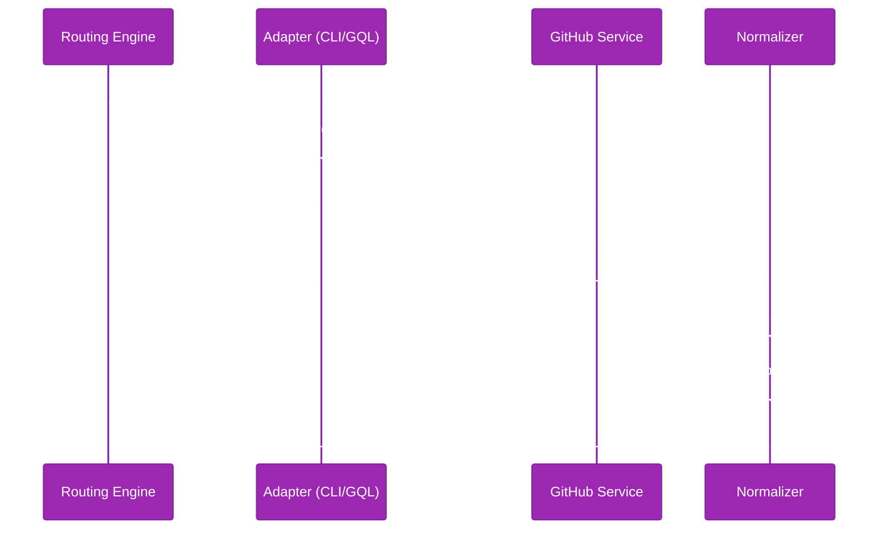

# Adapters

Adapters are the execution layer that translates capability cards into actual GitHub API calls. Each adapter normalizes its output to the stable `ResultEnvelope` contract.

## Adapter Overview

Three adapters handle different GitHub interaction modes:

| Adapter | Coverage | Route Name | Status | Purpose |
|---------|----------|-----------|--------|---------|
| **CLI Adapter** | All 66 | `cli` | Active | Execute via `gh` command-line tool |
| **GraphQL Adapter** | 28 | `graphql` | Active | Execute via GitHub GraphQL API |
| **REST Adapter** | None | `rest` | Stub | Planned for future expansion |



## CLI Adapter

The CLI adapter executes capabilities through the GitHub command-line tool (`gh`).

### Execution Model

1. Load capability card and extract CLI metadata (`command`, `args`, `output_format`)
2. Build command arguments from input parameters using card-defined mappings
3. Execute via safe CLI runner with timeout + output size limits
4. Parse output (typically JSON) using output schema
5. Validate output against capability's output schema
6. Normalize to `ResultEnvelope`

### Features

- **Full coverage**: All 66 capabilities have CLI routes defined
- **Safe spawning**: Uses `spawn()` with `shell: false` — no shell interpretation
- **Timeout enforcement**: Per-command timeout (default 30s)
- **Output limits**: Bounded stdout/stderr size (default 10 MB)
- **Error classification**: Maps CLI stderr and exit codes to normalized error codes

### CLI Command Mapping

Card metadata defines how parameters map to CLI arguments:

```yaml
cli:
  command: "gh"
  args:
    - arg: "repo"
    - arg: "view"
    - param: "owner/repo"
    - flag: "--json"
    - param: "fields"
  output_format: "json"
```

Parameter values are substituted into the argument list; the adapter ensures safe shell quoting.

### Location

- **Main adapter**: `packages/core/src/core/execution/adapters/cli-capability-adapter.ts`
- **Safe runner**: `packages/core/src/core/execution/cli/safe-runner.ts`
- **Generic wrapper**: `packages/core/src/core/execution/adapters/cli-adapter.ts`

## GraphQL Adapter

The GraphQL adapter executes capabilities through GitHub's GraphQL API.

### Execution Model

1. Load capability card and extract GraphQL metadata (`operation`, `field_mapping`)
2. Resolve operation from generated GraphQL SDK (`packages/core/src/gql/operations/*.generated.ts`)
3. Build query variables from input parameters
4. Execute GraphQL query using authenticated `graphql-request` client
5. Extract and transform response using field mapping
6. Validate output against capability's output schema
7. Normalize to `ResultEnvelope`

### Features

- **Typed queries**: Generated operation SDKs with type safety
- **Selective coverage**: 28 capabilities support GraphQL routes (typically read-heavy operations)
- **Authentication**: Requires `GITHUB_TOKEN` environment variable
- **Error classification**: Maps GraphQL errors (auth, rate limit, not found, etc.) to normalized error codes
- **Field mapping**: Adapts GitHub's response shape to capability output schema

### GraphQL Operation Generation

Operations are generated from `.graphql` files using `graphql-codegen`:

```bash
pnpm run ghx:gql:check  # Verify operations are up-to-date
```

Generated code is in `packages/core/src/gql/operations/*.generated.ts` and `packages/core/src/gql/generated/`.

### Location

- **Main adapter**: `packages/core/src/core/execution/adapters/graphql-capability-adapter.ts`
- **Generic wrapper**: `packages/core/src/core/execution/adapters/graphql-adapter.ts`
- **Client**: `packages/core/src/gql/client.ts`
- **Generated operations**: `packages/core/src/gql/operations/*.generated.ts`

## REST Adapter

The REST adapter is a stub in v1 and not part of active routing.

**Location**: `packages/core/src/core/execution/adapters/rest-adapter.ts`

**Future**: REST adapter would provide access to GitHub's v3 REST API for capabilities not available in CLI or GraphQL.

## Normalizer

The normalizer translates raw adapter output into the stable `ResultEnvelope` contract.

### Normalization Steps

1. **Success path**:
   - Extract adapter output
   - Validate against capability's `output_schema`
   - Wrap in `ResultEnvelope` with `ok: true` and normalized `data`

2. **Error path**:
   - Catch adapter error (exception, exit code, GraphQL error, etc.)
   - Classify error using `mapErrorToCode()` → normalized error code
   - Extract retryability from error code
   - Wrap in `ResultEnvelope` with `ok: false` and normalized `error`

3. **Metadata**:
   - Add `capability_id`, `route_used`, `reason`, `attempts`, `timings`
   - Include optional fields like `pagination` for list operations

### Error Code Mapping

Error classification follows this precedence order:

1. **Rate Limit** → `RATE_LIMIT` (retryable)
2. **Server Error** → `SERVER` (retryable)
3. **Network Error** → `NETWORK` (retryable)
4. **Not Found** → `NOT_FOUND` (non-retryable)
5. **Authentication** → `AUTH` (non-retryable)
6. **Validation** → `VALIDATION` (non-retryable)
7. **Adapter Unsupported** → `ADAPTER_UNSUPPORTED` (fallback-able)
8. **Unknown** → `UNKNOWN` (non-retryable)

### Location

- **Main normalizer**: `packages/core/src/core/execution/normalizer.ts`
- **Error classification**: `packages/core/src/core/errors/map-error.ts`
- **Error codes**: `packages/core/src/core/errors/codes.ts`

## Adapter Lifecycle



## Adding Adapter Support

To add adapter support for a new capability:

### CLI Route

1. Add CLI metadata to operation card:
   ```yaml
   cli:
     command: "gh"
     args: [...]
     output_format: "json"
   ```

2. Add implementation in `cli-capability-adapter.ts`:
   - Parse input parameters
   - Build command arguments
   - Execute via safe CLI runner
   - Transform output if needed

3. Add tests in `packages/core/test/unit/` and `packages/core/test/integration/`

### GraphQL Route

1. Write GraphQL operation in `packages/core/src/gql/operations/<capability>.graphql`
2. Run `pnpm run ghx:gql:check` to regenerate SDKs
3. Add GraphQL metadata to operation card:
   ```yaml
   graphql:
     operation: "getCapability"
     field_mapping: {...}
   ```

4. Add implementation in `graphql-capability-adapter.ts`:
   - Build query variables from input
   - Execute operation
   - Apply field mapping
   - Transform output if needed

5. Add tests in `packages/core/test/unit/` and `packages/core/test/integration/`

## Related Documentation

- [routing-engine.md](routing-engine.md) — route selection and fallback
- [operation-cards.md](operation-cards.md) — capability definitions and metadata
- [Result Envelope Guide](../guides/result-envelope.md) — ResultEnvelope parsing and contracts
- [Error Handling Guide](../guides/error-handling.md) — error codes and retry semantics
