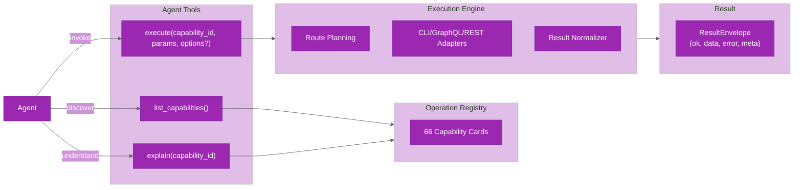

# Agent Interface

The agent interface exposes a compact, capability-agnostic surface for agents and scripts to interact with ghx. Three tools provide listing, explanation, and execution of capabilities.

## Tool Surface



## Tool Reference

### execute(capability_id, params, options?)

Executes a capability and returns a normalized `ResultEnvelope`.

**Parameters:**
- `capability_id` (string): The capability to execute (e.g., `pr.view`, `issue.list`)
- `params` (object): Capability-specific input parameters
- `options?` (object, optional):
  - `skip_preflight?` (boolean): Skip preflight checks (default: false)
  - `cli_runner?` (function): Custom CLI command runner

**Returns:**
```typescript
ResultEnvelope {
  ok: boolean
  data?: any          // Normalized output on success
  error?: {
    code: ErrorCode
    message: string
    retryable: boolean
    details?: any
  }
  meta: {
    capability_id: string
    route_used: string
    reason: RouteReasonCode
    attempts?: number
    timings?: object
    cost?: object
  }
}
```

**Example:**
```typescript
const result = await execute('pr.view', {
  owner: 'torvalds',
  repo: 'linux',
  pull_number: 1,
})

if (result.ok) {
  console.log(result.data.title)
} else {
  console.error(result.error.message)
}
```

### explain(capability_id)

Returns a compact explanation of a capability: schema, preferred/fallback routes, and usage guidance.

**Parameters:**
- `capability_id` (string): The capability to explain (e.g., `pr.list`)

**Returns:**
```typescript
{
  capability_id: string
  description: string
  input_schema: JSONSchema
  output_schema: JSONSchema
  routes: {
    preferred: string[]
    fallbacks: string[]
  }
}
```

**Example:**
```typescript
const info = await explain('pr.view')
console.log(info.description)
console.log(info.input_schema.properties)
```

### list_capabilities()

Returns all available capabilities, grouped by domain.

**Returns:**
```typescript
Capability[] {
  capability_id: string
  description: string
  tags?: string[]
}[]
```

**Example:**
```typescript
const all = await list_capabilities()
const pr_capabilities = all.filter(c => c.capability_id.startsWith('pr.'))
console.log(`${pr_capabilities.length} PR capabilities available`)
```

## Implementation Details

### Location

- **Execute tool**: `packages/core/src/agent-interface/tools/execute-tool.ts`
- **Explain tool**: `packages/core/src/agent-interface/tools/explain-tool.ts`
- **List capabilities tool**: `packages/core/src/agent-interface/tools/list-capabilities-tool.ts`

### Exports

- **Package exports** (`packages/core/src/agent.ts`):
  ```typescript
  export { createExecuteTool, listCapabilities, explainCapability }
  ```

- **CLI integration** (`packages/core/src/cli/index.ts`):
  - `ghx capabilities list` — wraps `listCapabilities()`
  - `ghx capabilities explain <id>` — wraps `explainCapability(id)`
  - `ghx run <id> --input '<json>'` — wraps `executeTask()`

### Main Skill Text

The agent interface is paired with a main-skill prompt that constrains agent behavior:

- **Location**: `packages/core/src/agent-interface/prompt/main-skill.ts`
- **Content**: Instructions for capability discovery, safe execution, and error handling

## CLI Safety Defaults

When `executeTask` is called without a custom CLI runner, the runtime uses a safe default runner that:

- Executes via `spawn(command, args, { shell: false })`
- Enforces per-command timeout (default: 30 seconds)
- Enforces bounded combined stdout/stderr size (default: 10 MB)
- Blocks shell interpretation of arguments

**Location**: `packages/core/src/core/execution/cli/safe-runner.ts`

## Integration Points

### For Agent Developers

1. Import tools from `@ghx-dev/core/agent.ts`:
   ```typescript
   import { createExecuteTool, listCapabilities, explainCapability } from '@ghx-dev/core/agent'
   ```

2. Make tools available to your agent model:
   ```typescript
   const tools = {
     execute: createExecuteTool(),
     list: listCapabilities,
     explain: explainCapability,
   }
   ```

3. Handle `ResultEnvelope` structure in tool call results

### For CLI Users

```bash
# List all capabilities
ghx capabilities list

# Explain a capability
ghx capabilities explain pr.view

# Run a capability
ghx run pr.view --input '{"owner":"rails","repo":"rails","pull_number":1}'
```

### For Library Consumers

```typescript
import { executeTask, listOperationCards } from '@ghx-dev/core'

// Execute a capability
const result = await executeTask({
  task: 'pr.view',
  input: { owner: 'rails', repo: 'rails', pull_number: 1 },
})

// List capabilities
const cards = await listOperationCards()
```

## Related Documentation

- [Result Envelope Guide](../guides/result-envelope.md) — ResultEnvelope parsing and field reference
- [operation-cards.md](operation-cards.md) — capability definitions
- [adapters.md](adapters.md) — adapter implementation details
