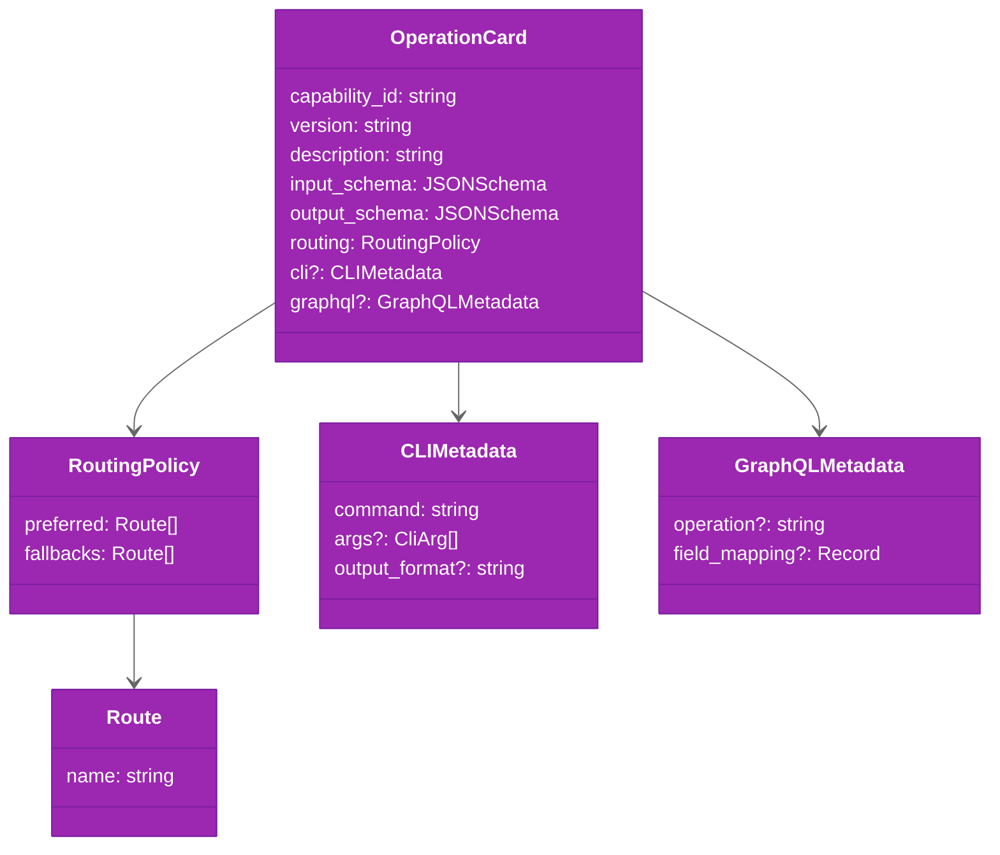

# Operation Cards

Operation cards are the runtime source of truth for capabilities. Each card defines a capability's contract, schemas, and routing policy.

## Card Schema



## Card Contents

Each operation card includes:

| Field | Purpose | Required |
|-------|---------|----------|
| `capability_id` | Unique identifier (e.g., `pr.view`, `issue.list`) | Yes |
| `version` | Card version for tracking schema evolution | Yes |
| `description` | Human-readable purpose and scope | Yes |
| `input_schema` | JSON Schema for required/optional parameters | Yes |
| `output_schema` | JSON Schema for normalized response payload | Yes |
| `routing.preferred` | Primary route(s) to attempt first | Yes |
| `routing.fallbacks` | Secondary routes in order of preference | Yes |
| `cli` | CLI command metadata and output mapping | No |
| `graphql` | GraphQL operation and field mapping | No |

## Current Capability Surface

`ghx` currently defines **66 capabilities** across these domains:

| Domain | Count | Purpose |
|--------|-------|---------|
| **Issues** | 18 | Create, read, update, close, link, label, milestone, assign issues |
| **Pull Requests** | 21 | Read PR metadata, lists, reviews, comments, checks, mergeability, mutations |
| **Releases** | 5 | Query and draft releases, publish, update |
| **Workflows** | 12 | Query workflow runs, jobs, logs, cancel, rerun; list workflows |
| **Repositories** | 1 | Repo metadata and label/type listing |
| **Projects (v2)** | 6 | Query and mutate projects, fields, items |
| **Check Runs** | 1 | List check run annotations |
| **Workflow Dispatch** | 1 | Trigger workflow runs |

### Issue Capabilities (18)

`issue.view`, `issue.list`, `issue.create`, `issue.update`, `issue.close`, `issue.reopen`, `issue.delete`, `issue.comments.list`, `issue.comments.create`, `issue.labels.update`, `issue.assignees.update`, `issue.milestone.set`, `issue.linked_prs.list`, `issue.parent.set`, `issue.parent.remove`, `issue.blocked_by.add`, `issue.blocked_by.remove`, `issue.relations.get`

### Pull Request Capabilities (21)

`pr.view`, `pr.list`, `pr.comments.list`, `pr.reviews.list`, `pr.diff.list_files`, `pr.status.checks`, `pr.checks.get_failed`, `pr.checks.rerun_failed`, `pr.checks.rerun_all`, `pr.mergeability.view`, `pr.comment.reply`, `pr.comment.resolve`, `pr.comment.unresolve`, `pr.ready_for_review.set`, `pr.review.submit_approve`, `pr.review.submit_comment`, `pr.review.submit_request_changes`, `pr.reviewers.request`, `pr.branch.update`, `pr.merge.execute`, `pr.assignees.update`

### Release Capabilities (5)

`release.get`, `release.list`, `release.create_draft`, `release.publish_draft`, `release.update`

### Workflow Capabilities (12)

`workflow.get`, `workflow.list`, `workflow_dispatch.run`, `workflow_run.get`, `workflow_runs.list`, `workflow_run.jobs.list`, `workflow_run.cancel`, `workflow_run.rerun_all`, `workflow_run.rerun_failed`, `workflow_run.artifacts.list`, `workflow_job.logs.get`, `workflow_job.logs.analyze`

### Repository Capabilities (1)

`repo.view`, `repo.issue_types.list`, `repo.labels.list`

### Project Capabilities (6)

`project_v2.user.get`, `project_v2.org.get`, `project_v2.fields.list`, `project_v2.items.list`, `project_v2.item.add_issue`, `project_v2.item.field.update`

### Check Run Capabilities (1)

`check_run.annotations.list`

## Card Loading & Validation

1. **Load** — cards are read from `packages/core/src/core/registry/cards/*.yaml` at module initialization
2. **Validate** — cards are validated against the card schema using AJV in `packages/core/src/core/registry/index.ts`
3. **Registry** — validated cards are indexed for fast lookup by `capability_id`
4. **Derive** — routing registry derives from loaded cards to support route planning

## Adding a Capability

To add a new capability:

1. **Create a card** — add `packages/core/src/core/registry/cards/<capability_id>.yaml` with:
   - `capability_id`, `version`, `description`
   - Complete `input_schema` and `output_schema` (JSON Schema)
   - `routing.preferred` and `routing.fallbacks`
   - Adapter-specific metadata (CLI and/or GraphQL)

2. **Implement adapters** — add support in:
   - `packages/core/src/core/execution/adapters/cli-capability-adapter.ts` (if CLI route)
   - `packages/core/src/core/execution/adapters/graphql-capability-adapter.ts` (if GraphQL route)

3. **Write tests** — add unit and integration tests:
   - `packages/core/test/unit/` for schema and adapter logic
   - `packages/core/test/integration/` for end-to-end execution

4. **Add benchmark scenario** — create scenario in `packages/benchmark/scenarios/<capability_id>.json`:
   - Define test inputs and expected output assertions
   - Add to appropriate scenario set in `packages/benchmark/scenario-sets.json`

5. **Verify** — run:
   ```bash
   pnpm --filter @ghx-dev/benchmark run check:scenarios
   pnpm run test
   ```

## Card File Structure Example

```yaml
capability_id: repo.view
version: "1.0"
description: "View repository metadata and configuration."

input_schema:
  type: object
  properties:
    owner:
      type: string
      description: "Repository owner"
    repo:
      type: string
      description: "Repository name"
  required: [owner, repo]

output_schema:
  type: object
  properties:
    id:
      type: string
    name:
      type: string
    description:
      type: string
    url:
      type: string
  required: [id, name, url]

routing:
  preferred: [cli]
  fallbacks: [graphql]

cli:
  command: "gh"
  args:
    - arg: "repo"
    - arg: "view"
    - param: "owner/repo"
  output_format: "json"

graphql:
  operation: "getRepository"
```

## Source Files

- **Card definitions**: `packages/core/src/core/registry/cards/*.yaml`
- **Card types and loader**: `packages/core/src/core/registry/types.ts`, `packages/core/src/core/registry/index.ts`
- **Card schema validator**: `packages/core/src/core/registry/operation-card-schema.ts`
- **Schema validation**: `packages/core/src/core/registry/schema-validator.ts`

## Related Documentation

- [routing-engine.md](routing-engine.md) — how route policy is applied
- [adapters.md](adapters.md) — adapter implementation for cards
- [Result Envelope Guide](../guides/result-envelope.md) — ResultEnvelope contract details
