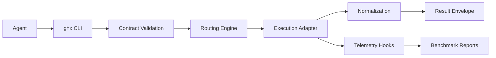

# Architecture Overview

`ghx-router` is built around three boundaries:

- `packages/ghx-router/src/core/`: task contracts, route policy, adapters, normalization, telemetry.
- `packages/ghx-router/src/cli/`: command interface and formatting.
- `packages/benchmark/`: independent benchmark harness and reporting.

Canonical architecture reference:

- `docs/architecture/system-design.md`

Supporting references:

- `docs/architecture/repository-structure.md`
- `docs/architecture/routing-policy.md`
- `docs/architecture/contracts.md`
- `docs/architecture/errors-and-retries.md`

This file is a stable summary and index to deeper architecture docs.
