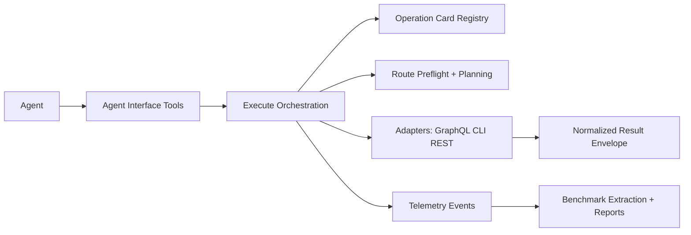

# Architecture Overview

`ghx-router` has three primary boundaries:

- `packages/ghx-router/src/core/` - contracts, operation-card registry, execute orchestration, adapters, telemetry.
- `packages/ghx-router/src/agent-interface/` - agent-facing tools (`execute`, `explain`, `list_capabilities`) and stable main-skill text.
- `packages/benchmark/` - benchmark scenarios, runner, extraction, and reporting.

Primary references:

- `docs/architecture/contracts.md`
- `docs/architecture/routing-policy.md`
- `docs/architecture/errors-and-retries.md`
- `docs/architecture/operation-card-registry.md`
- `docs/architecture/agent-interface-tools.md`
- `docs/architecture/telemetry.md`
