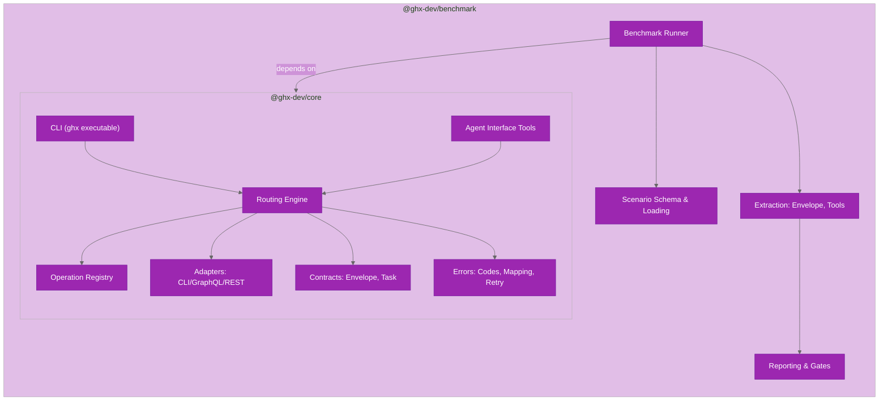

# Repository Structure

This document provides a comprehensive overview of the ghx repository layout, module organization, and key files.

## Workspace Structure

`ghx` is an Nx + pnpm monorepo with two runtime packages plus supporting tooling:

```text
ghx/
├── .changeset/                  # Changesets for versioning
├── .github/
│   ├── dependabot.yml          # Automated dependency updates
│   └── workflows/              # CI/CD workflows
├── docs/
│   ├── architecture/           # Architecture documentation (this section)
│   ├── benchmark/              # Benchmark methodology & reporting
│   ├── capabilities/           # Per-domain capability reference
│   ├── contributing/           # Development setup, testing, CI, publishing
│   ├── getting-started/        # Installation, first task, agent setup
│   ├── guides/                 # CLI usage, library API, error handling
│   └── archive/                # Archived design docs
├── packages/
│   ├── core/                   # @ghx-dev/core (public npm package)
│   │   ├── src/
│   │   │   ├── agent-interface/      # Agent tool surface
│   │   │   ├── cli/                  # ghx CLI entrypoint
│   │   │   ├── core/                 # Core runtime
│   │   │   │   ├── contracts/        # Stable envelope & task contracts
│   │   │   │   ├── errors/           # Error taxonomy & mapping
│   │   │   │   ├── execute/          # Execution orchestration
│   │   │   │   ├── execution/        # Adapters & normalizer
│   │   │   │   ├── registry/         # Operation card registry
│   │   │   │   ├── routing/          # Route planning & engine
│   │   │   │   └── telemetry/        # Structured logging
│   │   │   ├── gql/                  # GraphQL client & operations
│   │   │   └── shared/               # Shared utilities
│   │   ├── scripts/            # Build-time scripts
│   │   ├── test/               # Tests
│   │   └── tsup.config.ts      # Build config
│   └── benchmark/              # @ghx-dev/benchmark (private)
│       ├── src/
│       │   ├── cli/            # Benchmark CLI entrypoints
│       │   ├── domain/         # Types & contracts
│       │   ├── extract/        # Envelope & tool extraction
│       │   ├── report/         # Reporting & gates
│       │   ├── runner/         # Scenario execution orchestrator
│       │   └── scenario/       # Scenario schema & loading
│       ├── scenarios/          # Benchmark test scenarios
│       ├── results/            # Benchmark output files
│       ├── reports/            # Generated reports
│       ├── test/               # Tests
│       └── tsup.config.ts      # Build config
├── nx.json                     # Nx configuration
├── package.json                # Root package and workspace scripts
├── pnpm-workspace.yaml         # Workspace definition
├── biome.json                  # Biome formatter config
├── lefthook.yml                # Pre-commit hooks
├── .npmrc                      # pnpm configuration
└── CLAUDE.md                   # Claude Code guidance
```

## Core Package Modules

`packages/core/src` is organized into logical modules:

### Contracts & Errors (`core/contracts`, `core/errors`)

**Purpose**: Define stable contracts and error taxonomy.

| Module | Purpose | Key Exports |
|--------|---------|-------------|
| `core/contracts/envelope.ts` | Result envelope contract | `ResultEnvelope`, `RouteSource` |
| `core/contracts/task.ts` | Input task contract | `TaskRequest` |
| `core/errors/codes.ts` | Error code taxonomy | `errorCodes`, `ErrorCode` |
| `core/errors/map-error.ts` | Error classification | `mapErrorToCode()` |
| `core/errors/retryability.ts` | Retry policy by code | `isRetryableErrorCode()` |

### Registry (`core/registry`)

**Purpose**: Load, validate, and lookup operation cards.

| Module | Purpose | Key Exports |
|--------|---------|-------------|
| `core/registry/index.ts` | Card loader & lookup | `validateOperationCard()`, `listOperationCards()`, `getOperationCard()` |
| `core/registry/types.ts` | Card and routing types | `OperationCard`, `SuitabilityRule` |
| `core/registry/schema-validator.ts` | JSON schema validation | `validateInput()`, `validateOutput()` |
| `core/registry/operation-card-schema.ts` | Card schema definition | `operationCardSchema` |
| `core/registry/ajv-instance.ts` | Shared AJV instance | `ajv` |
| `core/registry/cards/*.yaml` | Capability definitions | 66 operation cards |

### Routing Engine (`core/routing`)

**Purpose**: Plan routes and select preferred execution paths.

| Module | Purpose | Key Exports |
|--------|---------|-------------|
| `core/routing/engine.ts` | Main task coordinator | `executeTask()` |
| `core/routing/policy.ts` | Route preference ordering | `routePreferenceOrder` |
| `core/routing/reason-codes.ts` | Route reason taxonomy | `routeReasonCodes`, `RouteReasonCode` |
| `core/routing/capability-registry.ts` | Registry view for routing | `capabilityRegistry` |

### Execution Pipeline (`core/execute`, `core/execution`)

**Purpose**: Validate, execute, retry, and normalize.

| Module | Purpose | Key Exports |
|--------|---------|-------------|
| `core/execute/execute.ts` | Route planning & retry loop | `execute()` |
| `core/execution/preflight.ts` | Route readiness checks | `preflightCheck()` |
| `core/execution/normalizer.ts` | Output normalization | `normalizeResult()`, `normalizeError()` |
| `core/execution/adapters/cli-capability-adapter.ts` | CLI capability adapter | `runCliCapability()` |
| `core/execution/adapters/graphql-capability-adapter.ts` | GraphQL capability adapter | `runGraphqlCapability()` |
| `core/execution/adapters/cli-adapter.ts` | Generic CLI wrapper | `runCliAdapter()` |
| `core/execution/adapters/graphql-adapter.ts` | Generic GraphQL wrapper | `runGraphqlAdapter()` |
| `core/execution/adapters/rest-adapter.ts` | REST stub | `runRestAdapter()` |
| `core/execution/cli/safe-runner.ts` | Safe CLI spawn wrapper | `createSafeCliCommandRunner()` |

### Telemetry (`core/telemetry`)

**Purpose**: Structured logging with redaction.

| Module | Purpose | Key Exports |
|--------|---------|-------------|
| `core/telemetry/logger.ts` | Event emitter | `logger.emit()` |

### GraphQL Client (`gql`)

**Purpose**: Typed GitHub GraphQL facade.

| Module | Purpose | Key Exports |
|--------|---------|-------------|
| `gql/client.ts` | GraphQL client factory | `createGraphqlClient()`, `createGithubClient()` |
| `gql/operations/*.generated.ts` | Generated operation SDKs | Operation-specific `getSdk()` |
| `gql/generated/common-types.ts` | Generated scalar types | Type aliases |

### CLI & Agent Interface

**Purpose**: User entrypoints and agent tool surface.

| Module | Purpose | Key Exports |
|--------|---------|-------------|
| `cli/index.ts` | CLI command router | `main()` |
| `cli/commands/run.ts` | Task parsing & execution | `runCommand()` |
| `cli/commands/setup.ts` | Skill installation | `setupCommand()` |
| `cli/commands/capabilities-list.ts` | List capabilities | `capabilitiesListCommand()` |
| `cli/commands/capabilities-explain.ts` | Explain capability | `capabilitiesExplainCommand()` |
| `cli/assets/skills/ghx/SKILL.md` | Setup skill template | (markdown) |
| `agent-interface/tools/execute-tool.ts` | Execute wrapper | `createExecuteTool()` |
| `agent-interface/tools/list-capabilities-tool.ts` | List tool | `listCapabilities()` |
| `agent-interface/tools/explain-tool.ts` | Explain tool | `explainCapability()` |
| `agent-interface/prompt/main-skill.ts` | Agent safety text | `MAIN_SKILL_TEXT` |

### Package Entrypoints

| File | Purpose |
|------|---------|
| `index.ts` | Public npm package API |
| `agent.ts` | Agent-facing tool exports |

## Benchmark Package Modules

`packages/benchmark/src` is organized by concern:

### Domain & Scenario (`domain`, `scenario`)

| Module | Purpose | Key Exports |
|--------|---------|-------------|
| `domain/types.ts` | Benchmark row types | `BenchmarkMode`, `Scenario`, `BenchmarkRow` |
| `scenario/schema.ts` | Zod scenario validation | `validateScenario()` |
| `scenario/loader.ts` | Scenario file loading | `loadScenarios()`, `loadScenarioSets()` |

### Runner & Extraction (`runner`, `extract`)

| Module | Purpose | Key Exports |
|--------|---------|-------------|
| `runner/suite-runner.ts` | Orchestrator | `runSuite()`, `runScenario()` |
| `extract/envelope.ts` | Envelope extraction | `extractFirstJsonObject()`, `validateEnvelope()` |
| `extract/attempts.ts` | Attempt metrics | `extractAttemptMetrics()` |
| `extract/tool-usage.ts` | Tool aggregation | `aggregateToolCounts()` |

### Reporting & CLI (`report`, `cli`)

| Module | Purpose | Key Exports |
|--------|---------|-------------|
| `report/aggregate.ts` | Summary & gates | `buildSummary()`, `toMarkdown()` |
| `cli/benchmark.ts` | Benchmark command | `main()` |
| `cli/check-scenarios.ts` | Scenario validation | `main()` |
| `cli/report.ts` | Report generation | `main()` |

## Key Files by Concern

### Workspace + Build System

- `package.json` - root scripts for build/format/lint/test/typecheck/benchmark
- `pnpm-workspace.yaml` - workspace discovery + pnpm catalog
- `nx.json` - Nx task orchestration
- `biome.json` - Biome formatter (2-space indent, 100-char width)
- `lefthook.yml` - pre-commit hooks (format, lint, typecheck)
- `.npmrc` - pnpm settings
- `.github/dependabot.yml` - dependency update automation

### Core Router Execution

- `packages/core/src/core/routing/engine.ts` - **route selection + preflight**
- `packages/core/src/core/execute/execute.ts` - **route attempts, retry, validation**
- `packages/core/src/core/execution/adapters/cli-capability-adapter.ts` - CLI mapping
- `packages/core/src/core/execution/adapters/graphql-capability-adapter.ts` - GraphQL mapping
- `packages/core/src/core/registry/cards/*.yaml` - **capability definitions**

### Error Handling

- `packages/core/src/core/errors/codes.ts` - **error code list**
- `packages/core/src/core/errors/map-error.ts` - **error classification**
- `packages/core/src/core/errors/retryability.ts` - retry policy

### CLI User Interaction

- `packages/core/src/cli/index.ts` - `ghx` executable
- `packages/core/src/cli/commands/run.ts` - task parsing
- `packages/core/src/cli/commands/setup.ts` - skill installation

### Agent Tools

- `packages/core/src/agent.ts` - agent tool exports
- `packages/core/src/agent-interface/tools/execute-tool.ts` - execute wrapper
- `packages/core/src/agent-interface/tools/list-capabilities-tool.ts` - list tool
- `packages/core/src/agent-interface/prompt/main-skill.ts` - agent constraints

### Benchmark Orchestration

- `packages/benchmark/src/cli/benchmark.ts` - benchmark run command
- `packages/benchmark/src/runner/suite-runner.ts` - scenario execution
- `packages/benchmark/src/extract/envelope.ts` - result extraction
- `packages/benchmark/src/report/aggregate.ts` - summary + gates

### Tests

- `packages/core/test/unit/*.test.ts` - unit tests
- `packages/core/test/integration/*.integration.test.ts` - integration tests
- `packages/benchmark/test/unit/*.test.ts` - benchmark tests

## Package Boundaries



## Navigation Shortcuts

Use these paths when debugging common concerns:

| Concern | Starting File |
|---------|---------------|
| Route selection issue | `packages/core/src/core/routing/engine.ts` |
| Input/output validation | `packages/core/src/core/execute/execute.ts` + `packages/core/src/core/registry/schema-validator.ts` |
| Capability metadata | `packages/core/src/core/registry/cards/*.yaml` |
| CLI command shape | `packages/core/src/core/execution/adapters/cli-capability-adapter.ts` |
| GraphQL field mismatch | `packages/core/src/gql/client.ts` + `packages/core/src/gql/operations/*.generated.ts` |
| Benchmark scenario failure | `packages/benchmark/src/scenario/schema.ts` |
| Scenario coverage | `packages/benchmark/src/cli/check-scenarios.ts` + `packages/benchmark/scenario-sets.json` |
| Gate failure | `packages/benchmark/src/report/aggregate.ts` |

## Suggested Reading Paths

### New Contributor

1. [docs/architecture/system-design.md](system-design.md) — understand design goals
2. [docs/architecture/repository-structure.md](repository-structure.md) (this file) — map the codebase
3. [docs/architecture/routing-engine.md](routing-engine.md) — understand route selection
4. [docs/architecture/operation-cards.md](operation-cards.md) — understand capabilities

### Router Internals

1. [docs/architecture/routing-engine.md](routing-engine.md) — route planning
2. [packages/core/src/core/routing/engine.ts](../../packages/core/src/core/routing/engine.ts) — implementation
3. [docs/architecture/adapters.md](adapters.md) — adapter execution
4. [docs/guides/error-handling.md](../guides/error-handling.md) — error handling

### Adding a Capability

1. [docs/architecture/operation-cards.md](operation-cards.md) — card structure
2. [packages/core/src/core/registry/cards/](../../packages/core/src/core/registry/cards/) — examples
3. [docs/architecture/adapters.md](adapters.md) — adapter support
4. [docs/architecture/routing-engine.md](routing-engine.md) — routing policy

### Benchmark Internals

1. [docs/benchmark/harness-design.md](../benchmark/harness-design.md)
2. [packages/benchmark/src/runner/suite-runner.ts](../../packages/benchmark/src/runner/suite-runner.ts)
3. [docs/benchmark/reporting.md](../benchmark/reporting.md)

## External Integration Points

- **GitHub GraphQL API** — `packages/core/src/gql/client.ts`
- **GitHub CLI (`gh`)** — `packages/core/src/core/execution/adapters/cli-capability-adapter.ts`
- **OpenCode SDK** — `packages/benchmark/src/runner/suite-runner.ts`
- **JSON Schema Validation (AJV)** — `packages/core/src/core/registry/`
- **Scenario Validation (Zod)** — `packages/benchmark/src/scenario/schema.ts`

## Related Documentation

- [docs/architecture/](.) — All architecture docs
- [docs/benchmark/](../benchmark/) — Benchmark methodology & metrics
- [docs/guides/](../guides/) — CLI usage, library API, agent integration, error handling
- [docs/contributing/](../contributing/) — Development setup, testing, CI, publishing
