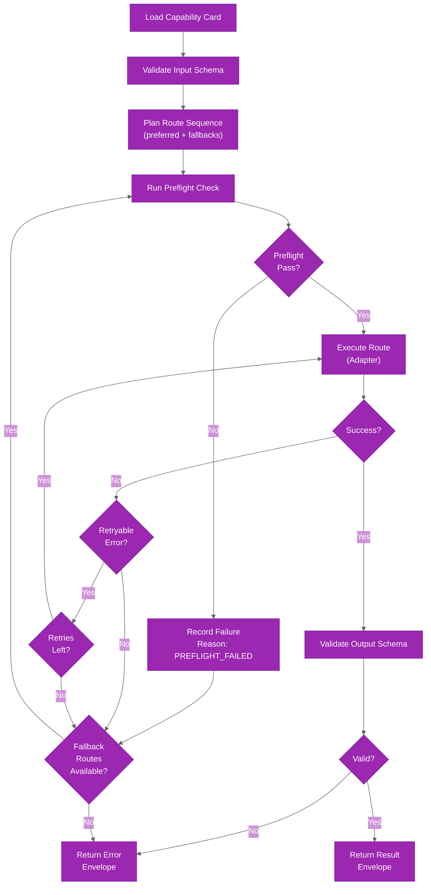

# Routing Engine

The routing engine is responsible for planning, executing, and falling back through capability routes. It's deterministic, card-driven, and supports bounded retries with fallback sequences.

## Route Planning

For a given capability card, the engine constructs an ordered route sequence:

1. Load `routing.preferred` route(s) from the card
2. Append `routing.fallbacks` in card-defined order
3. Deduplicate routes (preserve first occurrence)
4. Validate each route with preflight checks
5. Execute against first viable route
6. Retry on retryable errors within per-route budget
7. Fallback to next route on terminal errors or retryability exhaustion

## Planning Rules

### Route Order

- **Preferred routes** come first and have priority
- **Fallback routes** are ordered explicitly in the card
- **Global preference** (when both preferred and fallback are available): CLI > GraphQL > REST
- **REST** is a stub in v1 and is not part of active routing for current capabilities

### Preflight Evaluation

Before executing a route, preflight checks validate:

- **GraphQL routes**: `GITHUB_TOKEN` environment variable is set
- **CLI routes**: `gh --version` and `gh auth status` execute successfully
- **REST routes**: Currently unsupported (stub)

Preflight failures are recorded but do not terminate route evaluation — the engine proceeds to the next route.

### Retry and Fallback

Each route gets a bounded retry budget for retryable error codes:

- **Retryable codes**: `NETWORK`, `RATE_LIMIT`, `SERVER`
- **Non-retryable codes**: `AUTH`, `VALIDATION`, `NOT_FOUND`, `ADAPTER_UNSUPPORTED`, `UNKNOWN`

Conditions that trigger fallback:

- Retryable budget exhausted for the current route
- Non-retryable error from current route (except `ADAPTER_UNSUPPORTED`)
- `ADAPTER_UNSUPPORTED` is always fallback-able

## Route Reason Codes

Each route attempt is tagged with a reason code indicating why that route was selected:

| Code | Meaning |
|------|---------|
| `CARD_PREFERRED` | Route is the card's preferred route |
| `CARD_FALLBACK` | Route is one of the card's fallback routes |
| `PREFLIGHT_FAILED` | Previous route's preflight check failed |
| `ENV_CONSTRAINT` | Required environment variable missing (e.g., `GITHUB_TOKEN`) |
| `CAPABILITY_LIMIT` | Capability is restricted to specific routes (e.g., GraphQL-only) |
| `DEFAULT_POLICY` | No explicit card policy; using global preference order |

## Route Patterns in Practice

### Example 1: Issue View (Preferred CLI)

Card definition:
```yaml
routing:
  preferred: [cli]
  fallbacks: [graphql]
```

Route sequence:
1. Preflight check for `gh auth status`
   - Success → execute via CLI adapter
   - Failure → reason=`PREFLIGHT_FAILED`, fallback to GraphQL
2. Preflight check for `GITHUB_TOKEN`
   - Success → execute via GraphQL adapter
   - Failure → return error with reason=`ENV_CONSTRAINT`

### Example 2: PR Review Read (GraphQL Only)

Card definition:
```yaml
routing:
  preferred: [graphql]
  fallbacks: []
```

Route sequence:
1. Preflight check for `GITHUB_TOKEN`
   - Success → execute via GraphQL adapter
   - Failure → return error with reason=`ENV_CONSTRAINT`

### Example 3: Workflow Job Logs (CLI Only)

Card definition:
```yaml
routing:
  preferred: [cli]
  fallbacks: []
```

Route sequence:
1. Preflight check for `gh auth status`
   - Success → execute via CLI adapter
   - Failure → return error with reason=`PREFLIGHT_FAILED`

## Execution Flow



## Source Files

- **Route planning & preflight**: `packages/core/src/core/routing/engine.ts`
- **Execute loop & retry**: `packages/core/src/core/execute/execute.ts`
- **Preflight checks**: `packages/core/src/core/execution/preflight.ts`
- **Route reason codes**: `packages/core/src/core/routing/reason-codes.ts`
- **Route preference order**: `packages/core/src/core/routing/policy.ts`
- **Card definitions**: `packages/core/src/core/registry/cards/*.yaml`

## Related Documentation

- [operation-cards.md](operation-cards.md) — how cards define route policy
- [adapters.md](adapters.md) — how routes execute
- [Error Handling Guide](../guides/error-handling.md) — error codes and retryability semantics
