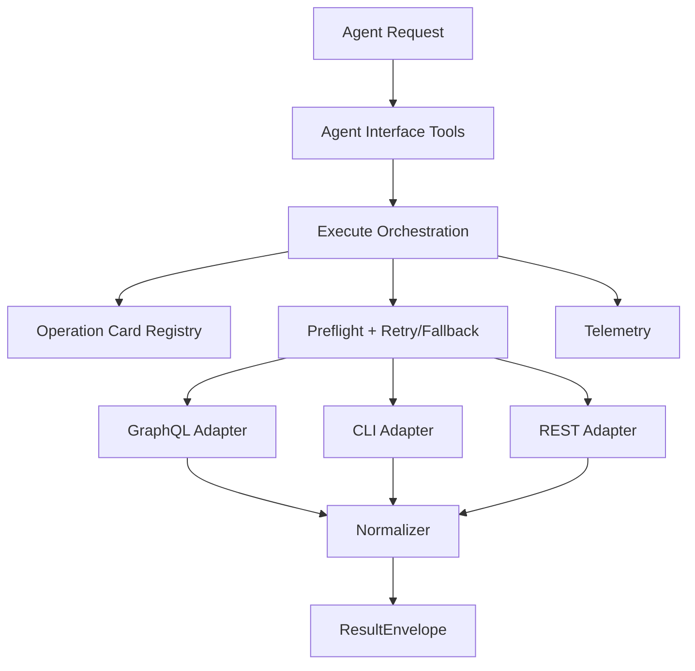

# System Design (v1)

`ghx-router` moves GitHub execution policy into deterministic runtime behavior.

## Goals

- stable capability contracts
- deterministic route planning and fallback
- normalized route-independent output
- benchmarkable reliability and efficiency

## Runtime Model

## Result Envelope

Every capability returns:

- `ok`: boolean
- `data`: normalized payload on success
- `error`: normalized error on failure
- `meta`: `capability_id`, `route_used`, `reason`, plus optional trace/timing fields

## Route Planning

- capability cards define preferred and fallback routes
- preflight checks gate route eligibility
- execute applies bounded retries for retryable errors
- fallback proceeds in deterministic card order

## Current v1 Scope

- `repo.view`, `issue.view`, `issue.list`, `pr.view`, `pr.list`
- CLI preferred with GraphQL fallback for those read capabilities
- `issue.comments.list` prefers GraphQL with CLI fallback
- REST is planned, not active in v1 route preference

## Source References

- `packages/ghx-router/src/core/execute/execute.ts`
- `packages/ghx-router/src/core/registry/cards/*.yaml`
- `packages/ghx-router/src/core/contracts/envelope.ts`
- `packages/ghx-router/src/agent-interface/tools/`
