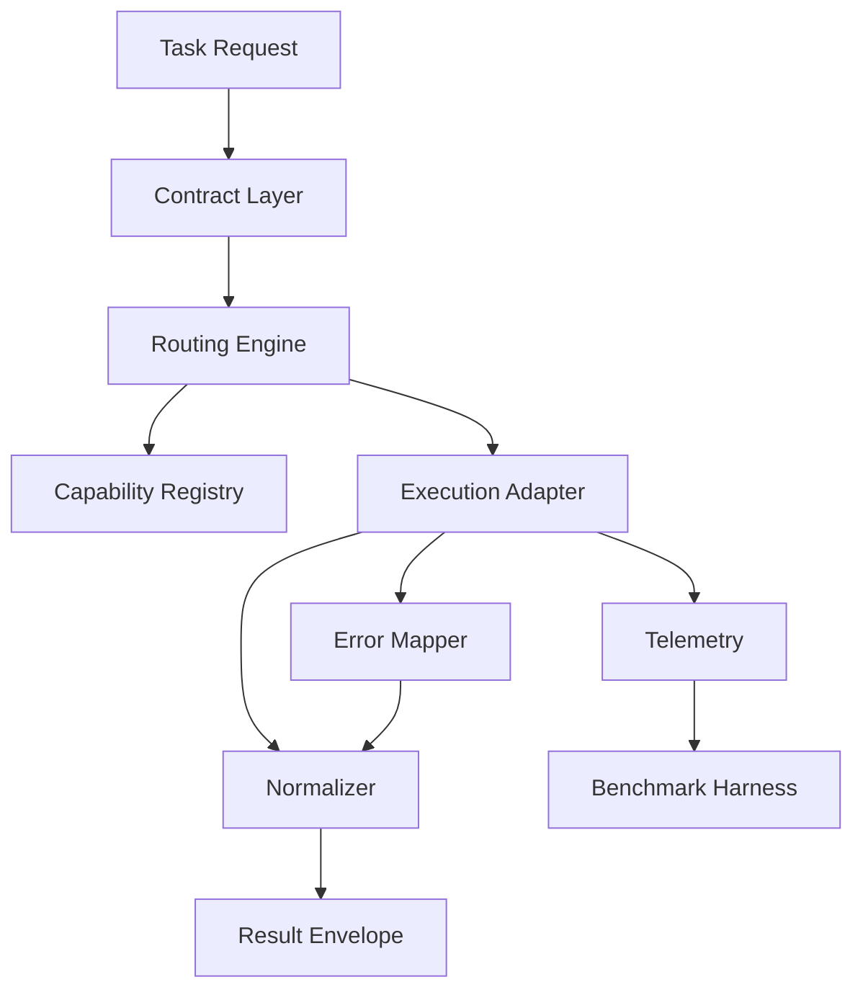

# System Design (v1)

This document defines the long-lived architecture baseline for `ghx-router`.

## Problem

Agents can complete GitHub tasks through `gh`, `gh api`, GraphQL, and MCP tooling, but ad hoc route selection creates inconsistent output, extra retries, and repeated context usage.

`ghx-router` moves route selection and output shaping into deterministic runtime behavior.

## Design Goals

- Keep task contracts stable and explicit.
- Keep route selection deterministic and inspectable.
- Keep adapter output normalized into one envelope.
- Keep benchmark measurement independent from runtime internals.

## Component Model

### Contract Layer

- Validates task input and output shape.
- Fails fast with normalized validation errors.

### Routing Engine

- Resolves route by task capability metadata.
- Applies fallback policy when no task entry exists.
- Emits reason code in output metadata.

### Execution Adapters

- Execute task implementation for `cli`, `rest`, or `graphql` paths.
- Encapsulate transport behavior and provider-specific failure modes.

### Normalization

- Emits stable envelope shape across all routes.
- Prevents downstream automation from route-specific branching.

## Result Envelope

Every task result follows this shape:

- `success`: boolean
- `data`: object or array on success
- `error`: structured object on failure
- `meta`: route source, reason, and execution metadata

## Error Strategy

- Map adapter failures to shared error codes.
- Mark retryability explicitly.
- Keep error payload safe for logs and automation.

## Scope

- Current shipped tasks cover `repo.view`, `issue.view`, `issue.list`, `pr.view`, and `pr.list`.
- Current route defaults for shipped tasks are GraphQL, as defined in capability registry entries.
- CLI-first matrix remains the target policy as additional adapters are expanded.
