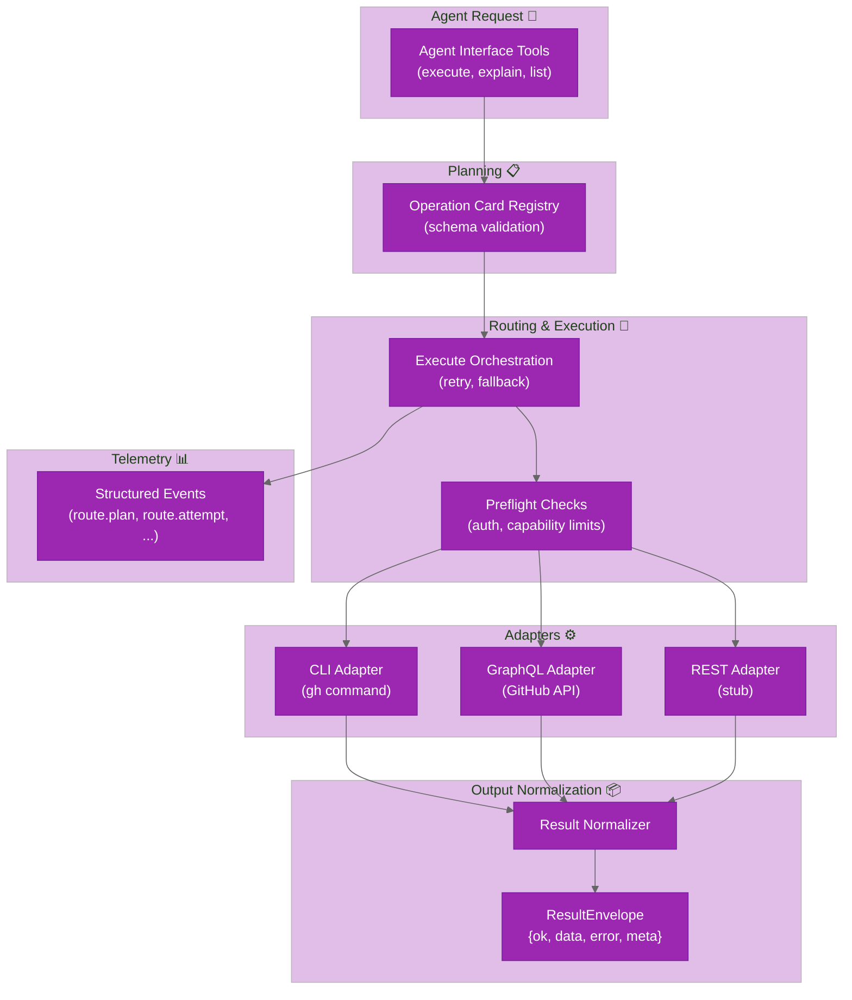

# System Design (v1)

`ghx` moves GitHub execution policy into deterministic runtime behavior.

## Goals

- stable capability contracts
- deterministic route planning and fallback
- normalized route-independent output
- benchmarkable reliability and efficiency

## Runtime Model

## Result Envelope

Every capability returns:

- `ok`: boolean
- `data`: normalized payload on success
- `error`: normalized error on failure
- `meta`: `capability_id`, `route_used`, `reason`, plus optional trace/timing fields

## Route Planning

- capability cards define preferred and fallback routes
- preflight checks gate route eligibility
- execute applies bounded retries for retryable errors
- fallback proceeds in deterministic card order

## Current Scope

- Repository + issue reads: `repo.view`, `issue.view`, `issue.list`, `issue.comments.list`
- Pull request reads: `pr.view`, `pr.list`, `pr.thread.list`, `pr.review.list`, `pr.diff.files`, `pr.diff.view`
- Pull request checks + mergeability: `pr.checks.list`, `pr.checks.failed`, `pr.merge.status`
- Pull request mutations: `pr.create`, `pr.update`, `pr.thread.reply`, `pr.thread.resolve`, `pr.thread.unresolve`, `pr.merge`, `pr.review.submit`, `pr.review.request`
- CI diagnostics/logs: `check_run.annotations.list`, `workflow.runs.list`, `workflow.job.logs.raw`, `workflow.job.logs.get`
- Route preferences are capability-specific and defined in cards (`preferred` + `fallbacks`), with REST still outside active routing for current capabilities

## Source References

- `packages/core/src/core/execute/execute.ts`
- `packages/core/src/core/registry/cards/*.yaml`
- `packages/core/src/core/contracts/envelope.ts`
- `packages/core/src/agent-interface/tools/`
