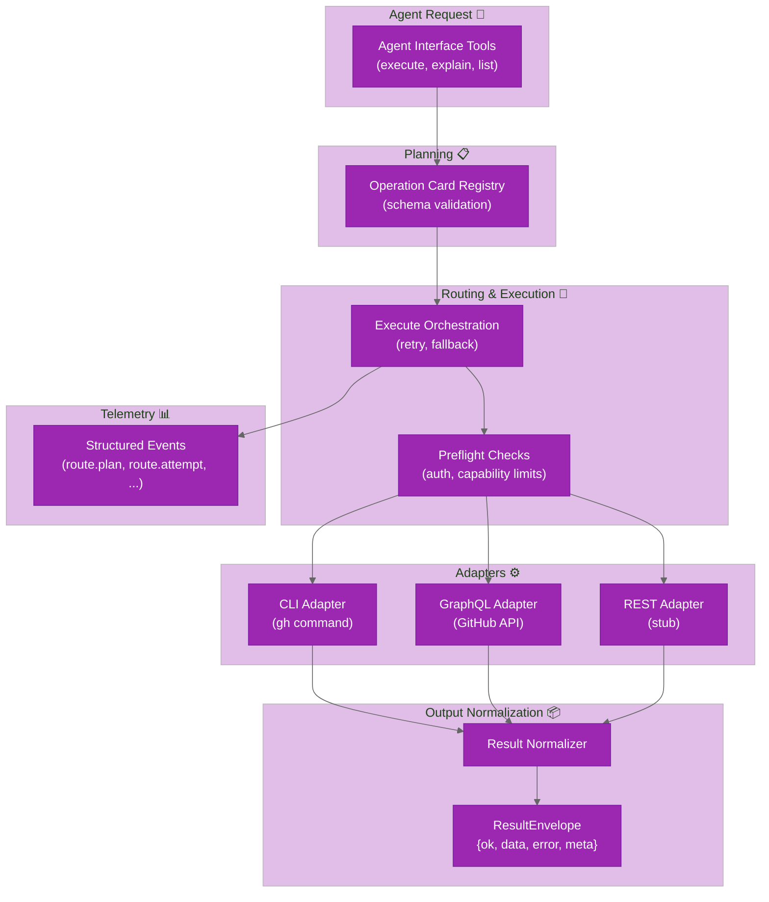

# System Design (v1)

`ghx` moves GitHub execution policy into deterministic runtime behavior.

## Goals

- stable capability contracts
- deterministic route planning and fallback
- normalized route-independent output
- benchmarkable reliability and efficiency

## Runtime Model

## Result Envelope

Every capability returns:

- `ok`: boolean
- `data`: normalized payload on success
- `error`: normalized error on failure
- `meta`: `capability_id`, `route_used`, `reason`, plus optional trace/timing fields

## Route Planning

- capability cards define preferred and fallback routes
- preflight checks gate route eligibility
- execute applies bounded retries for retryable errors
- fallback proceeds in deterministic card order

## Current Scope

69 capabilities (66 atomic + 3 composite) across 7 domains:

- **Issues** (21): view, list, create, update, close, reopen, delete, comment, label, assign, milestone, link, parent, block, relation, and 2 composite batch capabilities
- **Pull Requests** (22): view, list, create, update, thread operations, review operations, diff, checks, merge, branch update, and 1 composite batch capability
- **Workflows** (11): view, list, dispatch, run lifecycle, logs, cancel, rerun, artifacts
- **Releases** (5): get, list, create draft, publish draft, update
- **Repositories** (3): view, labels list, issue types list
- **Projects v2** (6): get, fields list, items list, add issue, update field
- **Check Runs** (1): annotations list

Composite capabilities batch multiple GraphQL mutations into a single network round-trip. Route preferences are capability-specific and defined in cards (`preferred` + `fallbacks`), with REST still outside active routing for current capabilities.

## Source References

- `packages/core/src/core/execute/execute.ts`
- `packages/core/src/core/registry/cards/*.yaml`
- `packages/core/src/core/contracts/envelope.ts`
- `packages/core/src/core/execute/execute-tool.ts`
- `packages/core/src/core/registry/list-capabilities.ts`
- `packages/core/src/core/registry/explain-capability.ts`
