# System Design (v1)

`ghx` moves GitHub execution policy into deterministic runtime behavior.

## Goals

- stable capability contracts
- deterministic route planning and fallback
- normalized route-independent output
- benchmarkable reliability and efficiency

## Runtime Model

```mermaid
%%{init: {'theme': 'base', 'themeVariables': {'primaryColor': '#9C27B0', 'primaryTextColor': '#fff', 'primaryBorderColor': '#7B1FA2', 'lineColor': '#666', 'secondaryColor': '#CE93D8', 'tertiaryColor': '#E1BEE7'}}}%%
flowchart TB
  subgraph Agent["Agent Request 🤖"]
    A["Agent Interface Tools<br/>(execute, explain, list)"]
  end

  subgraph Planning["Planning 📋"]
    B["Operation Card Registry<br/>(schema validation)"]
  end

  subgraph Engine["Routing & Execution 🔀"]
    C["Execute Orchestration<br/>(retry, fallback)"]
    D["Preflight Checks<br/>(auth, capability limits)"]
  end

  subgraph Adapters["Adapters ⚙️"]
    E["CLI Adapter<br/>(gh command)"]
    F["GraphQL Adapter<br/>(GitHub API)"]
    G["REST Adapter<br/>(stub)"]
  end

  subgraph Output["Output Normalization 📦"]
    H["Result Normalizer"]
    I["ResultEnvelope<br/>{ok, data, error, meta}"]
  end

  subgraph Meta["Telemetry 📊"]
    J["Structured Events<br/>(route.plan, route.attempt, ...)"]
  end

  A --> B
  B --> C
  C --> D
  D --> E
  D --> F
  D --> G
  E --> H
  F --> H
  G --> H
  H --> I
  C --> J

  subgraph "Atomic Chaining (2+ tasks)"
    EC["executeTasks()"] --> PF2["Pre-flight validation\n(all steps)"]
    PF2 -->|"any invalid"| REJ["Reject whole chain"]
    PF2 -->|"all valid"| P1["Phase 1 — batch resolution query\n≤1 HTTP round-trip"]
    P1 --> P2["Phase 2 — batch mutation\n≤1 HTTP round-trip"]
    P2 --> CR["ChainResultEnvelope\nstatus: success / partial / failed"]
  end
```

## Result Envelope

Every capability returns:

- `ok`: boolean
- `data`: normalized payload on success
- `error`: normalized error on failure
- `meta`: `capability_id`, `route_used`, `reason`, plus optional trace/timing fields

## Route Planning

- capability cards define preferred and fallback routes
- preflight checks gate route eligibility
- execute applies bounded retries for retryable errors
- fallback proceeds in deterministic card order

## Current Scope

70 capabilities across 7 domains:

- **Issues** (19): view, list, create, update, close, reopen, delete, comment, label, assign, milestone, link, parent, block, relation
- **Pull Requests** (21): view, list, create, update, thread operations, review operations, diff, checks, merge, branch update
- **Workflows** (11): view, list, dispatch, run lifecycle, logs, cancel, rerun, artifacts
- **Releases** (5): get, list, create draft, publish draft, update
- **Repositories** (3): view, labels list, issue types list
- **Projects v2** (6): get, fields list, items list, add issue, update field
- **Check Runs** (1): annotations list

Route preferences are capability-specific and defined in cards (`preferred` + `fallbacks`), with REST still outside active routing for current capabilities. For multi-capability mutations, use `executeTasks()` — it batches all resolution lookups into one Phase 1 query and all mutations into one Phase 2 mutation (≤2 HTTP round-trips for any chain length).

## Source References

- `packages/core/src/core/execute/execute.ts`
- `packages/core/src/core/routing/engine.ts` — `executeTask()`, `executeTasks()`
- `packages/core/src/core/registry/cards/*.yaml`
- `packages/core/src/core/contracts/envelope.ts` — `ChainResultEnvelope`, `ChainStepResult`, `ChainStatus`
- `packages/core/src/gql/document-registry.ts` — lookup & mutation document registry
- `packages/core/src/gql/resolve.ts` — resolution inject logic
- `packages/core/src/core/execute/execute-tool.ts`
- `packages/core/src/core/registry/list-capabilities.ts`
- `packages/core/src/core/registry/explain-capability.ts`
