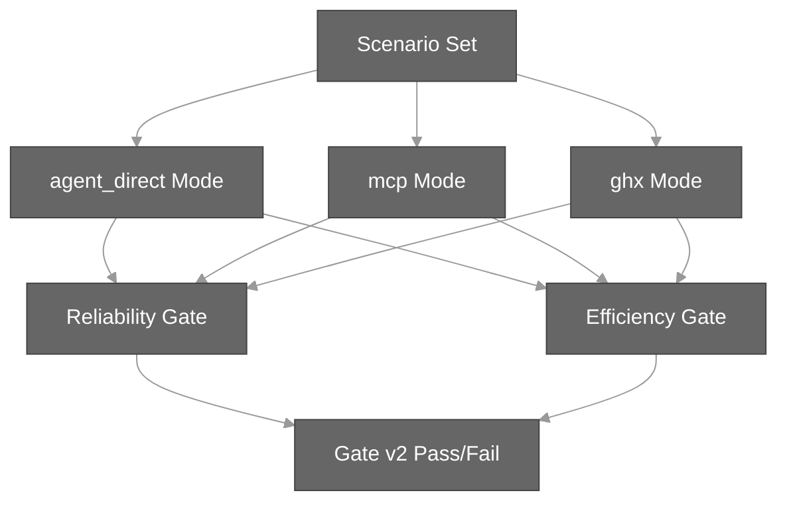

# Benchmark Documentation

The `ghx` benchmark harness measures the correctness, efficiency, and reliability of the routing engine compared to baseline execution modes. This hub guides you through benchmark concepts, execution, and scenario authoring.

## What the Benchmark Measures

The benchmark compares three execution modes:

- **`agent_direct`** — direct execution without routing (baseline)
- **`mcp`** — execution via MCP (future baseline)
- **`ghx`** — execution through the ghx routing engine

For each scenario, we measure:

- **Reliability:** success rate, output validity, runner failure rate, timeout/stall rate, retry rate
- **Efficiency:** token usage (active tokens), latency, tool calls, cost

The benchmark ensures that `ghx` routing does not degrade reliability while maintaining or improving efficiency.

## Execution Flow



## Documentation Map

| Topic | Purpose |
|-------|---------|
| [Methodology](./methodology.md) | Run controls, metric system, aggregation strategy, verify workflows |
| [Running Benchmarks](./running-benchmarks.md) | How to execute benchmarks locally and in CI, interpret results |
| [Scenario Authoring](./scenario-authoring.md) | How to write scenarios for new capabilities |
| [Metrics](./metrics.md) | Detailed definitions of reliability and efficiency metrics |
| [Efficiency Criteria](./efficiency-criteria.md) | Gate validation thresholds (`verify_pr`, `verify_release`) |
| [Scenario Assertions](./scenario-assertions.md) | Assertion schema and validation types |
| [Reporting](./reporting.md) | Summary artifacts, gate profiles, profiling snapshots |
| [Harness Design](./harness-design.md) | Internal harness architecture, extractors, security |

## Quick Start

### Prerequisites

- `opencode` CLI installed
- `GITHUB_TOKEN` set for GitHub API access
- `pnpm` and Node.js >=22

### Run a Quick PR Verification

```bash
# From repo root
pnpm run benchmark:verify:pr
```

This runs the lightweight `ci-verify-pr` scenario set (2 scenarios, 4 reps per mode) and reports gate status.

### Run Full Benchmarks

```bash
# Full scenario set
pnpm --filter @ghx-dev/benchmark run benchmark -- ghx 3 --scenario-set all

# With fixtures (for mutation scenarios)
pnpm --filter @ghx-dev/benchmark run suite:config -- \
  --out config/suite-runner.json \
  --scenario-set pr-exec \
  --repetitions 3 \
  --gate-profile verify_pr \
  --with-cleanup \
  --with-seed

pnpm --filter @ghx-dev/benchmark run suite:run -- --config config/suite-runner.json
```

## Key Concepts

### Scenario Sets

Predefined groups of scenarios organized by domain or gate profile:

- `ci-verify-pr` — lightweight PR gate (2 scenarios)
- `ci-verify-release` — release gate (5 scenarios)
- `pr-exec` — PR execution operations
- `issues` — issue mutations
- `workflows` — workflow operations
- `projects-v2` — Projects v2 API operations
- `release-delivery` — release operations
- `all` — union of all roadmap scenarios
- `full-seeded` — full coverage with sandbox fixtures

See `packages/benchmark/scenario-sets.json` for complete list.

### Fixture Bindings

Scenarios can bind input parameters to sandbox fixture data:

```json
{
  "fixture": {
    "repo": "aryeko/ghx-bench-fixtures",
    "bindings": {
      "input.owner": "repo.owner",
      "input.name": "repo.name",
      "input.prNumber": "resources.pr.number"
    }
  }
}
```

Requires seeding the fixture manifest first.

### Gate Profiles

Two validation profiles ensure different levels of confidence:

- **`verify_pr`** — faster PR validation (3pp success-rate tolerance, 15% efficiency threshold)
- **`verify_release`** — stricter release validation (1pp success-rate tolerance, 22% efficiency threshold)

See [Efficiency Criteria](./efficiency-criteria.md) for full thresholds.

## Outputs

- **JSONL rows:** `packages/benchmark/results/*.jsonl` (per-run metrics)
- **Machine summary:** `packages/benchmark/reports/latest-summary.json`
- **Human summary:** `packages/benchmark/reports/latest-summary.md`

## Next Steps

- **First time?** Start with [Running Benchmarks](./running-benchmarks.md).
- **Adding a capability?** See [Scenario Authoring](./scenario-authoring.md).
- **Understanding results?** Read [Metrics](./metrics.md) and [Reporting](./reporting.md).
- **Implementing the harness?** Check [Harness Design](./harness-design.md).
