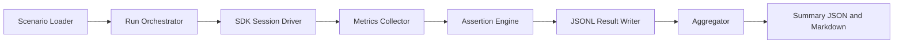

# Benchmark Harness Design

Defines benchmark runner architecture and data contracts for efficiency evaluation.

## Purpose

Provide a repeatable benchmark harness that compares `ghx_router` against baseline modes with consistent metadata and summary artifacts.

## Modes

- `agent_direct`
- `mcp` (when available)
- `ghx_router`

## High-Level Flow

## Core Components

### Scenario Loader

- Reads canonical scenarios from `packages/benchmark/scenarios/*.json`.
- Validates scenario schema before execution.

### Run Orchestrator

- Applies run mode and repetition count.
- Controls scenario order and reproducibility seed.

### SDK Session Driver

- Executes each scenario through OpenCode SDK session lifecycle.
- Captures assistant timing and token metadata when available.

### Assertion Engine

- Evaluates scenario success criteria.
- Records `success`, `output_valid`, and failure taxonomy.

### Reporter

- Aggregates medians and P90s.
- Writes `packages/benchmark/reports/latest-summary.json` and markdown summary.

## Result Row Contract

Each run writes one JSONL row with:

- scenario identity and iteration metadata
- mode, success, output validity
- latency/token/cost/tool-call measures
- optional normalized error payload

## Reliability Controls

- Fixed fixtures and model/provider per suite.
- Minimum 10 repetitions per scenario/mode.
- Logged metadata for commit, timestamp, and run seed.
- Bounded retries only for infrastructure failures.
