# Capabilities Reference

Welcome to ghx's comprehensive capabilities reference. These 66 capabilities form the
core of ghx's ability to automate GitHub workflows for AI agents.

Capabilities are organized by domain — from managing issues and pull requests to
orchestrating workflows and tracking projects.

## Capabilities by Domain

```mermaid
%%{init: {'theme': 'base', 'themeVariables': {'primaryColor': '#F5A623', 'primaryTextColor': '#fff', 'primaryBorderColor': '#D4891A', 'lineColor': '#666'}}}%%
graph TB
    Issues["Issues<br/>(19 capabilities)"]
    PRs["Pull Requests<br/>(22 capabilities)"]
    Releases["Releases<br/>(5 capabilities)"]
    Workflows["Workflows<br/>(12 capabilities)"]
    Repos["Repositories<br/>(3 capabilities)"]
    Projects["Projects V2<br/>(6 capabilities)"]
    CheckRuns["Check Runs<br/>(1 capability)"]

    style Issues fill:#F5A623
    style PRs fill:#F5A623
    style Releases fill:#F5A623
    style Workflows fill:#F5A623
    style Repos fill:#F5A623
    style Projects fill:#F5A623
    style CheckRuns fill:#F5A623
```



## Summary Table

| Capability ID | Description | Routes |
|---|---|---|
| **Issues (19)** |
| `issue.create` | Create a new issue. | graphql (preferred) |
| `issue.view` | Fetch one issue by number. | cli (preferred), graphql (fallback) |
| `issue.list` | List repository issues. | cli (preferred), graphql (fallback) |
| `issue.update` | Update issue title and/or body. | graphql (preferred) |
| `issue.close` | Close an issue. | graphql (preferred) |
| `issue.reopen` | Reopen a closed issue. | graphql (preferred) |
| `issue.delete` | Delete an issue. | graphql (preferred) |
| `issue.comments.create` | Create an issue comment. | graphql (preferred) |
| `issue.comments.list` | List comments for one issue. | graphql (preferred), cli (fallback) |
| `issue.labels.update` | Replace issue labels. | graphql (preferred) |
| `issue.labels.add` | Add labels to an issue without removing existing labels. | graphql (preferred) |
| `issue.assignees.update` | Replace issue assignees. | graphql (preferred) |
| `issue.milestone.set` | Set issue milestone number or clear with null. | graphql (preferred) |
| `issue.parent.set` | Set an issue parent relation. | graphql (preferred) |
| `issue.parent.remove` | Remove an issue parent relation. | graphql (preferred) |
| `issue.blocked_by.add` | Add a blocked-by relation for an issue. | graphql (preferred) |
| `issue.blocked_by.remove` | Remove a blocked-by relation for an issue. | graphql (preferred) |
| `issue.linked_prs.list` | List pull requests linked to an issue. | graphql (preferred) |
| `issue.relations.get` | Get issue parent/children/blocking relations. | graphql (preferred) |
| **Pull Requests (22)** |
| `pr.view` | Fetch one pull request by number. | cli (preferred), graphql (fallback) |
| `pr.list` | List repository pull requests. | cli (preferred), graphql (fallback) |
| `pr.merge.execute` | Execute a pull request merge. | cli (preferred) |
| `pr.branch.update` | Update pull request branch with latest base changes. | cli (preferred) |
| `pr.assignees.update` | Update pull request assignees. | cli (preferred) |
| `pr.comments.list` | List PR review threads with unresolved filtering. | graphql (preferred) |
| `pr.comment.reply` | Reply to a pull request review thread. | graphql (preferred) |
| `pr.comment.resolve` | Resolve a pull request review thread. | graphql (preferred) |
| `pr.comment.unresolve` | Unresolve a pull request review thread. | graphql (preferred) |
| `pr.reviews.list` | List pull request reviews. | graphql (preferred) |
| `pr.review.submit_approve` | Submit an approving pull request review. | cli (preferred) |
| `pr.review.submit_comment` | Submit a comment-only pull request review. | cli (preferred) |
| `pr.review.submit_request_changes` | Submit a PR review requesting changes. | cli (preferred) |
| `pr.reviewers.request` | Request pull request reviewers. | cli (preferred) |
| `pr.checks.get_failed` | List failed pull request checks. | cli (preferred) |
| `pr.checks.rerun_all` | Rerun all PR workflow checks for a selected run. | cli (preferred) |
| `pr.checks.rerun_failed` | Rerun failed PR workflow checks for a selected run. | cli (preferred) |
| `pr.diff.list_files` | List changed files in a pull request diff. | graphql (preferred) |
| `pr.diff.view` | View the unified diff for a pull request. | cli (preferred) |
| `pr.mergeability.view` | View PR mergeability and readiness signals. | cli (preferred) |
| `pr.ready_for_review.set` | Mark pull request as ready for review or draft. | cli (preferred) |
| `pr.status.checks` | List PR check statuses with summary counts. | cli (preferred) |
| **Releases (5)** |
| `release.create_draft` | Create a draft release. | cli (preferred) |
| `release.get` | Get release details by tag name. | cli (preferred) |
| `release.list` | List releases for a repository. | cli (preferred) |
| `release.publish_draft` | Publish an existing draft release. | cli (preferred) |
| `release.update` | Update a draft release without publishing it. | cli (preferred) |
| **Workflows (12)** |
| `workflow.list` | List repository workflows. | cli (preferred) |
| `workflow.get` | Get one repository workflow. | cli (preferred) |
| `workflow.dispatch.run` | Trigger a workflow dispatch event. | cli (preferred) |
| `workflow.runs.list` | List workflow runs for a repository. | cli (preferred) |
| `workflow.run.view` | View a workflow run with its jobs. | cli (preferred) |
| `workflow.run.cancel` | Cancel a workflow run. | cli (preferred) |
| `workflow.run.rerun_all` | Rerun all jobs in a workflow run. | cli (preferred) |
| `workflow.run.rerun_failed` | Rerun failed jobs for a workflow run. | cli (preferred) |
| `workflow.run.artifacts.list` | List artifacts for a workflow run. | cli (preferred) |
| `workflow.job.logs.raw` | Fetch raw (unprocessed) logs for a workflow job. | cli (preferred) |
| `workflow.job.logs.get` | Fetch and analyze workflow job logs. | cli (preferred) |
| **Repositories (3)** |
| `repo.view` | Fetch repository metadata. | cli (preferred), graphql (fallback) |
| `repo.labels.list` | List repository labels. | cli (preferred) |
| `repo.issue_types.list` | List repository issue types. | cli (preferred) |
| **Projects V2 (6)** |
| `project_v2.org.get` | Get an organization Projects v2 project. | cli (preferred) |
| `project_v2.user.get` | Get a user Projects v2 project. | cli (preferred) |
| `project_v2.fields.list` | List fields for a Projects v2 project. | cli (preferred) |
| `project_v2.items.list` | List items in a Projects v2 project. | cli (preferred) |
| `project_v2.item.add_issue` | Add an issue to a Projects v2 project. | cli (preferred) |
| `project_v2.item.field.update` | Update a field on a Projects v2 project item. | cli (preferred) |
| **Check Runs (1)** |
| `check_run.annotations.list` | List annotations for one check run. | cli (preferred) |

## Domain Documentation

- [Issues](/docs/capabilities/issues.md) — Issue CRUD, comments, labels, assignees, milestones,
  and relations (parent/children/blocking).

- [Pull Requests](/docs/capabilities/pull-requests.md) — PR CRUD, comments, reviews, merge
  execution, checks, and status signals.

- [Releases](/docs/capabilities/releases.md) — Release lifecycle (create draft, update,
  publish, list, get).

- [Workflows](/docs/capabilities/workflows.md) — Workflow management, dispatch, runs, jobs,
  logs, and artifacts.

- [Repositories](/docs/capabilities/repositories.md) — Repository metadata, labels, and
  issue type configuration.

- [Projects V2](/docs/capabilities/projects.md) — Project discovery, field management, item
  tracking, and field updates.

- [Check Runs](/docs/capabilities/check-runs.md) — Check run annotation inspection.

## Usage

All capabilities can be invoked via the ghx CLI:

```bash
npx ghx run <capability_id> --input '<json_input>'
```

Each capability defines:
- **Input schema** — required and optional fields with type constraints.
- **Output schema** — response shape with field definitions.
- **Routes** — preferred and fallback execution paths (CLI, GraphQL).

See individual domain files for detailed input/output specifications and examples.
