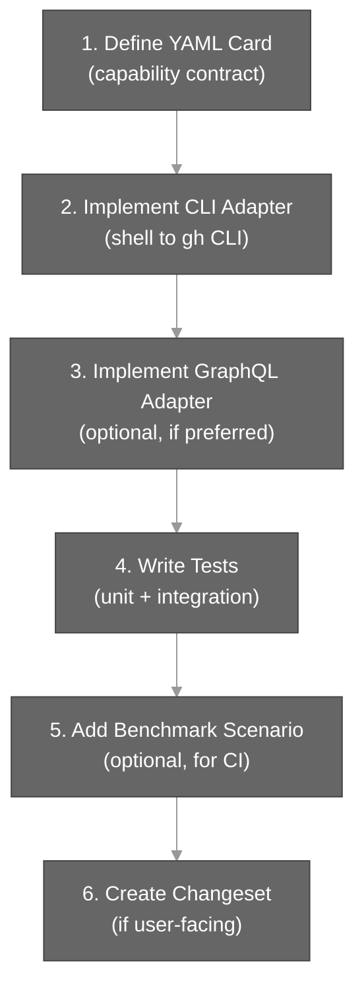

# Adding a Capability

This guide walks through adding a new operation to ghx. A capability is a self-contained GitHub action with input/output validation, routing logic, and test coverage.

## Overview



## Step 1: Define the Operation Card

Create a new YAML file in `packages/core/src/core/registry/cards/` named after your capability.

**Naming convention:** `{resource}.{action}.{variant?}.yaml`

Examples:
- `issue.create.yaml`
- `pr.review.submit.yaml`
- `workflow.run.rerun.failed.yaml`

### YAML Card Structure

```yaml
capability_id: issue.create
version: "1.0.0"
description: Create a new issue.
input_schema:
  type: object
  required: [owner, name, title]
  properties:
    owner: { type: string, minLength: 1 }
    name: { type: string, minLength: 1 }
    title: { type: string, minLength: 1 }
    body: { type: string }
  additionalProperties: false
output_schema:
  type: object
  required: [id, number]
  properties:
    id: { type: string, minLength: 1 }
    number: { type: integer, minimum: 1 }
    title: { type: string }
    state: { type: string }
    url: { type: string, minLength: 1 }
  additionalProperties: false
routing:
  preferred: graphql
  fallbacks: []
graphql:
  operationName: IssueCreate
  documentPath: src/gql/operations/issue-create.graphql
```

### Key Fields

- **capability_id:** Unique identifier for the operation (kebab-case hierarchy)
- **version:** Semantic version of the card
- **description:** User-facing description
- **input_schema:** JSON schema for input validation (uses AJV)
- **output_schema:** JSON schema for response validation
- **routing.preferred:** Primary adapter route (`cli` or `graphql`)
- **routing.fallbacks:** Fallback adapters if preferred fails
- **cli:** Optional CLI adapter configuration (command and flag mapping)
- **graphql:** Optional GraphQL adapter configuration (operation name and document path)

## Step 2: Implement the CLI Adapter

The CLI adapter shells out to the `gh` CLI for execution. Implement the adapter method in the CLI capability adapter.

**Location:** `packages/core/src/core/execution/adapters/cli-capability-adapter.ts`

### Example Implementation

```typescript
async case "issue.create": {
  const { owner, name, title, body } = input as IssueCreateInput
  const args = [
    "gh", "issue", "create",
    "--repo", `${owner}/${name}`,
    "--title", title,
  ]
  if (body) {
    args.push("--body", body)
  }
  const { stdout } = await this.exec(args.join(" "))
  // Parse gh CLI JSON output
  return { id: result.id, number: result.number, ... }
}
```

**Guidelines:**
- Use the `gh` CLI for all operations
- Build command arguments from validated input
- Parse `gh` CLI output (JSON where available)
- Return data matching the output schema
- Throw errors that `mapErrorToCode` can handle

## Step 3: Implement the GraphQL Adapter (Optional)

If the operation has a preferred `graphql` routing, implement the GraphQL adapter.

**Steps:**

1. **Define a GraphQL operation** at `packages/core/src/gql/operations/{capability-id}.graphql`

   ```graphql
   mutation IssueCreate(
     $owner: String!
     $name: String!
     $title: String!
     $body: String
   ) {
     createIssue(
       input: {
         repositoryId: $repositoryId
         title: $title
         body: $body
       }
     ) {
       issue {
         id
         number
         title
         state
         url
       }
     }
   }
   ```

2. **Regenerate GraphQL types**

   ```bash
   pnpm run ghx:gql:check
   ```

3. **Implement the GraphQL adapter** in `packages/core/src/core/execution/adapters/graphql-capability-adapter.ts`

   ```typescript
   async case "issue.create": {
     const { owner, name, title, body } = input as IssueCreateInput
     const result = await this.executeOperation<IssueCreateMutation>(
       "IssueCreate",
       { owner, name, title, body }
     )
     return result.createIssue.issue
   }
   ```

**Guidelines:**
- GraphQL operations are in `src/gql/operations/*.graphql`
- Generated types live in `src/gql/generated/**` (auto-updated via codegen)
- Return data matching the output schema
- Use the `executeOperation` helper for type-safe queries

## Step 4: Write Tests

Create unit and integration tests. Test files go in `test/unit/` with the naming convention `*.test.ts`.

### Test Structure

```typescript
describe("issue.create", () => {
  describe("validation", () => {
    it("accepts valid input", async () => {
      const result = await execute({
        task: "issue.create",
        input: {
          owner: "aryeko",
          name: "ghx",
          title: "New capability",
          body: "Test issue"
        }
      })
      expect(result.ok).toBe(true)
      expect(result.data).toHaveProperty("id")
      expect(result.data).toHaveProperty("number")
    })

    it("rejects missing required fields", async () => {
      const result = await execute({
        task: "issue.create",
        input: { owner: "aryeko" }  // missing name and title
      })
      expect(result.ok).toBe(false)
      expect(result.error).toMatch(/validation/)
    })
  })

  describe("execution", () => {
    it("creates an issue and returns metadata", async () => {
      // Mock gh CLI or GraphQL response
      const result = await execute({ /* ... */ })
      expect(result.data.number).toBeGreaterThan(0)
      expect(result.meta).toBeDefined()
    })
  })
})
```

### Test Coverage

- **Input validation:** Required fields, type checks, constraints
- **Error handling:** Missing fields, network errors, auth errors
- **Output shape:** All required fields present, correct types
- **Envelope structure:** All operations return `{ ok, data?, error?, meta? }`

Aim for **≥90% coverage** of the capability (our target is 95%).

## Step 5: Add Benchmark Scenario (Optional)

Add a scenario JSON file to `packages/benchmark/scenarios/` for CI benchmarking.

### Scenario File Structure

```json
{
  "id": "issue-create-001",
  "name": "Create issue with title and body",
  "task": "issue.create",
  "input": {
    "owner": "OWNER_PLACEHOLDER",
    "name": "REPO_PLACEHOLDER",
    "title": "Batch B create issue",
    "body": "Created by benchmark scenario"
  },
  "prompt_template": "Execute task {{task}} using input {{input_json}}. Return only valid JSON matching this envelope: {\"ok\": boolean, \"data\": any, \"error\": object|null, \"meta\": object}.",
  "timeout_ms": 60000,
  "allowed_retries": 0,
  "assertions": {
    "require_tool_calls": true,
    "min_tool_calls": 1,
    "required_fields": ["ok", "data", "error", "meta"],
    "expected_outcome": "success"
  },
  "tags": ["roadmap", "issues", "issue", "mutation"],
  "fixture": {
    "repo": "aryeko/ghx-bench-fixtures",
    "bindings": {
      "input.owner": "repo.owner",
      "input.name": "repo.name"
    }
  }
}
```

### Key Fields

- **id:** Unique scenario identifier
- **name:** Human-readable scenario name
- **task:** Capability ID to test
- **input:** Sample input for the operation
- **assertions:** Validation rules for the response
- **tags:** Metadata for grouping and filtering scenarios
- **fixture:** Optional test data bindings

**Guidelines:**
- Use placeholders (`OWNER_PLACEHOLDER`, `REPO_PLACEHOLDER`) for dynamic values
- Bind inputs to the fixture repo (`aryeko/ghx-bench-fixtures`)
- Set realistic `timeout_ms` and `allowed_retries`
- Define assertions for output structure

## Step 6: Create a Changeset

If the capability is user-facing, create a changeset:

```bash
pnpm run changeset
```

Select `@ghx-dev/core` and choose the appropriate release type:
- **patch** – bug fixes, minor enhancements
- **minor** – new capabilities, backward-compatible features
- **major** – breaking changes

### Changeset Format

```markdown
---
"@ghx-dev/core": minor
---

Add `issue.create` capability for creating GitHub issues with title, body, and labels.
```

## Validation Checklist

Before submitting a PR:

- [ ] YAML card is valid and follows naming conventions
- [ ] CLI adapter implemented and tested
- [ ] GraphQL adapter implemented (if preferred routing is GraphQL)
- [ ] Tests cover ≥90% of the capability
- [ ] Tests include validation, error, and happy-path cases
- [ ] Benchmark scenario added (if integration-testing is needed)
- [ ] Changeset created (if user-facing)
- [ ] `pnpm run ci` passes
- [ ] `pnpm run ghx:gql:check` passes (if GraphQL changes made)
- [ ] Affected tests pass: `pnpm --filter @ghx-dev/core run test`

## Complete Example

### 1. YAML Card (`issue.create.yaml`)

```yaml
capability_id: issue.create
version: "1.0.0"
description: Create a new issue.
input_schema:
  type: object
  required: [owner, name, title]
  properties:
    owner: { type: string }
    name: { type: string }
    title: { type: string }
    body: { type: string }
  additionalProperties: false
output_schema:
  type: object
  required: [id, number]
  properties:
    id: { type: string }
    number: { type: integer }
routing:
  preferred: graphql
  fallbacks: []
graphql:
  operationName: IssueCreate
  documentPath: src/gql/operations/issue-create.graphql
```

### 2. Test File (`issue-create.test.ts`)

```typescript
import { describe, it, expect } from "vitest"
import { execute } from "../index.js"

describe("issue.create", () => {
  it("creates an issue", async () => {
    const result = await execute({
      task: "issue.create",
      input: {
        owner: "aryeko",
        name: "ghx",
        title: "Test issue"
      }
    })
    expect(result.ok).toBe(true)
    expect(result.data?.number).toBeGreaterThan(0)
  })
})
```

### 3. Benchmark Scenario (`issue-create-001.json`)

```json
{
  "id": "issue-create-001",
  "name": "Create issue",
  "task": "issue.create",
  "input": {
    "owner": "OWNER_PLACEHOLDER",
    "name": "REPO_PLACEHOLDER",
    "title": "Test"
  },
  "assertions": {
    "expected_outcome": "success"
  },
  "fixture": {
    "repo": "aryeko/ghx-bench-fixtures",
    "bindings": {
      "input.owner": "repo.owner",
      "input.name": "repo.name"
    }
  }
}
```

## Next Steps

- **Code Style:** See [Code Style](./code-style.md) for formatting and naming conventions
- **Testing Guide:** See [Testing Guide](./testing-guide.md) for writing better tests
- **Publishing:** See [Publishing](./publishing.md) for creating changesets and releases
