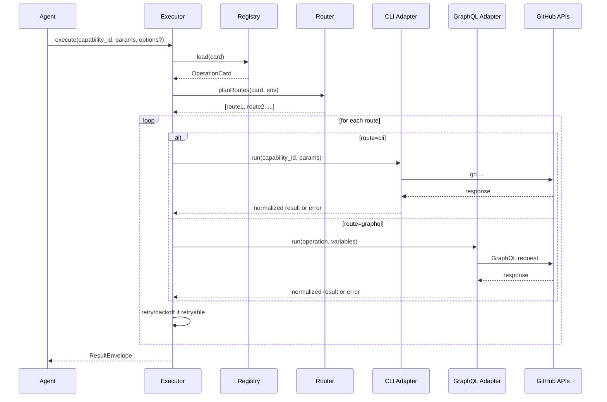

# Agentic Interface Design Spec (ghx)

**Status:** Draft  
**Audience:** Runtime/tooling engineers, agent prompt designers  
**Primary objective:** Minimize token/context cost for GitHub operations by replacing per-request schema/CLI-doc fetching with typed adapters + a small stable “main skill” and on-demand operation cards.

---

## 1) Background and Motivation

Agents interacting with GitHub frequently waste tokens by:
- Pulling `gh` CLI help/docs for every operation.
- Pulling and re-describing GitHub GraphQL schema for every operation.

This causes:
- High context/token cost.
- Fragility: hallucinated flags/fields, inconsistent output, poor retry behavior.
- Poor extensibility: each new operation requires “teaching” the agent again.

This design introduces a **runtime-mediated interface** where:
- The agent uses **one stable tool entrypoint** (`execute`) and **never fetches docs/schema**.
- The runtime uses **typed GraphQL operations** and **structured gh CLI wrappers**.
- Per-operation specifics are stored as **Operation Cards** (dynamic sub-skills) loaded only when needed.

---

## 2) Goals, Non-goals, and Success Metrics

### Goals
1. **Token efficiency:** remove schema/CLI-doc injection from standard flows.
2. **Reliability:** deterministic routing and typed I/O reduce errors.
3. **Extensibility:** adding a capability should not require large prompt updates.
4. **Observability:** route selection, retries, and failures are inspectable.
5. **Consistency:** single normalized envelope output across routes.

### Non-goals
- Replacing GitHub UI or providing full GitHub automation.
- A prompt-only documentation solution.
- Supporting *all* GitHub endpoints from day one.

### Success metrics
- ≥70% reduction in average tokens per operation compared to “fetch docs/schema” baseline.
- ≥95% pass rate on benchmark scenarios for supported capabilities.
- Stable output envelope; <1% schema/shape drift regressions after CI.
- Bounded tool calls per scenario (median ≤2, p95 ≤4 for read operations).

---

## 3) Definitions

- **Capability:** A named operation the agent can request (e.g., `issue.view`, `pr.list`).
- **Route:** An implementation channel for a capability:
  - `cli` (gh CLI)
  - `graphql` (typed GraphQL client)
  - `rest` (optional, via REST client if needed)
- **Operation Card:** A small machine-readable “sub-skill” describing how to execute a capability (inputs/outputs, preferred routes, fallbacks).
- **Main Skill:** A short, stable instruction set embedded into agent context describing the interface and rules.

---

## 4) High-level Architecture

### Component diagram

```mermaid
flowchart LR
  A[Agent] -->|execute(capability_id, params)| T[Agentic Tool Surface]
  T --> X[Executor]
  X --> R[Router]
  R --> C[(Operation Registry)]
  X --> G[GraphQL Adapter (typed)]
  X --> H[CLI Adapter (gh)]
  G --> GHQ[GitHub GraphQL API]
  H --> GHC[gh CLI -> GitHub API]
  X --> O[Telemetry/Logs]
  X --> B[Benchmark Harness]
```

### Sequence flow (execute)



---

## 5) Agentic Interface

### 5.1 Tools (minimal recommended surface)

1) **execute**
- Purpose: route + run capability + normalize result + handle fallbacks/retries.
- Signature (conceptual):
  - `execute(capability_id: string, params: object, options?: ExecuteOptions): ResultEnvelope`

2) **explain** (optional but strongly recommended)
- Purpose: return compact operation-card summary for the agent (50–200 tokens).
- Signature:
  - `explain(capability_id: string): OperationCardSummary`

3) **list_capabilities** (optional)
- Purpose: return IDs + short descriptions.

> Note: In the leanest configuration, `execute` is sufficient and `explain` can be used only for debugging or missing param discovery.

### 5.2 Main Skill (stable prompt content)

**Policy:** the agent MUST NOT fetch GraphQL schema nor `gh help`.  
**Mechanism:** always use `execute` (and `explain` if needed).

**Recommended main-skill text (template):**
- Use `execute(capability_id, params)` for all GitHub actions.
- Never call `gh help`, never fetch schema/introspection.
- If you do not know required params, call `explain(capability_id)` or ask the user.
- Treat `ResultEnvelope.ok=false` as failure; if `retryable=true` you may retry once unless the user requests otherwise.
- Only reason about `ResultEnvelope.data` or `ResultEnvelope.error`, not raw adapter outputs.

---

## 6) Operation Cards (“Dynamic Sub-skills”)

### 6.1 Why operation cards
Operation cards are compact, structured and **loaded at runtime**. They replace:
- “Context 7” style giant docs injected into prompts.
- “One skill per operation” explosion.

They enable:
- One global main-skill + small on-demand details per operation.
- Registry-driven routing with deterministic policy.

### 6.2 Card lifecycle
- Cards live in the repo under `packages/core/src/core/registry/cards/`.
- `execute` loads the card by `capability_id`.
- `explain` returns a compact summary derived from the card.
- Benchmarks validate card correctness (inputs/outputs) and route behavior.

### 6.3 OperationCard schema (TypeScript)

```ts
export type RouteType = "cli" | "graphql" | "rest";

export type RouteReason =
  | "CARD_PREFERRED"
  | "CARD_FALLBACK"
  | "PREFLIGHT_FAILED"
  | "ENV_CONSTRAINT"
  | "CAPABILITY_LIMIT"
  | "DEFAULT_POLICY";

export interface OperationCard<Input = any, Output = any> {
  capability_id: string;
  version: string;                 // bump on breaking changes to inputs/outputs
  description: string;

  // Input contract for the agent/runtime boundary
  input_schema: JsonSchema;        // JSON Schema Draft 2020-12 or equivalent
  output_schema: JsonSchema;       // normalized output schema

  routing: {
    preferred: RouteType;
    fallbacks: RouteType[];        // ordered
    // Optional deterministic suitability checks (implemented in code)
    suitability?: SuitabilityRule[];
    // Optional notes surfaced in explain()
    notes?: string[];
  };

  graphql?: {
    operationName: string;
    documentPath: string;          // e.g. operations/IssueView.graphql
    // Map from Input -> GraphQL variables (can be implicit by naming convention)
    variables?: Record<string, string>;
    // Optional constraints (page size limits, etc.)
    limits?: { maxPageSize?: number };
  };

  cli?: {
    command: string;               // gh subcommand, e.g. "issue view"
    // Structured execution settings; no shell templates exposed to agent
    jsonFields?: string[];         // for --json
    jq?: string;                   // for --jq (optional)
    // Optional constraints
    limits?: { maxItemsPerCall?: number };
  };

  rest?: {
    // Optional future extension
    endpoints: Array<{ method: string; path: string }>;
  };

  examples?: Array<{
    title: string;
    input: Input;
    // output omitted or truncated
  }>;
}

export interface SuitabilityRule {
  when: "always" | "env" | "params";
  // A small DSL evaluated by router/preflight (not by the agent)
  predicate: string;
  reason: string;
}
```

### 6.4 OperationCard JSON Schema (simplified)
(Use Draft 2020-12 if possible; below is abbreviated.)

```json
{
  "$id": "https://example.local/schemas/operation-card.json",
  "type": "object",
  "required": ["capability_id", "version", "description", "input_schema", "output_schema", "routing"],
  "properties": {
    "capability_id": { "type": "string" },
    "version": { "type": "string" },
    "description": { "type": "string" },
    "input_schema": { "type": "object" },
    "output_schema": { "type": "object" },
    "routing": {
      "type": "object",
      "required": ["preferred", "fallbacks"],
      "properties": {
        "preferred": { "enum": ["cli", "graphql", "rest"] },
        "fallbacks": {
          "type": "array",
          "items": { "enum": ["cli", "graphql", "rest"] }
        },
        "notes": { "type": "array", "items": { "type": "string" } }
      }
    },
    "graphql": { "type": "object" },
    "cli": { "type": "object" },
    "rest": { "type": "object" },
    "examples": { "type": "array" }
  }
}
```

---

## 7) Router and Execution Semantics

### 7.1 Routing principles
- Route selection is deterministic and based on:
  1) operation card preference + fallbacks
  2) preflight (auth/tool availability)
  3) capability constraints (pagination limits, required fields)
  4) environment constraints (no token, offline, etc.)

The agent is NOT responsible for route selection.

### 7.2 Preflight checks
- CLI preflight:
  - `gh` binary exists
  - `gh auth status` returns authenticated
  - optional: required scopes per capability
- GraphQL preflight:
  - token present
  - endpoint reachable (optional)
- REST preflight:
  - token/scopes present

If preflight fails for a route, router skips to next fallback.

### 7.3 Retry and fallback policy
Errors are normalized into a taxonomy with retryability.

- Retryable error classes:
  - `NETWORK`, `RATE_LIMIT`, selected `SERVER`
- Non-retryable:
  - `AUTH`, `VALIDATION`, `NOT_FOUND` (usually)

Fallback triggers:
- preflight failure
- non-retryable adapter limitation (e.g., CLI lacks field)
- persistent retryable failure after backoff budget

### 7.4 Execution flow

```mermaid
flowchart TD
  A[execute(capability_id, params)] --> B[Load Card]
  B --> C[Validate params against input_schema]
  C --> D[Plan route order: preferred + fallbacks]
  D --> E{Attempt route}
  E -->|success| Z[Return ok envelope]
  E -->|retryable| RB[Backoff + retry budget] --> E
  E -->|non-retryable| F{More routes?}
  F -->|yes| E2{Attempt next route}
  E2 -->|success| Z
  E2 -->|fail| F2{More routes?}
  F2 -->|no| X[Return error envelope]
```

---

## 8) Output Envelope and Error Taxonomy

### 8.1 ResultEnvelope (TypeScript)

```ts
export type ErrorCode =
  | "AUTH"
  | "NOT_FOUND"
  | "VALIDATION"
  | "RATE_LIMIT"
  | "NETWORK"
  | "SERVER"
  | "ADAPTER_UNSUPPORTED"
  | "UNKNOWN";

export interface ResultError {
  code: ErrorCode;
  message: string;
  retryable: boolean;
  details?: Record<string, unknown>;
}

export interface AttemptMeta {
  route: "cli" | "graphql" | "rest";
  status: "success" | "error" | "skipped";
  error_code?: ErrorCode;
  duration_ms?: number;
}

export interface ResultMeta {
  capability_id: string;
  route_used?: "cli" | "graphql" | "rest";
  reason?: string; // or RouteReason enum
  attempts?: AttemptMeta[]; // included when trace=true
  pagination?: { has_next_page?: boolean; end_cursor?: string; next?: unknown };
  timings?: { total_ms?: number; adapter_ms?: number };
  cost?: { tokens_in?: number; tokens_out?: number };
}

export interface ResultEnvelope<T = unknown> {
  ok: boolean;
  data?: T;
  error?: ResultError;
  meta: ResultMeta;
}
```

### 8.2 Normalization rules
- Adapters must return either:
  - normalized `data` matching `output_schema`
  - or `ResultError`
- Raw API payloads are never surfaced to the agent by default.
- `trace=true` includes attempt details, not raw payloads.

---

## 9) Typed GraphQL Adapter

### 9.1 Schema and codegen
- Pin GitHub GraphQL schema (introspection JSON) in-repo.
- Generate typed client and operation types via GraphQL codegen in CI.
- Operation documents stored as `.graphql` files, each mapped from cards.

### 9.2 Field minimization
Each operation queries only fields required for the normalized output.

### 9.3 Operation mapping
Cards reference:
- `operationName`
- `documentPath`
- optional `variables` mapping

The executor uses these references to run the correct typed method.

---

## 10) gh CLI Adapter

### 10.1 Strategy
- Prefer `--json` output for structured data.
- Use `--jq` to post-process when required (keep jq short and internal).
- Use spawn with args array; never string shell interpolation.

### 10.2 Structured wrapper pattern
Each CLI capability is a function that:
1) validates inputs
2) builds argv
3) runs `gh`
4) parses JSON
5) maps to normalized output shape

---

## 11) File Structure (Repo-ready)

```
ghx/
  docs/
    design/
      agentic-interface.md       # THIS DOCUMENT
  packages/
    core/
      src/
        envelope/
          ResultEnvelope.ts
          errors.ts
          normalize.ts
        registry/
          index.ts
          types.ts
          cards/
            issue.view.yaml
            issue.list.yaml
            pr.view.yaml
            pr.list.yaml
            repo.view.yaml
        routing/
          router.ts
          preflight.ts
          retry.ts
        execute/
          execute.ts
    adapters/
      graphql/
        schema/github-schema.json
        src/
          client.ts
          operations/
            IssueView.graphql
            IssueList.graphql
            PrView.graphql
            PrList.graphql
            RepoView.graphql
          generated/
      cli/
        src/
          gh.ts
          commands/
            issueView.ts
            issueList.ts
            prView.ts
            prList.ts
            repoView.ts
          preflight.ts
    agent-interface/
      src/
        tools/
          executeTool.ts
          explainTool.ts
          listCapabilitiesTool.ts
        prompt/
          mainSkill.ts
    benchmark/
      src/
        scenarios/
        validators/
        runner.ts
        report.ts
```

---

## 12) Benchmarks and CI

### 12.1 Scenario format
Each scenario should define:
- capability id
- input params
- expected shape assertions (not full snapshots)
- route expectations (optional)
- cost/tool-call limits (optional)

### 12.2 Validators
- Output schema validation
- Required tool calls (if relevant)
- Pagination behavior
- Error code correctness

### 12.3 CI checks
- `pnpm run ci:affected` on pull requests
- `pnpm run ci` on main
- `pnpm run ghx:gql:check` (codegen drift)
- `pnpm run benchmark:check` (scenario validation)
- coverage upload via Codecov with project and patch thresholds

---

## 13) Security Considerations

- Tokens are never embedded in prompt context.
- CLI execution uses safe process spawning.
- Output redaction: never return headers, tokens, or full raw API payloads by default.

---

## 14) Rollout Plan

1) Implement envelope + error taxonomy in `core`.
2) Add initial thin-slice capabilities: `repo.view`, `issue.view/list`, `pr.view/list`.
3) Implement typed GraphQL adapter for those operations.
4) Implement CLI wrappers for same operations using `gh --json`.
5) Add cards and router/fallback logic.
6) Benchmark for token/cost and correctness.
7) Expand capabilities incrementally.

---

## Appendix A: Example Operation Card (YAML)

```yaml
capability_id: issue.view
version: "1.0.0"
description: "Fetch a single issue by number with core fields."
input_schema:
  type: object
  required: [owner, repo, issue_number]
  properties:
    owner: { type: string }
    repo: { type: string }
    issue_number: { type: integer, minimum: 1 }
output_schema:
  type: object
  required: [id, number, title, state, url]
  properties:
    id: { type: string }
    number: { type: integer }
    title: { type: string }
    state: { type: string }
    url: { type: string }
routing:
  preferred: graphql
  fallbacks: [cli]
  notes:
    - "Use GraphQL for precise fields; fallback to gh CLI if GraphQL token missing."
graphql:
  operationName: IssueView
  documentPath: packages/adapters/graphql/src/operations/IssueView.graphql
cli:
  command: "issue view"
  jsonFields: ["id","number","title","state","url"]
examples:
  - title: "Basic issue view"
    input: { owner: "octocat", repo: "hello-world", issue_number: 123 }
```

---

## Appendix B: Explain() Output Shape (compact)

`explain(capability_id)` SHOULD return:
- capability id + one-line purpose
- required inputs
- route preference and fallback
- output fields list (core)

No long prose; keep it small.
