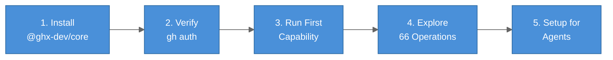

# Getting Started with ghx

ghx brings **typed, deterministic GitHub operations** to your project or agent. This guide walks you
through installation, your first capability execution, and agent setup.



## Prerequisites

Before you begin:

- **Node.js 22+** — Check with `node --version`
- **`gh` CLI installed** — [Install guide](https://cli.github.com/)
- **`gh` authenticated** — Run `gh auth status` (shows "Logged in to github.com")
- **GitHub token** (optional) — Environment variable `GITHUB_TOKEN` or `GH_TOKEN`

## Step 1: Installation

Install ghx in your project or globally:

```bash
# In a project (npm, pnpm, yarn)
npm install @ghx-dev/core

# Or with pnpm
pnpm add @ghx-dev/core

# Or yarn
yarn add @ghx-dev/core

# Or install globally
npm install -g @ghx-dev/core
```

Verify installation:

```bash
npx ghx --version
# or if installed globally:
ghx --version
```

## Step 2: Verify gh Authentication

ghx requires `gh` to be authenticated:

```bash
gh auth status
# Output: Logged in to github.com as <username> (...)
```

If you see an error, authenticate:

```bash
gh auth login
```

## Step 3: List Available Capabilities

See all 66 capabilities ghx provides:

```bash
npx ghx capabilities list
```

Output groups capabilities by domain:

```text
Repository (3)
├─ repo.view
├─ repo.labels.list
└─ repo.issue_types.list

Issues (18)
├─ issue.view
├─ issue.create
├─ issue.update
...

Pull Requests (21)
├─ pr.view
├─ pr.list
├─ pr.merge.execute
...
```

## Step 4: Run Your First Capability

Execute a simple capability to fetch a repository:

```bash
npx ghx run repo.view --input '{"owner":"aryeko","name":"ghx"}'
```

You should see:

```json
{
  "ok": true,
  "data": {
    "id": "R_kgDOOx...",
    "name": "ghx",
    "nameWithOwner": "aryeko/ghx",
    "description": "Typed GitHub execution router for AI agents",
    "url": "https://github.com/aryeko/ghx"
  },
  "error": null,
  "meta": {
    "capability_id": "repo.view",
    "route_used": "cli",
    "reason": "CARD_PREFERRED"
  }
}
```

Every capability returns this stable envelope: `ok`, `data`, `error`, `meta`.

## Step 5: Understand a Capability Contract

Before using a new capability, check its input/output schema:

```bash
npx ghx capabilities explain repo.view
```

Output shows:

- Purpose description
- Required and optional input fields with types
- Output data shape
- Example usage

Example:

```bash
npx ghx capabilities explain issue.create
```

Shows that `issue.create` needs:

- `owner` (string)
- `repo` (string)
- `title` (string)
- `body` (optional string)
- `labels` (optional array)
- `assignees` (optional array)

## Next Steps

- **[Full Installation Guide](installation.md)** — Prerequisites, package managers, environment setup
- **[First Task Tutorial](first-task.md)** — Build a complete workflow (create, update, list)
- **[Agent Setup Guide](setup-for-agents.md)** — Install ghx skill for coding agents
- **[How ghx Works](how-it-works.md)** — Understand routing, execution, and result envelopes

## Common Patterns

### Check if a Capability Succeeded

```bash
result=$(npx ghx run repo.view --input '{"owner":"aryeko","name":"ghx"}')

if echo "$result" | jq '.ok' | grep -q true; then
  echo "Success!"
else
  echo "Error: $(echo "$result" | jq '.error.message')"
fi
```

### Extract Data from Result

```bash
npx ghx run repo.view --input '{"owner":"aryeko","name":"ghx"}' \
  | jq '.data'

# Output:
# {
#   "id": "R_kgDOOx...",
#   "name": "ghx",
#   ...
# }
```

### Chain Multiple Capabilities

Example: Create an issue, then assign labels:

```bash
# Step 1: Create an issue
result=$(npx ghx run issue.create --input '{
  "owner": "aryeko",
  "repo": "ghx",
  "title": "Improve docs",
  "body": "Add more examples"
}')

issue_number=$(echo "$result" | jq '.data.number')

# Step 2: Update labels on the issue
npx ghx run issue.labels.update --input "{
  \"owner\": \"aryeko\",
  \"repo\": \"ghx\",
  \"number\": $issue_number,
  \"labels\": [\"docs\", \"enhancement\"]
}"
```

## Using ghx in Node.js Code

If you prefer programmatic access over CLI:

```ts
import { executeTask, createGithubClientFromToken } from "@ghx-dev/core"

const token = process.env.GITHUB_TOKEN!
const githubClient = createGithubClientFromToken(token)

const result = await executeTask(
  { task: "repo.view", input: { owner: "aryeko", name: "ghx" } },
  { githubClient, githubToken: token },
)

if (result.ok) {
  console.log(result.data)
} else {
  console.error(result.error?.code, result.error?.message)
}
```

See [First Task Tutorial](first-task.md) for more examples.

## Troubleshooting

### "gh CLI not found"

Install `gh`: https://cli.github.com/manual/installation

### "Not authenticated"

Run `gh auth login` and follow the prompts.

### "RATE_LIMIT error"

GitHub API has rate limits. Wait a few minutes or use a token with higher limits.

### "VALIDATION error"

Check the input schema with `npx ghx capabilities explain <capability-id>`.

### "Cannot find module '@ghx-dev/core'"

Ensure you installed the package: `npm install @ghx-dev/core`

## What to Do Next

**CLI users** should start with the [Installation Guide](installation.md), which covers all options and environment setup.

**Node.js developers** can jump to the [First Task Tutorial](first-task.md) to see library usage and error handling.

**Coding agents** benefit most from the [Agent Setup Guide](setup-for-agents.md), which installs the ghx skill so agents automatically discover capabilities.

**Curious about the design?** Read [How ghx Works](how-it-works.md) to understand routing,
execution paths, and why the result envelope matters.

---

**Questions?** Open an issue on [GitHub](https://github.com/aryeko/ghx/issues).
