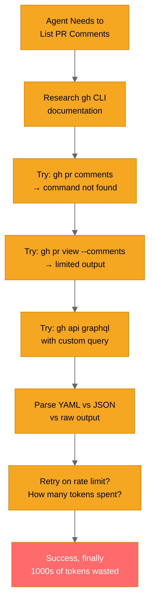
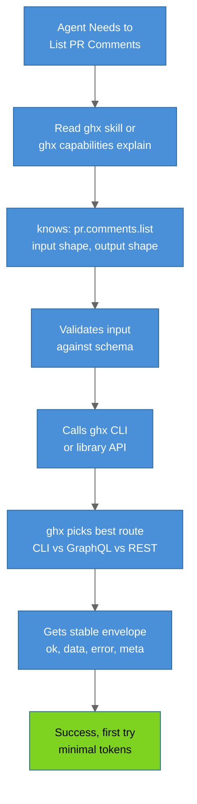
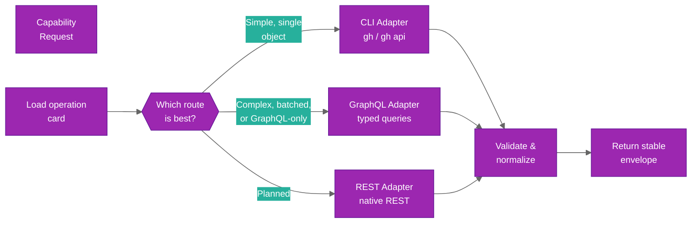
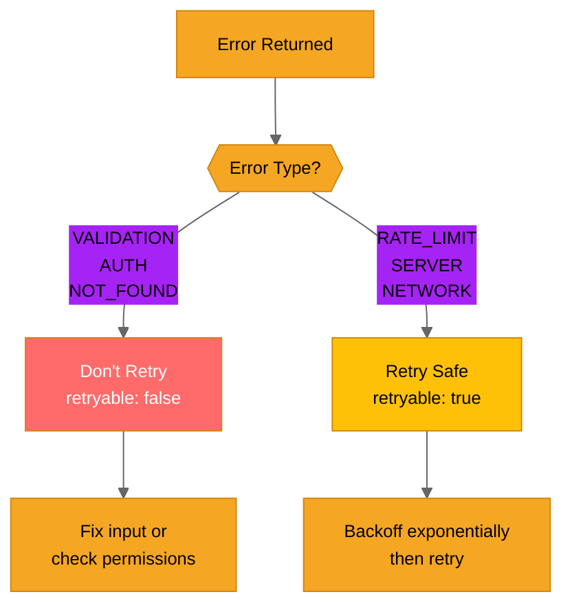
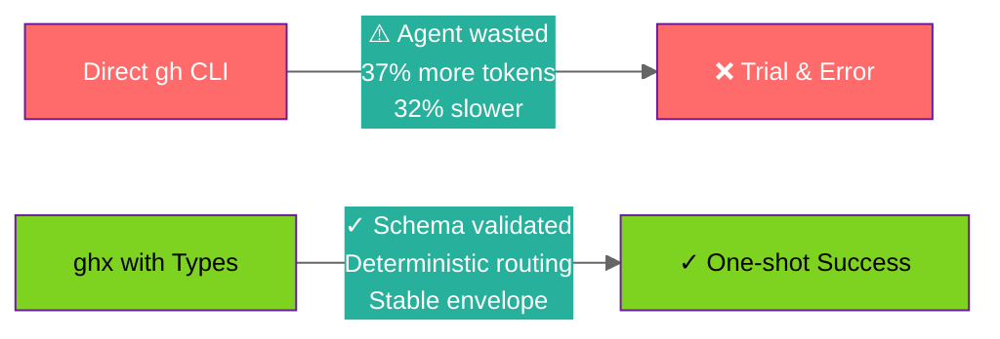

# How ghx Works: Conceptual Overview

Understand the core concepts behind ghx: why it exists, how it routes requests, and what makes
the result envelope stable. This guide focuses on *why* you should trust ghx, not the detailed
implementation (see [Architecture](../architecture/README.md) for that).

## The Problem ghx Solves

Without ghx, agents and scripts struggle with GitHub operations:



This costs:

- **-37% more tokens** on discovery and trial-and-error
- **-32% slower** due to failed attempts
- **-33% more tool invocations** per task

## The ghx Solution

ghx eliminates discovery:



This is:

- **+37% fewer tokens** — no discovery overhead
- **+32% faster** — one attempt, no backtracking
- **+33% fewer calls** — direct routing

## Three Core Concepts

### 1. Typed Capabilities (Contracts)

Every operation is defined by a **contract**: input schema → output schema

Example: `pr.comments.list`

```yaml
# What it does
description: "List comments on a pull request"

# What it needs
input:
  type: object
  required: [owner, repo, pull_number]
  properties:
    owner: { type: string, description: "Repository owner" }
    repo: { type: string, description: "Repository name" }
    pull_number: { type: integer, description: "PR number" }
    first: { type: integer, description: "Limit results (default: 30)" }

# What it returns
output:
  type: object
  properties:
    comments:
      type: array
      items:
        type: object
        properties:
          id: { type: string }
          body: { type: string }
          author: { type: string }
          createdAt: { type: string, format: "date-time" }
```

This contract means:

- **You know what to pass** — no guessing input shape
- **You know what to expect** — no surprise output fields
- **Runtime validates** — invalid input fails immediately with clear error

### 2. Deterministic Routing

ghx automatically chooses the best execution route for each capability:



**Why this matters:**

- **Consistency** — Same request shape always works, regardless of route
- **Reliability** — Each route is the best choice for that capability
- **Testability** — Every capability tested across all viable routes

Example routing decisions:

| Capability | Route | Reason |
|------------|-------|--------|
| `repo.view` | CLI | Simple, single-object query; fast |
| `pr.list` | GraphQL | Batching, filtering; schema-validated |
| `issue.comments.create` | CLI | Direct API call; no batching needed |
| `workflow_run.logs.get` | CLI | Text streaming; GraphQL limited |

### 3. Stable Result Envelope

Every capability returns the same shape, no matter what:

```ts
type ResultEnvelope = {
  ok: boolean              // true if successful
  data?: TData             // Capability-specific output (if ok=true)
  error?: {
    code: string           // "AUTH", "RATE_LIMIT", "VALIDATION", etc.
    message: string        // Human-readable error
    retryable: boolean     // Safe to retry?
    details?: Record<string, unknown>  // Extra context
  }
  meta: {
    capability_id: string  // "repo.view", "issue.create", etc.
    route_used?: "cli" | "graphql" | "rest"  // Which route was used
    reason?: string        // Why that route ("CARD_PREFERRED", etc.)
    attempts?: Array<{
      route: string
      status: string
      error_code?: string
      duration_ms?: number
    }>
  }
}
```

**Why this matters:**

Agents don't need to know the difference between CLI and GraphQL output:

```ts
// Exact same handling, regardless of which route ghx chose
const result = await executeTask(request, { githubClient, githubToken })

if (result.ok) {
  // Use result.data — same shape every time
  console.log(result.data.id)
} else {
  // Handle error — same error structure every time
  if (result.error?.code === "RATE_LIMIT") {
    // Retry logic
  }
}
```

## Execution Flow

Here's what happens when you run a capability:

```mermaid
%%{init: {'theme': 'base', 'themeVariables': {'primaryColor': '#4A90D9', 'primaryTextColor': '#fff', 'primaryBorderColor': '#2E6BA4', 'lineColor': '#666', 'fontSize': '13px'}}}%%
sequenceDiagram
  participant Agent
  participant CLI
  participant Engine
  participant Validator
  participant Router
  participant Adapter as Adapter<br/>CLI/GQL/REST
  participant Result

  Agent->>CLI: run issue.create --input '{...}'
  CLI->>Engine: executeTask({ task, input })
  Engine->>Engine: Load operation card
  Engine->>Validator: Validate input vs schema

  alt Invalid Input
    Validator-->>Result: { ok: false, error: VALIDATION }
  else Valid Input
    Engine->>Router: Select best route
    Router-->>Engine: Use CLI (preferred)
    Engine->>Adapter: Execute via CLI
    Adapter->>Adapter: Run: gh api ... --input
    Adapter-->>Engine: Raw output
    Engine->>Engine: Normalize & validate output
    Engine-->>Result: { ok: true, data, meta }
  end

  Result-->>Agent: Stable envelope

  style Agent fill:#4A90D9,color:#fff
  style Result fill:#4A90D9,color:#fff
```

**Key steps:**

1. **Load card** — Get the capability's contract (input/output schema, preferred route)
2. **Validate input** — Check request matches schema; fail fast if not
3. **Route selection** — Decide which adapter (CLI, GraphQL, REST) to use
4. **Execute** — Call the adapter; let it handle the protocol details
5. **Normalize** — Convert adapter output to standard shape
6. **Validate output** — Ensure result matches declared schema
7. **Return envelope** — Always the same shape: `{ ok, data, error, meta }`

This flow ensures **consistency**: The envelope shape is stable because ghx enforces it,
regardless of what the underlying API returns.

## Why Three Routes?

ghx supports three execution routes because each is optimal for different scenarios:

### CLI (gh / gh api)

**Best for:** Simple, single-object operations

**Pros:**

- Fast (no network round-trip interpretation)
- Works on any system with `gh` CLI
- Excellent error messages
- Supports streaming (logs, large outputs)

**Examples:**

- `repo.view` — Simple fetch
- `issue.create` — Single mutation
- `workflow_job.logs.get` — Streaming text

### GraphQL

**Best for:** Complex queries, batching, deeply typed operations

**Pros:**

- Powerful querying (filter, batch, traverse relationships)
- Type-safe with declared schemas
- Efficient network (single round-trip for multi-operation needs)
- Better for agents (structured, predictable)

**Examples:**

- `pr.list` with filtering
- `issue.comments.list` with pagination
- `workflow_run.jobs.list` (deeply nested query)

### REST (Planned)

**Best for:** Planned fallback and edge cases

**Pros:**

- Direct access to all GitHub REST endpoints
- Useful for capabilities GitHub hasn't optimized for
- Fallback if CLI/GraphQL unsupported

**Status:** Currently a stub; full implementation coming.

## Error Handling and Retries

ghx handles errors intelligently:



Error codes and retry guidance:

| Code | Retryable | Action |
|------|-----------|--------|
| `VALIDATION` | No | Fix your input; check schema |
| `AUTH` | No | Check token; verify permissions |
| `NOT_FOUND` | No | Resource doesn't exist |
| `RATE_LIMIT` | Yes | Wait, then retry (backoff) |
| `SERVER` | Yes | GitHub API error; retry |
| `NETWORK` | Yes | Connection issue; retry |

Agents learn from `retryable` flag:

```ts
if (!result.ok) {
  if (result.error?.retryable) {
    // Safe to retry with backoff
    await exponentialBackoff()
    const retry = await executeTask(request, ...)
  } else {
    // Don't retry; fix the issue first
    console.error("Fix input or permissions:", result.error?.message)
  }
}
```

## Why Agents Benefit Most

Agents (Claude, Cursor, OpenCode, etc.) excel at using ghx because:

1. **Schema is discoverable** — `ghx capabilities explain` + `SKILL.md` teach agents what's available
2. **Input is validated** — Bad requests fail immediately with clear errors (no hallucinations)
3. **Output is predictable** — Same envelope shape every time (no parsing variance)
4. **Errors are actionable** — `code`, `message`, `details` give agents enough to decide
5. **Retry logic is built-in** — Agents don't waste tokens guessing what's safe to retry

Example: Without ghx, an agent might:

- Waste 50 tokens researching `gh pr` commands
- Make 3 incorrect API calls before finding the right one
- Spend tokens parsing different output formats
- Not know if an error is retryable

With ghx, the agent:

- Reads SKILL.md once (instant)
- Makes one correct call (validated input)
- Parses standard envelope (no variance)
- Checks `retryable` flag (no guessing)

**Total cost reduction: 37% fewer tokens, 32% faster execution.**

## Comparing Approaches



| Aspect | Direct gh | ghx |
|--------|-----------|-----|
| **Discovery** | Manual research | Automated (explain, skill) |
| **Input validation** | Runtime errors | Pre-flight schema validation |
| **Output parsing** | Varies (JSON/YAML) | Stable envelope |
| **Error handling** | Guess retryability | Built-in retryable flag |
| **Agent efficiency** | Low (trial-and-error) | High (direct routing) |

## Summary

ghx is designed around three principles:

1. **Typed Capabilities** — Contracts eliminate guessing
2. **Deterministic Routing** — Best adapter always chosen
3. **Stable Envelope** — Consistent result shape always

This means:

- **You** write less code (contracts handled for you)
- **Agents** waste fewer tokens (no discovery overhead)
- **Scripts** are more reliable (validated, predictable results)

## What's Next?

- **Want details?** Read [System Design](../architecture/system-design.md)
- **Curious about routing?** See [Routing Engine](../architecture/routing-engine.md)
- **Need adapter info?** Check [Adapters](../architecture/adapters.md)
- **Want to try it?** Go back to [Getting Started](README.md)

---

**Questions?** Open an issue on [GitHub](https://github.com/aryeko/ghx/issues) or check the
[FAQ](../contributing/README.md#faq).
