# Article Diagrams — Mermaid Source

Render these with the [Mermaid Live Editor](https://mermaid.live) or any Mermaid-compatible tool.
Export as PNG at 2x resolution for Medium (recommended width: 1400px+).

---

## Diagram 1: The Ad-Hoc Failure Loop

**Filename:** `ad-hoc-failure-loop.png`
**Used in:** "What Actually Goes Wrong" section

Shows how agents without ghx get stuck in a wasteful discovery-retry loop.

```mermaid
flowchart LR
  A["🤖 Agent receives<br/>GitHub task"] --> B["📖 Re-discover<br/>CLI/API surface"]
  B --> C["🎲 Route chosen<br/>by guesswork"]
  C --> D["🔧 Parse transport-<br/>specific output"]
  D --> E{"Output<br/>usable?"}
  E -- "❌ No" --> F["🔄 Prompt repair<br/>& retry"]
  F --> B
  E -- "✅ Yes" --> G{"Mutation<br/>succeeded?"}
  G -- "❌ No" --> H["⚠️ Error triage<br/>(inconsistent messages)"]
  H --> F
  G -- "✅ Yes" --> I["✅ Task complete<br/>(high variance)"]

  style A fill:#1e293b,stroke:#0ea5a4,color:#f1f5f9
  style B fill:#7c3aed,stroke:#a78bfa,color:#f1f5f9
  style C fill:#7c3aed,stroke:#a78bfa,color:#f1f5f9
  style D fill:#7c3aed,stroke:#a78bfa,color:#f1f5f9
  style E fill:#0f2747,stroke:#0ea5a4,color:#f1f5f9
  style F fill:#dc2626,stroke:#f87171,color:#f1f5f9
  style G fill:#0f2747,stroke:#0ea5a4,color:#f1f5f9
  style H fill:#dc2626,stroke:#f87171,color:#f1f5f9
  style I fill:#059669,stroke:#a7f3d0,color:#f1f5f9
```

---

## Diagram 2: ghx Architecture Flow

**Filename:** `architecture-flow.png`
**Used in:** "How It Works Under the Hood" section

Shows the clean execution pipeline from caller through registry, routing, adapters, and normalization.

```mermaid
flowchart TB
  A["Caller:<br/>capability ID + input JSON"] --> B["📋 Capability Registry<br/>(YAML operation card)"]
  B --> C["✅ Input Validation<br/>(AJV schema)"]
  C --> D["🧭 Route Planner<br/>(preferred → fallbacks)"]
  D --> E["⚡ Adapter Execution"]

  E --> E1["CLI Adapter<br/>(gh CLI)"]
  E --> E2["GraphQL Adapter<br/>(GitHub API)"]
  E --> E3["REST Adapter<br/>(planned)"]

  E1 --> F{"Attempt<br/>outcome"}
  E2 --> F
  E3 --> F

  F -- "❌ error<br/>(retryable)" --> G["Error Normalization<br/>→ next route"]
  G --> D
  F -- "✅ success" --> H["Output Validation<br/>(AJV schema)"]
  H --> I["📦 Result Envelope<br/>{ ok, data, error, meta }"]

  style A fill:#1e293b,stroke:#0ea5a4,color:#f1f5f9
  style B fill:#0f2747,stroke:#0ea5a4,color:#f1f5f9
  style C fill:#0f2747,stroke:#0ea5a4,color:#f1f5f9
  style D fill:#0f2747,stroke:#0ea5a4,color:#f1f5f9
  style E fill:#0f2747,stroke:#0ea5a4,color:#f1f5f9
  style E1 fill:#1e40af,stroke:#60a5fa,color:#f1f5f9
  style E2 fill:#1e40af,stroke:#60a5fa,color:#f1f5f9
  style E3 fill:#475569,stroke:#94a3b8,color:#f1f5f9
  style F fill:#0f2747,stroke:#0ea5a4,color:#f1f5f9
  style G fill:#dc2626,stroke:#f87171,color:#f1f5f9
  style H fill:#0f2747,stroke:#0ea5a4,color:#f1f5f9
  style I fill:#059669,stroke:#a7f3d0,color:#f1f5f9
```

---

## Diagram 3: Routing Decision Tree

**Filename:** `routing-decision-tree.png`
**Used in:** "How It Works Under the Hood" section

Shows the deterministic route selection logic with reason codes.

```mermaid
flowchart TB
  Start["Capability request<br/>received"] --> Card["Load operation<br/>card"]
  Card --> Pref{"Preferred route<br/>preflight OK?"}
  Pref -- "✅ Yes" --> ExecPref["Execute via<br/>preferred route<br/><small>CARD_PREFERRED</small>"]
  Pref -- "❌ No" --> FB1{"Fallback 1<br/>preflight OK?"}
  FB1 -- "✅ Yes" --> ExecFB1["Execute via<br/>fallback 1<br/><small>CARD_FALLBACK</small>"]
  FB1 -- "❌ No" --> FB2{"More<br/>fallbacks?"}
  FB2 -- "✅ Yes" --> FBN["Try next<br/>fallback<br/><small>PREFLIGHT_FAILED</small>"]
  FBN --> FB1
  FB2 -- "❌ No" --> Fail["Return error<br/><small>ADAPTER_UNSUPPORTED</small>"]

  ExecPref --> Result{"Execution<br/>result"}
  ExecFB1 --> Result
  Result -- "✅ OK" --> Envelope["Normalize to<br/>result envelope"]
  Result -- "❌ Retryable<br/>(NETWORK, RATE_LIMIT,<br/>SERVER)" --> Retry["Try next<br/>route in plan"]
  Retry --> FB1
  Result -- "❌ Non-retryable<br/>(AUTH, VALIDATION,<br/>NOT_FOUND)" --> ErrEnv["Return error<br/>envelope"]

  style Start fill:#1e293b,stroke:#0ea5a4,color:#f1f5f9
  style Card fill:#0f2747,stroke:#0ea5a4,color:#f1f5f9
  style Pref fill:#0f2747,stroke:#0ea5a4,color:#f1f5f9
  style ExecPref fill:#059669,stroke:#a7f3d0,color:#f1f5f9
  style FB1 fill:#0f2747,stroke:#0ea5a4,color:#f1f5f9
  style ExecFB1 fill:#059669,stroke:#a7f3d0,color:#f1f5f9
  style FB2 fill:#0f2747,stroke:#0ea5a4,color:#f1f5f9
  style FBN fill:#7c3aed,stroke:#a78bfa,color:#f1f5f9
  style Fail fill:#dc2626,stroke:#f87171,color:#f1f5f9
  style Result fill:#0f2747,stroke:#0ea5a4,color:#f1f5f9
  style Envelope fill:#059669,stroke:#a7f3d0,color:#f1f5f9
  style Retry fill:#f59e0b,stroke:#fcd34d,color:#1e293b
  style ErrEnv fill:#dc2626,stroke:#f87171,color:#f1f5f9
```

---

## Diagram 4: Benchmark Comparison (Bar Chart)

**Filename:** `benchmark-comparison.png`
**Used in:** "The Numbers" section

Best rendered as a styled bar chart image (see image generation prompts). Alternatively, use this Mermaid representation:

```mermaid
---
config:
  xyChart:
    width: 800
    height: 400
---
xychart-beta
  title "ghx vs agent_direct — PR Workflow Benchmark"
  x-axis ["Active Tokens", "Latency (s)", "Tool Calls"]
  y-axis "Value" 0 --> 60
  bar [2.851, 57.868, 8]
  bar [1.075, 5.860, 2]
```

---

## Diagram 5: PR Workflow Pipeline

**Filename:** `pr-workflow.png`
**Used in:** "A Real Workflow" section

Shows a clean 4-step PR diagnosis and merge workflow.

```mermaid
flowchart LR
  A["1️⃣ pr.status.checks<br/><small>Get CI status</small>"] --> B["2️⃣ pr.checks.get_failed<br/><small>Identify failures</small>"]
  B --> C["3️⃣ workflow_job.logs.analyze<br/><small>Diagnose root cause</small>"]
  C --> D["4️⃣ pr.merge.execute<br/><small>Squash merge</small>"]

  A -.->|"{ ok, data, error, meta }"| E["Same envelope<br/>every step"]
  B -.->|"{ ok, data, error, meta }"| E
  C -.->|"{ ok, data, error, meta }"| E
  D -.->|"{ ok, data, error, meta }"| E

  style A fill:#0f2747,stroke:#0ea5a4,color:#f1f5f9
  style B fill:#0f2747,stroke:#0ea5a4,color:#f1f5f9
  style C fill:#0f2747,stroke:#0ea5a4,color:#f1f5f9
  style D fill:#059669,stroke:#a7f3d0,color:#f1f5f9
  style E fill:#1e293b,stroke:#64748b,color:#94a3b8
```

---

## Diagram 6: Adoption Funnel

**Filename:** `adoption-funnel.png`
**Used in:** "Getting Started" section (optional, good for a companion LinkedIn post)

```mermaid
flowchart TB
  A["🔍 Discover<br/><code>npx @ghx-dev/core capabilities list</code>"] --> B["🧪 Try<br/><code>ghx run repo.view</code>"]
  B --> C["📦 Adopt read-only<br/>capabilities in workflows"]
  C --> D["⚡ Expand to mutations<br/>(PR merge, issue create)"]
  D --> E["🏗️ Team-wide<br/>capability governance"]
  E --> F["🚀 CI/CD and release<br/>path integration"]

  style A fill:#0f2747,stroke:#0ea5a4,color:#f1f5f9
  style B fill:#0f2747,stroke:#0ea5a4,color:#f1f5f9
  style C fill:#0f2747,stroke:#0ea5a4,color:#f1f5f9
  style D fill:#0f2747,stroke:#0ea5a4,color:#f1f5f9
  style E fill:#0f2747,stroke:#0ea5a4,color:#f1f5f9
  style F fill:#059669,stroke:#a7f3d0,color:#f1f5f9
```

---

## Rendering Instructions

1. Go to [mermaid.live](https://mermaid.live)
2. Paste each diagram's Mermaid code
3. Set theme to `dark` for consistency with ghx branding
4. Export as PNG at 2x scale
5. Target width: 1400px (renders well on Medium at full-width)
6. For the bar chart, consider using a dedicated charting tool (Figma, Excalidraw, or a data viz library) for a more polished result

### Brand Color Reference
- Dark ink: `#0A1220`
- Deep navy: `#0F2747`
- Teal accent: `#0EA5A4`
- Mint accent: `#A7F3D0`
- Light neutral: `#F1F5F9`
