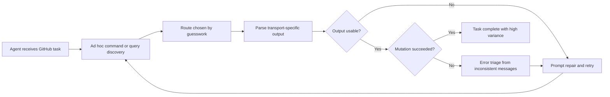
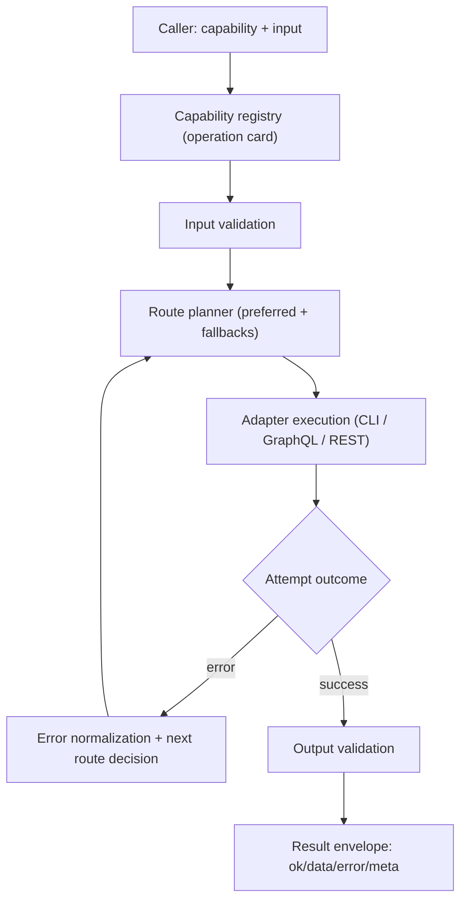
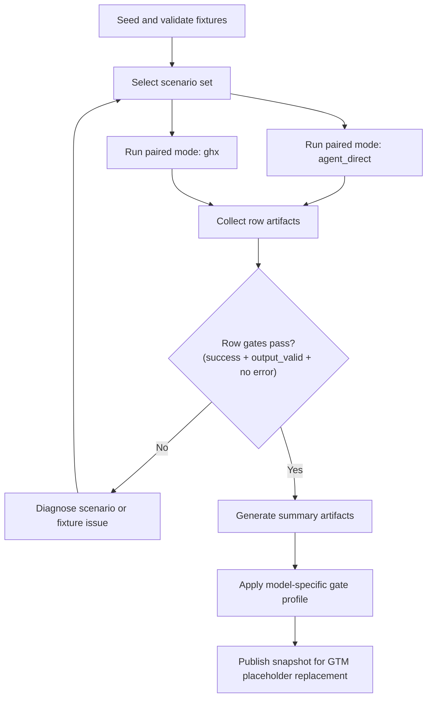
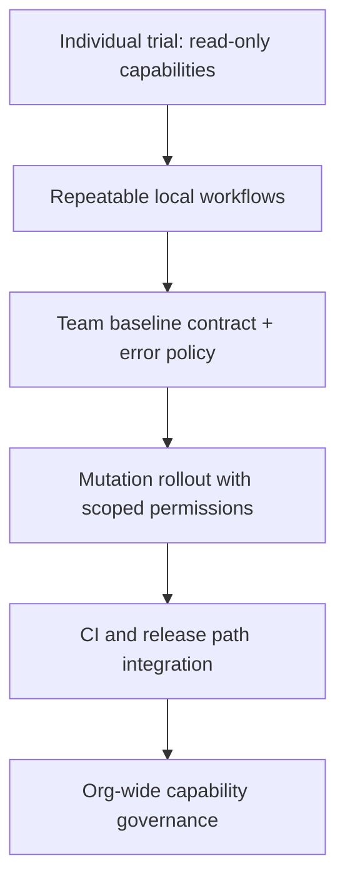

# Medium Draft 03: A Technical Architecture for Reliable GitHub Agent Execution

## Audience and Positioning
This draft is for solo AI-agent power users and developer tooling engineers who want repeatable GitHub execution behavior. The focus is practical systems design: why GitHub agent runs fail, why those failures repeat, and how a capability-routed architecture changes the operating model.

## 1) Motivation
Agents are strong at planning but weak at repeated infrastructure glue work. In GitHub workflows, that glue is expensive:
- command and API surface re-discovery every run
- route choice uncertainty between CLI and API paths
- output parsing that changes across endpoints and tools
- ad hoc retry logic that compounds failures instead of containing them

The result is not one dramatic outage. It is a continuous reliability leak: each run is "almost" correct, and teams keep paying that tax in tokens, latency, and manual supervision.

## 2) Goal and non-goals
### Goal
Build a stable execution substrate for GitHub tasks where agents call capability contracts, not raw transport details.

### Non-goals
- Replace GitHub primitives.
- Hide all failure details from callers.
- Guarantee success for invalid auth, insufficient permissions, or malformed intent.
- Optimize every route for every repository edge case.

The target is consistency and debuggability under realistic automation conditions.

## 3) Why current approaches fail
### Failure mode A: Discovery loop pressure
Agents repeatedly query docs, CLI help text, and schema shapes before running a task. This inflates context and introduces prompt drift.

### Failure mode B: Route drift
The same task may be executed through different call paths across runs. Behavior changes because transport and formatting differ, even when intent is the same.

### Failure mode C: Output contract drift
Raw output shapes vary by route. Callers write one-off parsers and brittle branching logic, then re-learn those assumptions on the next task.

### Failure mode D: Retry amplification
When errors are not normalized, retries are generic and blind. This adds tool calls without increasing success probability.

### Failure mode E: Permission ambiguity
Failures from missing scopes, missing resources, and malformed input can look similar. Agents spend cycles on low-signal recovery attempts.



## 4) ghx design approach
`ghx` treats GitHub work as capability execution with explicit contracts.

Core design principles:
- Capability-first interface: callers invoke stable IDs like `repo.view`.
- Deterministic route policy: each capability has preferred and fallback routes.
- Runtime schema boundaries: input and output are validated at execution boundaries.
- Stable result envelope: results normalize to `{ ok, data, error, meta }`.
- Error taxonomy: failures map to canonical codes that support policy-based recovery.

This moves complexity from every agent prompt into a reusable execution layer.

## 5) Architecture walkthrough
At runtime, the system composes registry metadata, route orchestration, adapters, and normalization.



### Component responsibilities
- Capability registry: defines operation contracts, route preferences, and routing metadata.
- Route planner: executes deterministic transport order instead of prompt-level guesswork.
- Adapters: isolate transport-specific behavior so callers do not branch on route mechanics.
- Validators: enforce boundary correctness before and after execution.
- Envelope normalizer: returns one shape for agent decision logic, logging, and retries.

### Why this matters for tooling engineers
A stable envelope and canonical error layer let you write recovery policies once and reuse them across task classes. That reduces bespoke prompt branching and makes automation behavior easier to reason about during incidents.

## 6) Benchmark methodology
The benchmark strategy compares two execution modes for the same scenario intent:
- `agent_direct`: baseline direct execution path
- `ghx`: capability-routed execution path

Method constraints:
- Shared fixture manifests to avoid repo-state drift.
- Scenario-level equivalence across both modes.
- Output validity checks per row, not only aggregate summaries.
- Explicit gate profiles and model-aware expectations.
- Single snapshot artifact as the source for GTM metric injection.



This design prevents metric storytelling from drifting away from execution reality.

## 7) Results (placeholders only)
The following values are intentionally placeholder tokens until benchmark snapshot sign-off:
- Tokens delta: `<TOKENS_DELTA_PCT>`
- Latency delta: `<LATENCY_DELTA_PCT>`
- Tool-call delta: `<TOOL_CALLS_DELTA_PCT>`
- Success rate: `<SUCCESS_RATE>`
- Sample size: `<N_RUNS>`
- Model id: `<MODEL_ID>`
- Benchmark date: `<BENCH_DATE>`

Do not replace these values outside the controlled snapshot injection step.

## 8) Tradeoffs and limits
- Capability modeling is upfront work: each operation needs clear contracts and route metadata.
- Deterministic routing favors predictability over transport-level opportunism.
- Validation strictness can surface more early failures, which is useful but noisier during initial adoption.
- Permission design remains your responsibility; routing cannot compensate for underscoped tokens.
- Some edge cases still require direct transport knowledge for deep incident debugging.

The point is not zero complexity. It is moving complexity into explicit, testable layers.

## 9) Adoption quickstart
Start with read-only capabilities, then expand to mutation workflows once permissions and policies are proven.

### Quickstart commands
```bash
npx @ghx-dev/core capabilities list
npx @ghx-dev/core run repo.view --input '{"owner":"aryeko","name":"ghx"}'
```

### Rollout funnel


## FAQ (objections)
### "Why not just call gh and GraphQL directly?"
You can. The tradeoff is that every agent run must own route choice, validation, and normalization logic.

### "Does this lock me into one transport?"
No. It locks callers into capability contracts while allowing deterministic route policies underneath.

### "Are performance claims final in this draft?"
No. Numeric benchmark claims remain placeholders until snapshot sign-off with model id, run count, and benchmark date.
