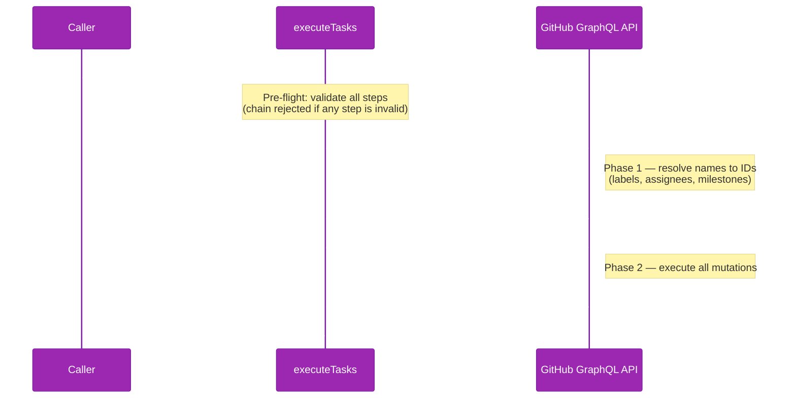

# Chaining Capabilities

Atomic chaining lets you execute multiple GitHub mutations in a single logical operation —
without needing to wire together individual `executeTask` calls. The entire chain completes in
at most **2 HTTP round-trips** regardless of how many steps you have.

## When to Use Chaining

Use `executeTasks()` (library) or `ghx chain` (CLI) when:

- Two or more mutations must be applied together (e.g., update labels **and** assignees on an
  issue atomically)
- You want pre-flight validation to reject the entire request before any mutation is attempted
- You want a single `ChainResultEnvelope` summarizing all steps, rather than multiple
  `ResultEnvelope` objects

For **independent read-only queries**, the standard `Promise.all(steps.map(executeTask))` or
shell `for` loop is still appropriate — chaining is designed for mutations.

## Library API

### `executeTasks(requests, deps)`

```ts
import { executeTasks, createGithubClientFromToken } from "@ghx-dev/core"

const token = process.env.GITHUB_TOKEN!
const githubClient = createGithubClientFromToken(token)

const chain = await executeTasks(
  [
    { task: "issue.labels.set",   input: { issueId: "I_kwDOOx...", labels: ["bug"] } },
    { task: "issue.assignees.set", input: { issueId: "I_kwDOOx...", assignees: ["octocat"] } },
  ],
  { githubClient, githubToken: token },
)
```

**Parameters:**

- `requests` — `Array<{ task: string; input: Record<string, unknown> }>` — ordered list of
  capability steps
- `deps` — same `ExecutionDeps` as `executeTask()` (requires a `githubClient` and token)

**Returns:** `Promise<ChainResultEnvelope>`

### Return Type: `ChainResultEnvelope`

```ts
type ChainStatus = "success" | "partial" | "failed"

interface ChainStepResult {
  task: string        // capability_id of the step
  ok: boolean
  data?: unknown      // step output (when ok is true)
  error?: {
    code: string
    message: string
    retryable: boolean
  }
}

interface ChainResultEnvelope {
  status: ChainStatus
  results: ChainStepResult[]
  meta: {
    route_used: "graphql"   // chains always use GraphQL
    total: number
    succeeded: number
    failed: number
  }
}
```

### `ChainStatus` Semantics

| Value | Meaning |
|-------|---------|
| `"success"` | All steps completed successfully |
| `"partial"` | Some steps succeeded, some failed |
| `"failed"` | No steps succeeded (pre-flight rejection or phase-level error) |

## CLI

### Inline JSON

```bash
ghx chain --steps '[
  {"task":"issue.labels.set","input":{"issueId":"I_kwDOOx...","labels":["bug"]}},
  {"task":"issue.assignees.set","input":{"issueId":"I_kwDOOx...","assignees":["octocat"]}}
]'
```

### Stdin Variant

```bash
echo '[
  {"task":"issue.labels.set","input":{"issueId":"I_kwDOOx...","labels":["bug"]}},
  {"task":"issue.assignees.set","input":{"issueId":"I_kwDOOx...","assignees":["octocat"]}}
]' | ghx chain --steps -
```

### Exit Codes

| Exit code | Condition |
|-----------|-----------|
| `0` | `status` is `"success"` or `"partial"` |
| `1` | `status` is `"failed"` |

## Pre-flight Validation

Before any HTTP call is made, `executeTasks()` validates every step:

1. The `task` must refer to a known capability
2. The `input` must pass JSON Schema validation for that capability
3. The capability must have a GraphQL route (`card.graphql` must be defined)

If **any** step fails pre-flight, the **entire chain is rejected** with `status: "failed"` and
no HTTP calls are made:

```json
{
  "status": "failed",
  "results": [
    {
      "task": "issue.labels.set",
      "ok": false,
      "error": {
        "code": "VALIDATION",
        "message": "Input validation failed: issueId: must be string",
        "retryable": false
      }
    }
  ],
  "meta": { "route_used": "graphql", "total": 1, "succeeded": 0, "failed": 1 }
}
```

## Two-Phase Execution Model



**Phase 1 — Batch resolution query (≤1 HTTP call):**

Some capabilities require human-readable names (label names, usernames, milestone titles) to
be resolved to GitHub node IDs before the mutation can run. For each step that declares a
`graphql.resolution` block in its operation card, `executeTasks()` collects the lookup queries
and batches them into a single GraphQL query.

**Phase 2 — Batch mutation (≤1 HTTP call):**

Using the resolved IDs from Phase 1, all mutations are combined into a single GraphQL
mutation document and sent in one request.

**If Phase 1 fails** (network error, auth failure, etc.), the entire chain is marked
`"failed"` and Phase 2 is not attempted.

**If Phase 2 fails** (the entire mutation batch is rejected), all steps in the chain are
marked as failed.

## Which Capabilities Support Chaining

Any capability with a `graphql` route can be chained. Capabilities that also declare a
`graphql.resolution` block benefit from automatic name→ID resolution in Phase 1:

| Capability | Phase 1 (resolution) | Phase 2 (mutation) |
|------------|---------------------|-------------------|
| `issue.labels.set` | Yes — resolves label names to IDs | Yes |
| `issue.assignees.set` | Yes — resolves login names to user IDs | Yes |
| `issue.milestone.set` | No | Yes |
| `issue.close` | No | Yes |
| `pr.thread.resolve` | No | Yes |
| `pr.thread.reply` | No | Yes |

To check whether a specific capability supports chaining, look for `graphql:` in its
operation card (`packages/core/src/core/registry/cards/<capability_id>.yaml`). If `graphql:`
is defined, the capability can be chained.

## Error Handling

### Pre-flight errors

The chain is rejected before any HTTP call. All steps are marked failed with `retryable: false`.
Fix the input and resubmit.

### Phase 1 errors

A network or auth failure during the batch resolution query marks **all steps** as failed with
`retryable: true`. The mutation is not attempted. Safe to retry.

### Phase 2 errors

A network or auth failure during the batch mutation marks **all pending steps** as failed with
`retryable: true`. Safe to retry.

### Step-level errors

If individual mutations within Phase 2 return GraphQL errors, those steps are marked as
failed while other steps may succeed — resulting in `status: "partial"`.

## Example: Update Assignees and Labels Atomically

```ts
import { executeTasks, createGithubClientFromToken } from "@ghx-dev/core"

const token = process.env.GITHUB_TOKEN!
const githubClient = createGithubClientFromToken(token)

// Both mutations execute in a single logical operation (≤2 HTTP calls total)
const chain = await executeTasks(
  [
    {
      task: "issue.labels.set",
      input: {
        issueId: "I_kwDOOx...",   // GitHub node ID of the issue
        labels: ["bug", "priority:high"],
      },
    },
    {
      task: "issue.assignees.set",
      input: {
        issueId: "I_kwDOOx...",
        assignees: ["octocat", "monalisa"],
      },
    },
  ],
  { githubClient, githubToken: token },
)

if (chain.status === "success") {
  console.log("Both mutations applied atomically")
  chain.results.forEach((step) => {
    console.log(`  ${step.task}: ok`)
  })
} else if (chain.status === "partial") {
  console.warn("Some steps failed:")
  chain.results.forEach((step) => {
    if (!step.ok) {
      console.error(`  ${step.task}: [${step.error?.code}] ${step.error?.message}`)
    }
  })
} else {
  console.error("Chain failed:", chain.results[0]?.error?.message)
}
```

---

See [Understanding the Result Envelope](result-envelope.md) for the `ChainResultEnvelope`
type reference, and [Operation Cards](../architecture/operation-cards.md) for the
`graphql.resolution` block schema.
