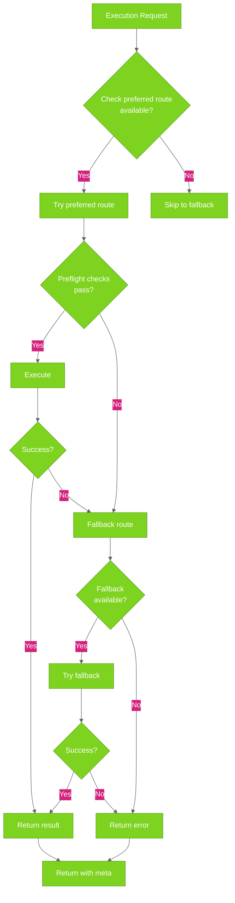

# How Routing Works

Understand how ghx decides which execution route (CLI or GraphQL) to use, and
what happens when one fails.

## Three Routes

ghx supports three execution routes:

- **CLI** — Uses the GitHub CLI (`gh` command)
- **GraphQL** — Uses GitHub's GraphQL API
- **REST** — Planned; stub implementation ready

## Routing Decision

Every capability has a **preferred route** and **fallback routes** defined in
its operation card. ghx uses this information to decide which route to try.



## Route Preferences

Most capabilities prefer **CLI** because it's lightweight:

```bash
$ ghx capabilities list | head -5
[
  {
    "capability_id": "repo.view",
    "description": "Get repository metadata"
  },
  ...
]
```

Check a capability's routing:

```bash
ghx capabilities explain repo.view
# Output:
# {
#   "capability_id": "repo.view",
#   "purpose": "Get repository metadata",
#   "preferred_route": "cli",
#   "fallback_routes": ["graphql"],
#   ...
# }
```

## Preflight Checks

Before executing, ghx runs **preflight checks** to ensure the route is viable:

### CLI Route Preflight

1. **Is `gh` CLI installed?** — Run `gh --version`
2. **Is `gh` authenticated?** — Run `gh auth status`

If either check fails, ghx skips CLI and tries the fallback route (usually
GraphQL).

### GraphQL Route Preflight

1. **Is `GITHUB_TOKEN` available?** — Check environment

If the token is missing, ghx can't use GraphQL and returns an error.

## Deterministic Behavior

Routing is **deterministic**: the same request with the same environment will
always use the same route.

Example:

If `repo.view` prefers CLI and CLI is available, ghx will always use CLI for
that capability — no randomness or guessing.

## What Happens When a Route Fails

If the preferred route fails, ghx automatically tries the fallback route:

### CLI Fails → GraphQL Fallback

```
Request: repo.view
1. Try CLI (preferred)
   → Fails (unknown error)
2. Try GraphQL (fallback)
   → Succeeds
3. Return result with meta showing the history
```

### GraphQL Fails → No Fallback

```
Request: (GraphQL-only capability)
1. Try GraphQL (preferred)
   → Fails (rate limited)
2. No fallback available
3. Return error
```

## Reading Routing Metadata

Every response includes routing metadata:

```json
{
  "ok": true,
  "data": { ... },
  "meta": {
    "capability_id": "repo.view",
    "route_used": "cli",
    "reason": "CARD_PREFERRED",
    "attempts": [
      {
        "route": "cli",
        "status": "success",
        "duration_ms": 245
      }
    ]
  }
}
```

### `route_used`

Which route executed successfully. One of: `"cli"`, `"graphql"`, `"rest"`.

### `reason`

Why this route was chosen. Common reasons:

- `CARD_PREFERRED` — Preferred route in the operation card
- `CLI_NOT_AVAILABLE` — CLI not installed; used fallback
- `CLI_UNAUTHENTICATED` — CLI not authenticated; used fallback
- `PREFERRED_ROUTE_FAILED` — Preferred route failed; used fallback
- `DEFAULT_POLICY` — Default routing policy applied

### `attempts`

History of all attempted routes (optional; only present if multiple routes were
tried):

```json
{
  "attempts": [
    {
      "route": "cli",
      "status": "error",
      "error_code": "CLI_NOT_AVAILABLE",
      "duration_ms": 125
    },
    {
      "route": "graphql",
      "status": "success",
      "duration_ms": 342
    }
  ]
}
```

Each attempt shows:

- `route` — Route attempted
- `status` — Result: `"success"`, `"error"`, or `"skipped"`
- `error_code` — Error code if failed
- `duration_ms` — How long it took

## CLI vs GraphQL: When to Use Each

### CLI Route

**Advantages:**

- Lightweight and fast
- Good for simple, single-entity operations
- Works on enterprise GitHub (via `GH_HOST`)

**Disadvantages:**

- Requires `gh` CLI installed and authenticated
- Less powerful for complex queries

**Best for:**

- `repo.view` — Get single repository
- `issue.create` — Create single issue
- `pr.view` — Get single PR

### GraphQL Route

**Advantages:**

- Powerful for batch queries and complex operations
- Works when CLI is unavailable
- Only requires GITHUB_TOKEN

**Disadvantages:**

- Requires authentication
- Slightly slower than CLI for simple operations

**Best for:**

- `pr.list` — List many pull requests with filtering
- Batch operations on multiple entities
- Complex queries with multiple levels of data

## Practical Examples

### Example 1: CLI Available

```ts
const result = await executeTask("repo.view", { owner: "aryeko", name: "ghx" })

// Assumptions: gh CLI installed, gh auth status = authenticated
// Result:
// {
//   "route_used": "cli",
//   "reason": "CARD_PREFERRED",
//   "attempts": [{ route: "cli", status: "success" }]
// }
```

### Example 2: CLI Not Available → GraphQL Fallback

```ts
const result = await executeTask("repo.view", { owner: "aryeko", name: "ghx" })

// Assumptions: gh CLI not installed, GITHUB_TOKEN set
// Result:
// {
//   "route_used": "graphql",
//   "reason": "CLI_NOT_AVAILABLE",
//   "attempts": [
//     { route: "cli", status: "error", error_code: "CLI_NOT_AVAILABLE" },
//     { route: "graphql", status: "success" }
//   ]
// }
```

### Example 3: Both Routes Fail

```ts
const result = await executeTask("repo.view", {
  owner: "nonexistent",
  name: "repo",
})

// Result:
// {
//   "ok": false,
//   "error": {
//     "code": "NOT_FOUND",
//     "message": "Repository not found",
//     "retryable": false
//   },
//   "route_used": "cli",
//   "attempts": [{ route: "cli", status: "error", error_code: "NOT_FOUND" }]
// }
```

## Checking Which Route Was Used

Use the metadata to see routing decisions:

```ts
const result = await executeTask(task, input)

if (result.meta.route_used === "cli") {
  console.log("Executed via CLI")
} else if (result.meta.route_used === "graphql") {
  console.log("Executed via GraphQL")
}

if (result.meta.attempts && result.meta.attempts.length > 1) {
  console.log("Fallback was triggered")
}
```

## Performance Implications

- **CLI** is usually faster for simple operations (245ms typical)
- **GraphQL** adds slight overhead (300–400ms typical) but is powerful for batch
  operations
- **Fallback attempts** add latency (duplicate attempt times)

See [Benchmark Results](../benchmark/README.md) for detailed performance
metrics.

## Enterprise and Custom Hosts

For GitHub Enterprise Server, set `GH_HOST`:

```bash
export GH_HOST=github.mycompany.com
```

ghx automatically:

1. Uses `gh` with the custom host
2. Derives the GraphQL endpoint from the host
3. Routes to the correct Enterprise GitHub instance

---

See [Understanding the Result Envelope](result-envelope.md) for reading routing
metadata, and [Error Handling & Codes](error-handling.md) for handling route
failures.
