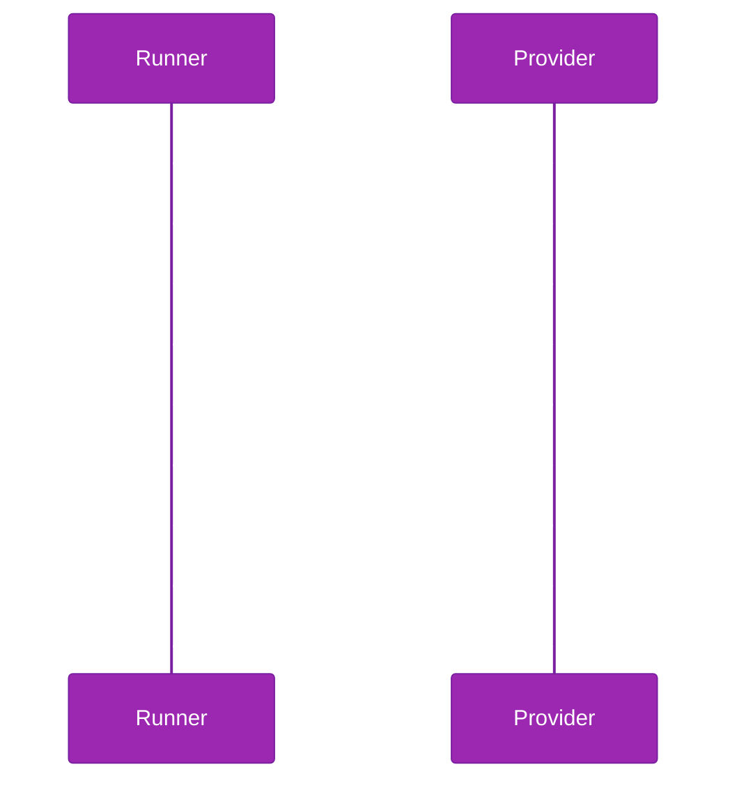

# Implementing a Provider

Step-by-step guide to implementing the SessionProvider contract that drives agent sessions through the profiler lifecycle.

## Provider Lifecycle

The runner calls provider methods in a strict sequence. Understanding this sequence is essential before writing any implementation code.



The runner calls `init()` once per suite before the mode loop begins, then repeats `createSession` through `destroySession` for every iteration within each mode. After all modes and iterations complete, the runner calls `shutdown()`.

## Step 1: Create a Class Implementing SessionProvider

Define a class or object that satisfies the `SessionProvider` interface. The interface requires an `id` string and six async methods.

```typescript
import type { SessionProvider } from "@ghx-dev/agent-profiler"

class MyProvider implements SessionProvider {
  readonly id = "my-provider"

  async init(config) { /* ... */ }
  async createSession(params) { /* ... */ }
  async prompt(handle, text, timeoutMs) { /* ... */ }
  async exportSession(handle) { /* ... */ }
  async destroySession(handle) { /* ... */ }
  async shutdown() { /* ... */ }
}
```

## Step 2: Implement init()

The `init` method receives a `ProviderConfig` object with fields for configuring the underlying agent runtime. Use this to establish connections, validate credentials, or start background processes.

```typescript
import type { ProviderConfig } from "@ghx-dev/agent-profiler"

async init(config: ProviderConfig): Promise<void> {
  // ProviderConfig fields:
  //   port: number
  //   model: string
  //   mode: string
  //   permissions: PermissionConfig  // { autoApprove: boolean, allowedTools: readonly string[] }
  //   environment: Readonly<Record<string, string>>
  //   workdir: string

  this.port = config.port
  this.model = config.model
  this.workdir = config.workdir
  this.env = config.environment

  // Example: start an agent server process
  await this.startAgentServer(config.port, config.environment)
}
```

The runner calls `init()` once per suite, before the mode loop begins. It is not called again for each mode. `shutdown()` is called once after all modes complete.

## Step 3: Implement createSession()

The `createSession` method receives `CreateSessionParams` and returns a `SessionHandle` that identifies the session for subsequent calls.

```typescript
import type { CreateSessionParams, SessionHandle } from "@ghx-dev/agent-profiler"

async createSession(params: CreateSessionParams): Promise<SessionHandle> {
  // CreateSessionParams fields:
  //   systemInstructions: string
  //   scenarioId: string
  //   iteration: number

  const sessionId = await this.agentClient.startSession({
    instructions: params.systemInstructions,
    scenario: params.scenarioId,
  })

  return {
    sessionId,
    provider: this.id,
    createdAt: new Date().toISOString(),
  }
}
```

The runner creates a new session for every iteration. If retries are configured, a failed iteration destroys the old session and calls `createSession` again.

## Step 4: Implement prompt()

The `prompt` method sends the scenario prompt to the agent and returns a `PromptResult` containing the agent output and all collected metrics.

```typescript
import type {
  SessionHandle,
  PromptResult,
  TokenBreakdown,
  TimingBreakdown,
  TimingSegment,
  ToolCallRecord,
  CostBreakdown,
} from "@ghx-dev/agent-profiler"

async prompt(handle: SessionHandle, text: string, timeoutMs?: number): Promise<PromptResult> {
  const start = Date.now()
  const response = await this.agentClient.send(handle.sessionId, text, { timeoutMs })
  const wallMs = Date.now() - start

  const tokens: TokenBreakdown = {
    input: response.usage.inputTokens,
    output: response.usage.outputTokens,
    reasoning: response.usage.reasoningTokens,
    cacheRead: response.usage.cacheReadTokens,
    cacheWrite: response.usage.cacheWriteTokens,
    total: response.usage.totalTokens,
    active: response.usage.totalTokens - response.usage.cacheReadTokens,
  }

  const timing: TimingBreakdown = {
    wallMs,
    segments: [
      { label: "agent_processing", startMs: 0, endMs: wallMs },
    ],
  }

  const toolCalls: readonly ToolCallRecord[] = response.tools.map((t) => ({
    name: t.name,
    category: t.category,
    success: t.success,
    durationMs: t.durationMs ?? null,
    ...(t.error ? { error: t.error } : {}),
  }))

  const cost: CostBreakdown = {
    totalUsd: response.cost.total,
    inputUsd: response.cost.input,
    outputUsd: response.cost.output,
    reasoningUsd: response.cost.reasoning,
  }

  return {
    text: response.output,
    metrics: { tokens, timing, toolCalls, cost },
    // completionReason is one of: "stop" | "timeout" | "error" | "tool_limit"
    completionReason: response.stopReason,
  }
}
```

### Metric Type Reference

| Type | Fields | Description |
|------|--------|-------------|
| `TokenBreakdown` | `input`, `output`, `reasoning`, `cacheRead`, `cacheWrite`, `total`, `active` | All fields are `number`. `active` excludes cache-read tokens. |
| `TimingBreakdown` | `wallMs`, `segments` | `wallMs` is total wall-clock milliseconds. `segments` is `TimingSegment[]`. |
| `TimingSegment` | `label`, `startMs`, `endMs` | Named time interval within the prompt execution. |
| `ToolCallRecord` | `name`, `category`, `success`, `durationMs`, `error?` | One record per tool invocation. `durationMs` is `number \| null`. |
| `CostBreakdown` | `totalUsd`, `inputUsd`, `outputUsd`, `reasoningUsd` | USD cost by token category. |

## Step 5: Implement exportSession()

The `exportSession` method returns a `SessionTrace` containing the full event history of the session. The trace feeds into analyzers.

```typescript
import type { SessionTrace, TraceEvent, Turn } from "@ghx-dev/agent-profiler"

async exportSession(handle: SessionHandle): Promise<SessionTrace> {
  const rawEvents = await this.agentClient.getSessionEvents(handle.sessionId)

  // TraceEvent is a discriminated union on `type`. Each variant has its own
  // fields -- there is no shared `timestamp`/`data` shape. See types/trace.ts.
  // Variants: "reasoning", "tool_call", "text_output", "turn_boundary", "error"
  const events: readonly TraceEvent[] = rawEvents.map((e) => mapToTraceEvent(e))

  const turns: readonly Turn[] = this.groupEventsIntoTurns(events)

  return {
    sessionId: handle.sessionId,
    events,
    turns,
    summary: {
      totalTurns: turns.length,
      totalToolCalls: events.filter((e) => e.type === "tool_call").length,
      totalTokens: this.computeTotalTokens(events), // TokenBreakdown, not a computed number
      totalDuration: turns.reduce((sum, t) => sum + t.durationMs, 0),
    },
  }
}
```

### TraceEvent Types

| Type | Meaning |
|------|---------|
| `"reasoning"` | Internal reasoning step by the agent |
| `"tool_call"` | A tool invocation (read file, run command, etc.) |
| `"text_output"` | Agent text output to the user |
| `"turn_boundary"` | Marks the boundary between conversational turns |
| `"error"` | An error event during execution |

### Turn Structure

Each `Turn` groups sequential events into a numbered conversational unit:

```typescript
interface Turn {
  readonly number: number
  readonly events: readonly TraceEvent[]
  readonly startTimestamp: string
  readonly endTimestamp: string
  readonly durationMs: number
}
```

## Step 6: Implement destroySession()

The `destroySession` method cleans up resources associated with a single session. The runner calls this after every iteration, including failed iterations and retries.

```typescript
async destroySession(handle: SessionHandle): Promise<void> {
  await this.agentClient.endSession(handle.sessionId)
}
```

## Step 7: Implement shutdown()

The `shutdown` method performs final cleanup for the provider. The runner calls this once per suite, after all modes and iterations complete (in a `finally` block).

```typescript
async shutdown(): Promise<void> {
  await this.agentClient.stopServer()
  this.port = undefined
}
```

## Complete Stub Example

A minimal provider that returns fixed data, useful for testing the profiler pipeline without a real agent.

```typescript
import type {
  SessionProvider,
  ProviderConfig,
  CreateSessionParams,
  SessionHandle,
  PromptResult,
  SessionTrace,
} from "@ghx-dev/agent-profiler"

const stubProvider: SessionProvider = {
  id: "stub-provider",

  async init(_config: ProviderConfig): Promise<void> {
    // No-op for stub
  },

  async createSession(params: CreateSessionParams): Promise<SessionHandle> {
    return {
      sessionId: `stub-${params.scenarioId}-${params.iteration}`,
      provider: "stub-provider",
      createdAt: new Date().toISOString(),
    }
  },

  async prompt(_handle: SessionHandle, _text: string, _timeoutMs?: number): Promise<PromptResult> {
    return {
      text: "Stub response.",
      metrics: {
        tokens: { input: 50, output: 25, reasoning: 10, cacheRead: 0, cacheWrite: 0, total: 85, active: 85 },
        timing: { wallMs: 500, segments: [] },
        toolCalls: [],
        cost: { totalUsd: 0.001, inputUsd: 0.0005, outputUsd: 0.0003, reasoningUsd: 0.0002 },
      },
      completionReason: "stop",
    }
  },

  async exportSession(handle: SessionHandle): Promise<SessionTrace> {
    return {
      sessionId: handle.sessionId,
      events: [],
      turns: [],
      summary: {
        totalTurns: 1,
        totalToolCalls: 0,
        totalTokens: { input: 50, output: 25, reasoning: 10, cacheRead: 0, cacheWrite: 0, total: 85, active: 85 },
        totalDuration: 500,
      },
    }
  },

  async destroySession(_handle: SessionHandle): Promise<void> {
    // No-op for stub
  },

  async shutdown(): Promise<void> {
    // No-op for stub
  },
}
```

## Pitfalls

- **`destroySession` is always called**, even after errors. Ensure your implementation is idempotent -- calling it twice on the same handle must not throw.
- **`exportSession` is only called** when `sessionExport: true` in the configuration or when analyzers are present. Do not assume it runs for every iteration.
- **`init()` is called once per suite**, not once per mode or per iteration. Store suite-level state in instance fields rather than recreating it per session.
- **`prompt` timeout may be `undefined`**. If `timeoutMs` is not provided, the provider should either apply its own default timeout or allow unbounded execution. Do not assume the parameter is always present.

## Source Reference

- Provider contract: `packages/agent-profiler/src/contracts/provider.ts`
- Runner lifecycle: `packages/agent-profiler/src/runner/profile-runner.ts`
- Iteration handling: `packages/agent-profiler/src/runner/iteration.ts`

## Related Documentation

- [Quick Start](../getting-started/quick-start.md) -- complete runnable example with a stub provider
- [Core Concepts](../getting-started/concepts.md) -- mental model and plugin-first architecture
- [Plugin Contracts](../architecture/plugin-contracts.md) -- full interface definitions
- [Profile Runner](../architecture/runner.md) -- execution matrix and hook invocation
- [Implementing a Scorer](implementing-a-scorer.md) -- the next plugin to implement
- [Configuration](configuration.md) -- controlling provider init via YAML
