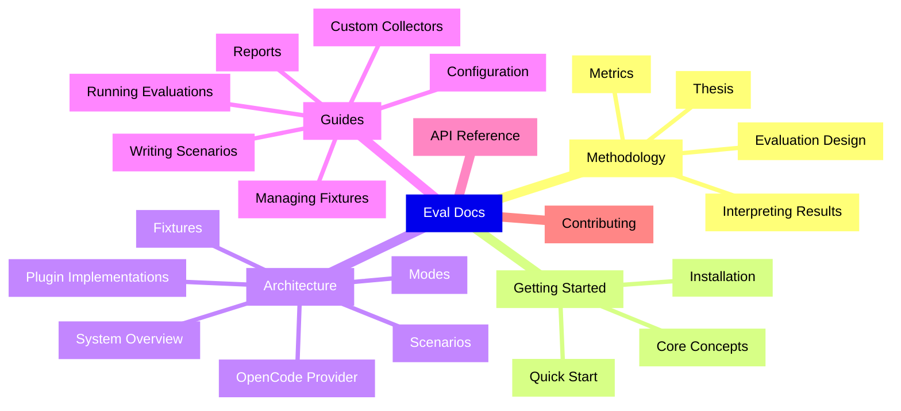

# Eval Documentation

`@ghx-dev/eval` proves that ghx -- a structured capability router for GitHub -- lets AI agents complete GitHub tasks with fewer tool calls, lower token cost, and higher reliability than raw `gh` CLI or GitHub MCP server tools. It does this by running identical tasks across three execution modes and comparing the results with statistical rigor.

## Quick Navigation

## By Use Case

### I want to understand what eval proves

Start here: **[Methodology](methodology/README.md)**

- [Thesis](methodology/thesis.md) -- The claim ghx makes and how eval tests it
- [Evaluation Design](methodology/evaluation-design.md) -- Why three modes, why repetitions, what makes a fair comparison
- [Metrics](methodology/metrics.md) -- Every metric collected, what it measures, and why it matters
- [Interpreting Results](methodology/interpreting-results.md) -- How to read eval reports as statistical evidence

### I want to run an evaluation

Start here: **[Getting Started](getting-started/README.md)**

- [Installation](getting-started/installation.md) -- Prerequisites, package setup, and environment variables
- [Quick Start](getting-started/quick-start.md) -- Run a single evaluation scenario from config to report
- [Core Concepts](getting-started/concepts.md) -- Modes, fixtures, checkpoints, and the execution matrix

### I want to understand the system design

Read: **[Architecture](architecture/README.md)**

- [System Overview](architecture/overview.md) -- End-to-end execution flow from configuration through profiling to reports
- [Plugin Implementations](architecture/plugin-implementations.md) -- How eval implements the 5 profiler plugin contracts
- [Modes](architecture/modes.md) -- The three evaluation modes and EvalModeResolver
- [Fixtures](architecture/fixtures.md) -- Fixture lifecycle: seed, status, reset, cleanup
- [Scenarios](architecture/scenarios.md) -- EvalScenario schema, template binding, and checkpoint definitions
- [OpenCode Provider](architecture/opencode-provider.md) -- SessionProvider implementation with SSE completion and trace building

### I want to write scenarios or extend the framework

See: **[Guides](guides/README.md)**

- [Writing Scenarios](guides/writing-scenarios.md) -- Step-by-step guide to creating evaluation scenarios
- [Managing Fixtures](guides/managing-fixtures.md) -- Seed, reset, and cleanup GitHub test fixtures
- [Configuration](guides/configuration.md) -- Full reference for config, CLI flags, and environment variables
- [Running Evaluations](guides/running-evaluations.md) -- CLI commands, flags, and interpreting output
- [Custom Collectors](guides/custom-collectors.md) -- Extend GhxCollector or create new collectors
- [Reports](guides/reports.md) -- Output formats, directory structure, and interpreting results

### I need type/API reference

Check: **[API Reference](api/README.md)**

- [EvalScenario Type Reference](api/eval-scenario.md) -- Field-by-field reference for the EvalScenario interface
- [Checkpoint Conditions](api/checkpoint-conditions.md) -- Reference for all 7 checkpoint condition types
- [Fixture Manifest](api/fixture-manifest.md) -- Reference for FixtureManifest and FixtureResource types
- [Public API](api/public-api.md) -- All exported functions, classes, types, and constants

### I want to contribute

See: **[Contributing](contributing/README.md)**

- [Development Setup](contributing/development-setup.md) -- Clone, install, and verify your environment
- [Adding Scenarios](contributing/adding-scenarios.md) -- Step-by-step guide for contributing new evaluation scenarios

## Key Facts

| Fact | Details |
|------|---------|
| Evaluation Modes | ghx (capability router), mcp (GitHub MCP server), baseline (raw `gh` CLI) |
| Plugin Implementations | OpenCodeProvider, CheckpointScorer, GhxCollector, EvalModeResolver, createEvalHooks |
| Scenario Format | JSON with Zod validation, fixture bindings, checkpoint assertions |
| Fixture Management | Seed, status, reset, cleanup lifecycle for GitHub test resources |
| CLI Commands | `eval run`, `eval analyze`, `eval report`, `eval check`, `eval fixture` |
| Statistical Methods | Bootstrap CI, Cohen's d effect size, permutation tests (via agent-profiler) |

## Requirements

- Node.js 22+
- pnpm workspace
- `@ghx-dev/agent-profiler`
- `@ghx-dev/core`

## Related Documentation

- [Agent Profiler Documentation](../../agent-profiler/docs/README.md) -- generic profiling framework that eval implements
