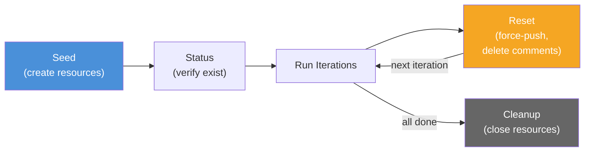

# Fixture Management

Fixtures are pre-seeded GitHub resources that scenarios reference. The fixture manager handles seeding, status checking, resetting between iterations, and cleanup. Without fixtures, scenarios would need to create their own state -- introducing variability and making results non-reproducible.

## Fixture Lifecycle



The lifecycle has four phases: seed creates the initial GitHub resources, status verifies they exist before a run, reset restores them to a known state between iterations, and cleanup closes resources after the run completes.

## Fixture Manifest

The manifest is a JSON file that records every fixture resource created during seeding. Scenarios reference fixtures by name (the keys in the `fixtures` map), and the fixture binder resolves template variables from the manifest values.

```typescript
interface FixtureManifest {
  readonly seedId: string
  readonly createdAt: string
  readonly repo: string
  readonly fixtures: Readonly<Record<string, FixtureResource>>
}

interface FixtureResource {
  readonly type: string
  readonly number: number
  readonly repo: string
  readonly branch?: string
  readonly labels?: readonly string[]
  readonly metadata: Readonly<Record<string, unknown>>
}
```

Example manifest:

```json
{
  "seedId": "seed-2026-02-15-001",
  "createdAt": "2026-02-15T10:30:00Z",
  "repo": "ghx-dev/ghx-bench-fixtures",
  "fixtures": {
    "pr_with_changes": {
      "type": "pr",
      "number": 42,
      "repo": "ghx-dev/ghx-bench-fixtures",
      "branch": "fix/mixed-thread-types",
      "labels": ["bench-fixture"],
      "metadata": {
        "originalSha": "abc123def456",
        "baseBranch": "main"
      }
    },
    "issue_with_labels": {
      "type": "issue",
      "number": 15,
      "repo": "ghx-dev/ghx-bench-fixtures",
      "labels": ["bench-fixture", "bug", "priority:high"],
      "metadata": {}
    }
  }
}
```

The `metadata.originalSha` field is critical for reset operations -- it records the branch HEAD at seed time so the manager can force-push back to it.

## Lifecycle Operations

### Seeding

Seeding creates fixtures in the benchmark repository. The process collects unique `fixture.requires` entries across all scenarios in the run, creates the corresponding GitHub resources (branches, PRs, issues), labels each with `bench-fixture` for identification, and writes the manifest to disk.

Seeding is triggered manually via `eval fixture seed` or automatically when `--seed-if-missing` is passed to `eval run`. The seed command is idempotent -- it checks for existing resources before creating new ones.

### Status Check

Before each run, the `beforeRun` hook calls `fixtureManager.status()` to verify every fixture in the manifest still exists. For each entry, the manager calls `gh pr view` or `gh issue view` and reports the result as OK or MISSING. If any fixtures are missing, the run aborts with a descriptive error listing the absent resources.

### Reset

For scenarios with `reseedPerIteration: true`, the `beforeScenario` hook resets fixtures to their original state before each iteration. This ensures every iteration starts from identical conditions.

The reset process for branch-based fixtures (PRs):

**Force-push retry:** Up to 3 attempts with 1-second delays between retries. Transient errors (network timeouts, 5xx responses) trigger retry; 4xx errors fail immediately. The force-push uses the GitHub REST API to update the git ref to the original SHA recorded in the manifest.

**Verification polling:** After a successful force-push, 5 polls at 500ms intervals confirm the branch HEAD matches the expected SHA. This guards against eventual consistency delays in the GitHub API.

**Comment cleanup:** Batched GraphQL mutations delete comments added during the previous iteration. Comments are processed in batches of 10 per request to stay within API rate limits.

**Performance:** A single reset takes approximately 3 seconds. For a scenario with 5 repetitions across 3 modes, that is 15 resets totaling roughly 45 seconds of overhead per scenario.

### Cleanup

After all iterations complete, cleanup closes the resources created during seeding:

- Close all open PRs in the fixture repository
- Close all open issues in the fixture repository
- Delete branches created for PR fixtures
- Remove `bench-fixture` labels
- Delete the manifest file

The `cleanup({ all: true })` variant finds all resources labeled `bench-fixture` in the repository, regardless of whether they appear in the current manifest. This is useful for recovering from interrupted runs.

## Integration with RunHooks

The `createEvalHooks()` factory connects fixture management to the profiler's run lifecycle:

```typescript
export function createEvalHooks(options: EvalHooksOptions): RunHooks {
  return {
    beforeRun: async (_ctx: RunContext) => {
      const status = await options.fixtureManager.status()
      if (status.missing.length > 0) {
        throw new Error(
          `Missing fixtures before run: ${status.missing.join(", ")}. Run "eval fixture seed" first.`,
        )
      }
    },

    beforeScenario: async (ctx) => {
      const scenario = ctx.scenario as unknown as EvalScenario
      if (scenario.fixture?.reseedPerIteration) {
        await options.fixtureManager.reset(scenario.fixture.requires)
      }
    },

    afterScenario: async (ctx: AfterScenarioContext) => {
      if (options.sessionExport && ctx.trace) {
        await exportSessionTrace(
          ctx.trace,
          ctx.scenario.id,
          ctx.mode,
          ctx.iteration,
          options.reportsDir ?? "reports",
        )
      }
    },
  }
}
```

The `beforeRun` hook acts as a gate -- no iterations execute if fixtures are missing. The `beforeScenario` hook runs before every iteration, but only triggers a reset when the scenario opts in via `reseedPerIteration`. The `afterScenario` hook handles session trace export, writing each trace to `reports/sessions/<scenarioId>/<mode>-iter-<n>.json`.

**Source:** `packages/eval/src/fixture/manager.ts`, `packages/eval/src/fixture/manifest.ts`

## Related Documentation

- [Evaluation Design](../methodology/evaluation-design.md)
- [Managing Fixtures Guide](../guides/managing-fixtures.md)
- [Fixture Manifest API](../api/fixture-manifest.md)
- [Scenarios](./scenarios.md)
