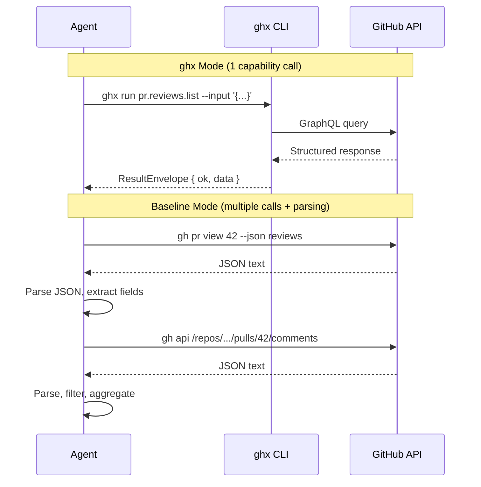

# Evaluation Modes

Modes define how the AI agent interacts with GitHub. Each mode configures a different toolset and instructions, creating controlled conditions for comparison. The three modes -- `ghx`, `mcp`, and `baseline` -- represent the primary question the eval framework answers: does structured capability routing (ghx) outperform alternative approaches?

## Mode Comparison Matrix

| Aspect | ghx | mcp | baseline |
|--------|-----|-----|----------|
| Tool call style | `ghx run <cap> --input '{}'` | MCP tool calls | `gh <cmd> --flag` |
| Output format | Structured JSON (normalized) | Structured JSON (MCP) | Text or JSON (varies) |
| Parsing required | No | No | Yes (agent must parse) |
| Capability discovery | SKILL.md (static) | MCP tool listing (dynamic) | Agent must know CLI |
| Error handling | Structured error codes | MCP error responses | Exit codes + stderr |
| Token overhead | Low (structured I/O) | Moderate | High (parsing, retries) |

## Mode Interaction Sequences



In ghx mode, the agent makes a single capability call and receives a normalized `ResultEnvelope`. In baseline mode, the same task may require multiple `gh` CLI invocations, manual JSON parsing, and result aggregation -- consuming more tokens and introducing more opportunities for error.

## EvalModeResolver

`EvalModeResolver` implements the profiler's `ModeResolver` contract. It maps each mode name to a `ModeConfig` containing environment variables, system instructions, and provider overrides:

```typescript
export class EvalModeResolver implements ModeResolver {
  async resolve(mode: string): Promise<ModeConfig> {
    switch (mode) {
      case "ghx":
        return {
          environment: {
            PATH: `${this.ghxBinDir()}:${process.env["PATH"] ?? ""}`,
          },
          systemInstructions: await this.loadSkillMd(),
          providerOverrides: {},
        }

      case "mcp":
        return {
          environment: {},
          systemInstructions: MCP_INSTRUCTIONS,
          providerOverrides: {
            mcpServers: [
              {
                name: "github",
                command: "npx",
                args: ["-y", "@modelcontextprotocol/server-github"],
                env: {
                  GITHUB_PERSONAL_ACCESS_TOKEN: this.requireGitHubToken(),
                },
              },
            ],
          },
        }

      case "baseline":
        return {
          environment: {},
          systemInstructions: BASELINE_INSTRUCTIONS,
          providerOverrides: {},
        }

      default:
        throw new Error(`Unknown mode: ${mode}`)
    }
  }
}
```

### ghx Mode

- **Environment:** Prepends the ghx binary directory to `PATH` so the agent can invoke `ghx run <capability>` directly.
- **System instructions:** Loads the full `SKILL.md` file, which documents every available capability with input/output schemas and examples. The resolver searches three locations in order: `GHX_SKILL_MD` environment variable, `./SKILL.md` in the working directory, and `~/.agents/skills/ghx/SKILL.md`. Falls back to a minimal instruction string if none are found.
- **Provider overrides:** None -- ghx operates as a CLI tool, not an MCP server.

### mcp Mode

- **Environment:** No PATH changes -- the GitHub MCP server is configured as a provider override.
- **System instructions:** Generic instructions describing available MCP tool categories (pull requests, issues, repositories, reviews, branches) and advising the agent to use the tool listing for discovery.
- **Provider overrides:** Configures `@modelcontextprotocol/server-github` as an MCP server with the GitHub token passed via environment.

### baseline Mode

- **Environment:** No modifications -- the agent uses whatever `gh` CLI is already on the PATH.
- **System instructions:** Minimal instructions listing common `gh` commands (`gh pr view`, `gh pr list`, `gh api graphql`, `gh issue view`) and advising the agent to use `--json` for structured output.
- **Provider overrides:** None -- the agent interacts with GitHub entirely through shell commands.

## System Instructions per Mode

Each mode's system instructions are calibrated to give the agent the right level of guidance for its toolset:

- **ghx:** Complete capability reference (SKILL.md) with input schemas, output shapes, and usage examples. The agent knows exactly what to call and what to expect back.
- **mcp:** Category-level guidance (PRs, issues, repos, reviews, branches) without specific tool names. The agent discovers available tools via the MCP tool listing protocol.
- **baseline:** Command-level examples (`gh pr view`, `gh api`) with a hint to use `--json`. The agent must know CLI syntax and parse output.

## Mode Execution Order

Modes run sequentially within a model. The OpenCode server is started once per model and reconfigured between modes:

1. For model M: start server with model M
2. Run ghx mode -- configure PATH + SKILL.md, execute all scenarios x repetitions
3. Run mcp mode -- reconfigure with MCP server, execute all scenarios x repetitions
4. Run baseline mode -- reconfigure with baseline instructions, execute all scenarios x repetitions
5. Shutdown server

The server is reused across modes when healthy, avoiding the 2--5 second startup cost per mode switch. Session isolation is maintained at the session level, not the server level -- each iteration creates a fresh session regardless of mode transitions.

**Source:** `packages/eval/src/mode/resolver.ts`, `packages/eval/src/mode/definitions.ts`

## Related Documentation

- [Thesis](../methodology/thesis.md)
- [System Overview](./overview.md)
- [Plugin Implementations](./plugin-implementations.md)
- [OpenCode Provider](./opencode-provider.md)
