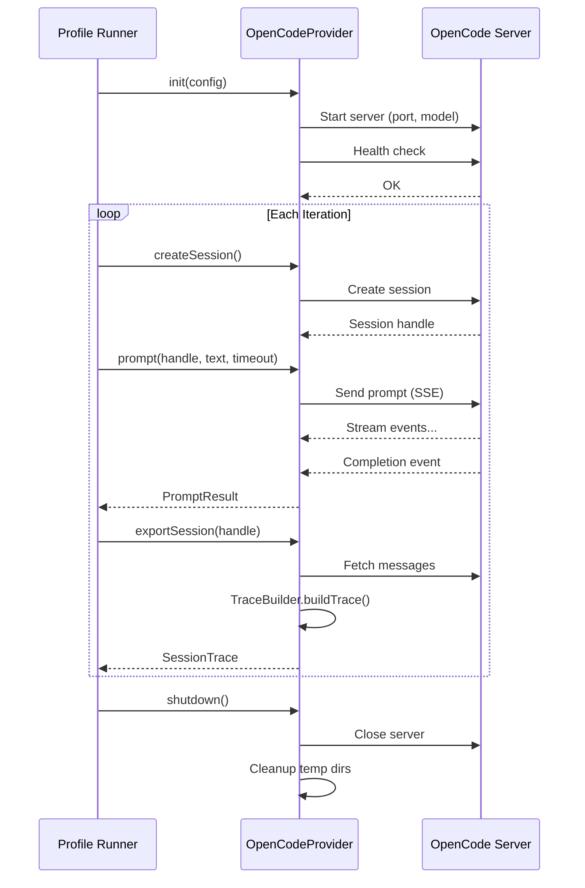

# OpenCode Provider

The OpenCode provider implements the profiler's `SessionProvider` contract using `@opencode-ai/sdk`. It manages server lifecycle, creates isolated sessions, detects completion via polling, extracts metrics from responses, and exports session traces for analysis.

## Provider Lifecycle



The runner calls `init()` once per (mode, model) group to start the OpenCode server. For each iteration, it creates a session, sends the prompt, waits for completion, optionally exports the session trace, then destroys the session. After all iterations for a mode complete, the runner calls `shutdown()` to close the server and clean up temporary directories.

## Completion Detection

The provider uses a polling approach to detect when the agent has finished processing. After sending a prompt via `promptAsync`, it polls the session messages endpoint every 300ms, checking the last message for a `step-finish` part with `reason: "stop"`. The poll loop runs until either completion is detected or the timeout expires.

```typescript
private async pollForCompletion(
  sessionApi: SessionApi,
  sessionId: string,
  timeoutMs: number,
): Promise<unknown[]> {
  const deadline = Date.now() + timeoutMs
  const pollInterval = 300

  while (Date.now() < deadline) {
    const rawMessages = await sessionApi.messages({
      url: "/session/{id}/message",
      path: { id: sessionId },
      query: { limit: 200 },
    })
    const messages = unwrapSessionMessages(rawMessages)
    if (this.isComplete(messages)) {
      return messages
    }
    await new Promise<void>((resolve) => setTimeout(resolve, pollInterval))
  }

  throw new TimeoutError(sessionId, timeoutMs)
}
```

When the timeout is reached without a completion signal, a `TimeoutError` is thrown with the session ID and timeout duration, enabling the profiler to record the failure with full context.

## Metric Extraction

Metrics are extracted from two sources after a prompt completes:

### From the last assistant message (per-turn)

Token breakdowns are extracted from the `tokens` field of the last assistant message:

```typescript
private extractTokens(message: unknown): TokenBreakdown {
  const msg = message as Record<string, unknown>
  const tokens = msg["tokens"] as Record<string, number> | undefined

  const input = tokens?.["input"] ?? 0
  const output = tokens?.["output"] ?? 0
  const cacheRead = tokens?.["cache_read"] ?? 0
  const cacheWrite = tokens?.["cache_write"] ?? 0
  const reasoning = tokens?.["reasoning"] ?? 0

  return {
    input,
    output,
    reasoning,
    cacheRead,
    cacheWrite,
    total: input + output + cacheRead + cacheWrite + reasoning,
    active: input + output + reasoning,
  }
}
```

Tool call records are extracted from all assistant messages by scanning for parts with `type: "tool"` and reading the tool state (name, success/error).

### From the session trace (full session)

The `exportSession()` method fetches all messages and passes them to `TraceBuilder.buildTrace()`, which produces a complete event stream with turn boundaries, reasoning blocks, tool calls/results, and aggregated token totals.

## Trace Builder

`TraceBuilder` converts OpenCode messages into the profiler's `TraceEvent[]` format. Each message part maps to a trace event type:

| OpenCode Part Type | Trace Event Type | Fields |
|--------------------|------------------|--------|
| `reasoning` | `reasoning` | content, estimated token count |
| `tool` | `tool_call` | name, input, output, success, error |
| `text` | `text_output` | content, estimated token count |
| message boundary | `turn_boundary` | turn number, timestamp |
| `step-finish` | (ignored) | Signals completion, not traced |

The trace builder also groups events into `Turn` objects using `turn_boundary` markers, computes per-turn timing from timestamps, and aggregates total token counts across all turns.

The full `SessionTrace` includes:

- `sessionId` -- links the trace to its provider session
- `events` -- flat array of all trace events in order
- `turns` -- events grouped by turn with timing metadata
- `summary` -- total turns, total tool calls, total tokens, total duration

## Session Isolation

Four mechanisms ensure each iteration runs in a clean environment:

1. **Fresh OpenCode session** -- `createSession()` creates a new server-side session for every iteration. No conversation history carries over.

2. **Isolated temp `XDG_CONFIG_HOME`** -- `init()` creates a temporary directory via `mkdtemp` and sets `XDG_CONFIG_HOME` and `OPENCODE_CONFIG_DIR` to point there. This prevents the provider from reading or writing the user's real OpenCode configuration.

3. **Clean environment** -- the provider snapshots all managed environment keys before `init()` and restores them on `shutdown()`. Only eval-controlled variables are present during the run.

4. **Mode-specific PATH/config** -- the `ModeResolver` injects per-mode environment variables and provider overrides that are applied before session creation.

The server itself is reused across iterations within a mode (startup takes 2--5 seconds). Isolation operates at the session level, not the server level.

## Health Check

The provider verifies server health implicitly through the `createSession()` call. If the SDK cannot connect to the server or the session creation fails, the error propagates to the profiler runner. The `init()` method validates that the server is not already initialized (calling `init()` twice without `shutdown()` throws) and catches SDK initialization errors to clean up the temp directory before re-throwing.

## Server Lifecycle

The server lifecycle is tied to the provider instance:

1. **Start** -- `init(config)` imports the OpenCode SDK, creates a temp config directory, applies environment variables, and starts the server on the configured port. The server process runs in the background.

2. **Reuse** -- between iterations, the server stays running. The `createSession()` and `prompt()` calls use the existing SDK client. No restart is needed when the mode does not change.

3. **Reconfigure** -- when the mode changes, the profiler calls `shutdown()` on the current provider and `init()` on a new one (or the same one after shutdown). The new `init()` starts a fresh server with the updated environment.

4. **Shutdown** -- `shutdown()` closes the server, nulls the client reference, removes the temp config directory, and restores the original environment variables from the snapshot taken during `init()`.

**Source:** `packages/eval/src/provider/opencode-provider.ts`, `packages/eval/src/provider/trace-builder.ts`, `packages/eval/src/provider/event-listener.ts`

## Related Documentation

- [System Overview](./overview.md)
- [Plugin Implementations](./plugin-implementations.md)
- [Modes](./modes.md)
- [Plugin Contracts (profiler)](../../../agent-profiler/docs/architecture/plugin-contracts.md)
