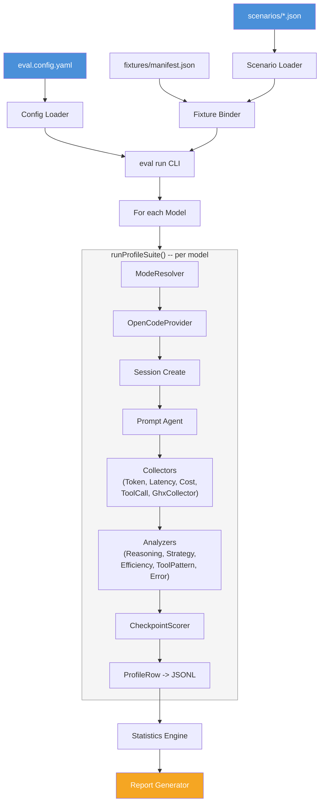

# System Overview

`@ghx-dev/eval` is the evaluation harness that measures how well AI agents perform GitHub tasks across different tooling strategies. It bridges the generic `@ghx-dev/agent-profiler` framework to the ghx ecosystem -- loading YAML configuration, binding fixture state to scenario templates, driving agent sessions through OpenCode, and scoring results via live GitHub API checks.

This page describes the end-to-end execution flow from YAML configuration through profiling to reports.

## Dependency Graph

```
@ghx-dev/eval
    +-- @ghx-dev/agent-profiler   (profiling framework: runner, stats, reporters, analyzers)
    +-- @ghx-dev/core             (ghx capabilities for checkpoint verification)
    +-- @opencode-ai/sdk          (OpenCode agent SDK for session management)
    +-- zod                       (config/scenario schema validation)
```

The profiler has zero domain dependencies. The eval package bridges the profiler to the ghx ecosystem.

## Execution Flow



The flow begins with three input sources -- the YAML configuration file, scenario JSON files, and the fixture manifest. The config loader parses and validates `eval.config.yaml`. The scenario loader reads `scenarios/*.json`, validates each against the `EvalScenarioSchema`, and hands them to the fixture binder which resolves `{{variable}}` placeholders using the manifest. The CLI command assembles these inputs and enters the model loop.

For each model, the CLI calls `runProfileSuite()` from the profiler. Inside the suite, the `EvalModeResolver` configures the environment for the current mode (ghx, mcp, or baseline), the `OpenCodeProvider` creates an isolated agent session and sends the prompt, built-in collectors plus `GhxCollector` extract metrics, built-in analyzers produce behavioral scores, and `CheckpointScorer` verifies task correctness against live GitHub state. Each iteration writes a `ProfileRow` to JSONL. After all iterations complete, the profiler's statistics engine computes descriptive stats and bootstrap confidence intervals, and the report generator produces Markdown, CSV, and JSON output.

## How Eval Uses the Profiler

The eval package wires its domain-specific implementations into the profiler's plugin contracts:

```typescript
import { runProfileSuite } from "@ghx-dev/agent-profiler"
import { OpenCodeProvider } from "./provider/opencode-provider.js"
import { CheckpointScorer } from "./scorer/checkpoint-scorer.js"
import { EvalModeResolver } from "./mode/resolver.js"
import { GhxCollector } from "./collector/ghx-collector.js"
import { createEvalHooks } from "./hooks/eval-hooks.js"

// In eval run command:
const results = await runProfileSuite({
  modes: config.modes,
  scenarios: loadedScenarios,
  repetitions: config.execution.repetitions,
  outputPath: config.output.resultsDir,

  provider: new OpenCodeProvider({ port: config.provider.port, model: currentModel }),
  scorer: new CheckpointScorer(githubToken),
  modeResolver: new EvalModeResolver(),
  collectors: [new GhxCollector()],
  hooks: createEvalHooks({ fixtureManager, sessionExport: config.output.sessionExport }),
})
```

The profiler owns the execution loop, statistics, and reporting. Eval supplies the five plugin implementations that make it specific to GitHub task evaluation.

## Package Structure

```
packages/eval/
  src/
    cli/              # CLI commands: run, check, fixture, analyze, report
    collector/        # GhxCollector -- tool call classification by category
    config/           # YAML config loader and Zod schema
    fixture/          # FixtureManager -- seed, status, reset, cleanup
    hooks/            # RunHooks -- fixture verification, reset, session export
    mode/             # EvalModeResolver -- ghx/mcp/baseline mode definitions
    provider/         # OpenCodeProvider -- session management via OpenCode SDK
    scenario/         # Scenario loader, schema, fixture binder
    scorer/           # CheckpointScorer -- ghx capability-based assertions
    index.ts          # Public API exports
  docs/               # Documentation (this directory)
  test/               # Unit and integration tests
  eval.config.yaml    # Default configuration
  scenarios/          # Scenario JSON files and scenario-sets.json
  fixtures/           # Fixture manifests
```

**Source:** `packages/eval/src/`

## Related Documentation

- [Plugin Implementations](./plugin-implementations.md)
- [Modes](./modes.md)
- [Core Concepts](../getting-started/concepts.md)
- [Thesis](../methodology/thesis.md)
