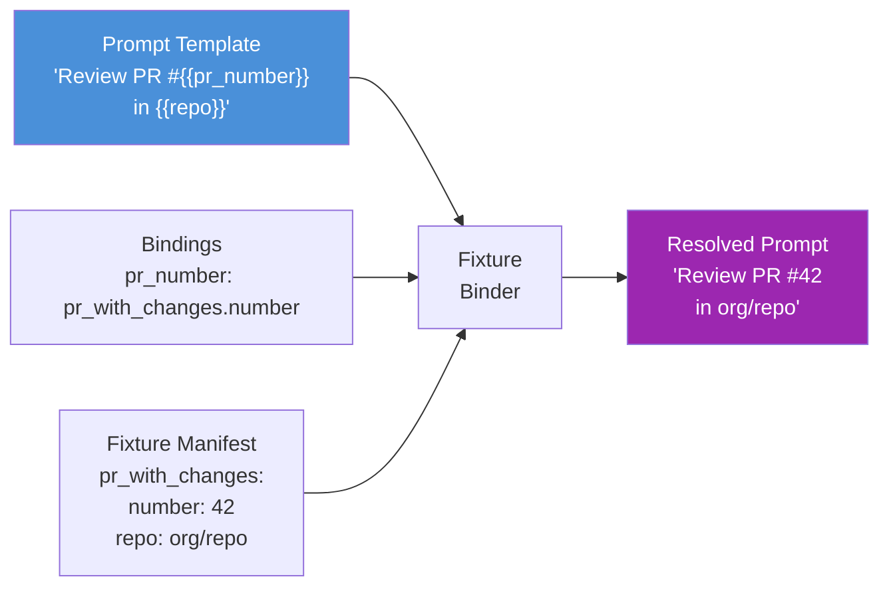

# Scenarios

Eval extends the profiler's `BaseScenario` with ghx-specific fields for fixtures, checkpoints, and task categorization. Scenarios are JSON files validated at load time against a Zod schema that enforces structural correctness, ID format, and checkpoint completeness.

## EvalScenario Schema

```typescript
interface EvalScenario {
  /** Unique ID matching ^[a-z0-9]+(?:-[a-z0-9]+)*-\d{3}$ */
  id: string
  /** Short display name */
  name: string
  /** Full description of the scenario's purpose */
  description: string
  /** Task prompt sent to the agent */
  prompt: string
  /** Maximum time in milliseconds for the agent to complete */
  timeoutMs: number
  /** Additional attempts permitted after the initial run (default: 0) */
  allowedRetries: number
  /** Arbitrary string tags for filtering and grouping */
  tags: string[]
  /** GitHub domain */
  category: "pr" | "issue" | "workflow" | "release" | "repo"
  /** Complexity level */
  difficulty: "basic" | "intermediate" | "advanced"
  /** GitHub fixture requirements (optional) */
  fixture?: FixtureRequirements
  /** Assertion checkpoints evaluated after the session */
  assertions: {
    checkpoints: Checkpoint[]
    expectedToolSequence?: string[]
    expectedCapabilities?: string[]
  }
}

interface Checkpoint {
  /** Unique identifier within the scenario */
  id: string
  /** Human-readable description of what is being asserted */
  description: string
  /** ghx capability task name, e.g. "pr.commits.list" */
  task: string
  /** Input passed to the capability task */
  input: Record<string, unknown>
  /** Condition that the task result must satisfy */
  condition: CheckpointCondition
}

type CheckpointCondition =
  | { type: "non_empty" }
  | { type: "empty" }
  | { type: "count_gte"; value: number }
  | { type: "count_eq"; value: number }
  | { type: "field_equals"; path: string; value: string | number | boolean | null }
  | { type: "field_contains"; path: string; value: string }
  | { type: "custom"; scorer: string }
```

## Categories and Difficulty

Categories map to GitHub domains:

- **pr** -- pull request operations (reviews, comments, merges, diffs)
- **issue** -- issue management (labels, assignments, comments, closing)
- **workflow** -- GitHub Actions workflows (triggers, status, logs)
- **release** -- release management (create, tag, assets)
- **repo** -- repository operations (branches, files, settings)

Difficulty levels indicate task complexity:

- **basic** -- single-step operations with one capability call (e.g., list PR reviews)
- **intermediate** -- multi-step workflows requiring sequencing (e.g., review a PR and leave comments)
- **advanced** -- complex orchestration across multiple domains (e.g., triage an issue, find related PRs, and update labels)

## Fixture Binding

The `fixture` section of a scenario declares its GitHub resource dependencies:

- **repo** -- the `owner/repo` containing fixture resources
- **requires** -- list of fixture names (keys in the manifest) this scenario depends on
- **bindings** -- map of template variable names to manifest paths (e.g., `pr_number: pr_with_changes.number`)
- **reseedPerIteration** -- when `true`, reset fixture branches to their original SHAs before each iteration

## Template Variable Resolution



The fixture binder resolves `{{variable}}` placeholders in the scenario's prompt and checkpoint inputs. Each binding maps a variable name to a dot-delimited path into the fixture manifest (e.g., `pr_with_changes.number` resolves to `manifest.fixtures.pr_with_changes.number`).

Two variables are auto-derived when a `repo` binding is present:

- `{{owner}}` -- the owner portion of the repo path (before the `/`)
- `{{repo_name}}` -- the repository name portion (after the `/`)

The binder returns a new scenario object -- the original is never mutated.

## Checkpoints

Each checkpoint specifies a ghx capability task to run after the agent session completes, along with a condition that the task result must satisfy. Checkpoints are evaluated in order by `CheckpointScorer`.

**Structure:**

- **id** -- unique within the scenario, used in scoring reports
- **description** -- human-readable explanation of what is being checked
- **task** -- a ghx capability name (e.g., `pr.reviews.list`, `issue.labels.list`)
- **input** -- arguments passed to the capability; may contain `{{variable}}` placeholders
- **condition** -- the assertion rule applied to the capability's result data

**Condition types:**

| Type | Passes when |
|------|-------------|
| `non_empty` | Result array has at least one element, or result is non-null |
| `empty` | Result array is empty, or result is null/undefined |
| `count_gte` | Result array length is >= `value` |
| `count_eq` | Result array length equals `value` |
| `field_equals` | Nested field at `path` strictly equals `value` (primitive) |
| `field_contains` | Nested field at `path` (string) contains the `value` substring |
| `custom` | Delegates to a named custom scorer function (v2 -- not yet implemented) |

## Example Scenarios

### Multi-step workflow scenario

```json
{
  "id": "pr-fix-mixed-threads-wf-001",
  "name": "Fix mixed review threads",
  "description": "Agent must identify unresolved review threads on a PR and resolve them by pushing appropriate fixes.",
  "prompt": "Review PR #{{pr_number}} in {{repo}}. Find all unresolved review threads and push fixes to resolve them.",
  "timeoutMs": 300000,
  "allowedRetries": 1,
  "tags": ["pr", "reviews", "multi-step"],
  "category": "pr",
  "difficulty": "advanced",
  "fixture": {
    "repo": "ghx-dev/ghx-bench-fixtures",
    "requires": ["pr_with_changes"],
    "bindings": {
      "pr_number": "pr_with_changes.number",
      "repo": "pr_with_changes.repo"
    },
    "reseedPerIteration": true
  },
  "assertions": {
    "checkpoints": [
      {
        "id": "threads-resolved",
        "description": "All review threads should be resolved",
        "task": "pr.reviews.list",
        "input": { "owner": "{{owner}}", "repo": "{{repo_name}}", "pull_number": "{{pr_number}}" },
        "condition": { "type": "non_empty" }
      },
      {
        "id": "commits-added",
        "description": "At least one fix commit should be pushed",
        "task": "pr.commits.list",
        "input": { "owner": "{{owner}}", "repo": "{{repo_name}}", "pull_number": "{{pr_number}}" },
        "condition": { "type": "count_gte", "value": 2 }
      }
    ],
    "expectedCapabilities": ["pr.reviews.list", "pr.commits.list"]
  }
}
```

### Simple single-step scenario

```json
{
  "id": "pr-review-comment-001",
  "name": "List PR review comments",
  "description": "Agent should retrieve all review comments on a pull request.",
  "prompt": "List all review comments on PR #{{pr_number}} in {{repo}}.",
  "timeoutMs": 60000,
  "allowedRetries": 0,
  "tags": ["pr", "reviews", "basic"],
  "category": "pr",
  "difficulty": "basic",
  "fixture": {
    "repo": "ghx-dev/ghx-bench-fixtures",
    "requires": ["pr_with_changes"],
    "bindings": {
      "pr_number": "pr_with_changes.number",
      "repo": "pr_with_changes.repo"
    },
    "reseedPerIteration": false
  },
  "assertions": {
    "checkpoints": [
      {
        "id": "comments-exist",
        "description": "PR should have at least one review comment",
        "task": "pr.review-comments.list",
        "input": { "owner": "{{owner}}", "repo": "{{repo_name}}", "pull_number": "{{pr_number}}" },
        "condition": { "type": "non_empty" }
      }
    ]
  }
}
```

## Scenario Sets

Named groupings in `scenario-sets.json` allow running predefined subsets of scenarios:

```json
{
  "smoke": ["pr-review-comment-001", "issue-label-assign-001"],
  "pr-full": [
    "pr-review-comment-001",
    "pr-fix-mixed-threads-wf-001",
    "pr-merge-ready-check-001"
  ],
  "basic-only": [
    "pr-review-comment-001",
    "issue-label-assign-001",
    "repo-branch-list-001"
  ]
}
```

Use `--scenario-set smoke` on the CLI to run only the scenarios in that set.

## Validation

The scenario loader enforces five validation rules at load time:

1. **Schema validation** -- every scenario must conform to the `EvalScenarioSchema` Zod schema, including all required fields and correct types
2. **ID format** -- IDs must match the regex `^[a-z0-9]+(?:-[a-z0-9]+)*-\d{3}$`
3. **Checkpoint task validity** -- checkpoint `task` values must be non-empty strings (runtime validation against the capability registry happens during scoring)
4. **Template completeness** -- when fixture bindings are provided, all `{{variable}}` placeholders in the prompt and checkpoint inputs must resolve to manifest values
5. **No duplicate IDs** -- scenario IDs must be unique across all loaded JSON files; duplicates cause an immediate error

## ID Format

Scenario IDs must match `^[a-z0-9]+(?:-[a-z0-9]+)*-\d{3}$`. The pattern is lowercase alphanumeric words separated by hyphens, ending with a three-digit sequence number.

Examples:
- `pr-review-comment-001`
- `issue-label-assign-002`
- `pr-fix-mixed-threads-wf-001`
- `repo-branch-list-003`

The trailing number enables multiple scenarios within the same domain to coexist without naming conflicts.

**Source:** `packages/eval/src/scenario/schema.ts`, `packages/eval/src/scenario/loader.ts`, `packages/eval/src/scenario/fixture-binder.ts`

## Related Documentation

- [Writing Scenarios Guide](../guides/writing-scenarios.md)
- [EvalScenario API](../api/eval-scenario.md)
- [Checkpoint Conditions API](../api/checkpoint-conditions.md)
- [Fixtures](./fixtures.md)
