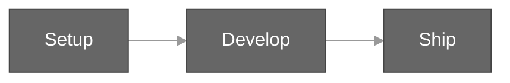

# Contributing to Eval

Hub for contributing to the `@ghx-dev/eval` package.



## Getting Started

| Guide | Description |
|-------|-------------|
| [Development Setup](./development-setup.md) | Clone, install, and verify your environment |
| [Adding Scenarios](./adding-scenarios.md) | Step-by-step guide for contributing new evaluation scenarios |

## Quick Reference

### Common Commands

```bash
# Build
pnpm run build

# Test
pnpm --filter @ghx-dev/eval run test
pnpm --filter @ghx-dev/eval exec vitest run test/unit/scenario/schema.test.ts

# Lint & Format
pnpm run format
pnpm run lint
pnpm run typecheck

# Full CI
pnpm run ci --outputStyle=static
```

### Testing

The coverage target is 90% (aim for 95%). Run the full test suite before opening a pull request to confirm nothing regresses.

### Pre-commit Hooks

Lefthook runs automatically on every commit:

- Biome format and auto-stage
- ESLint on staged `.ts` / `.js` / `.mjs` files
- Full typecheck

### Branch Naming

Use a prefix that matches the change type:

- `feat/` -- new functionality
- `fix/` -- bug fixes
- `chore/` -- maintenance, dependency updates
- `docs/` -- documentation-only changes

### Commit Messages

Follow conventional commits scoped to the eval package:

```text
feat(eval): add new scenario for workflow dispatch
fix(eval): handle empty fixture manifest
docs(eval): document checkpoint conditions
```

## Related Documentation

- [Getting Started](../getting-started/README.md)
- [Architecture](../architecture/README.md)
- [API Reference](../api/README.md)
