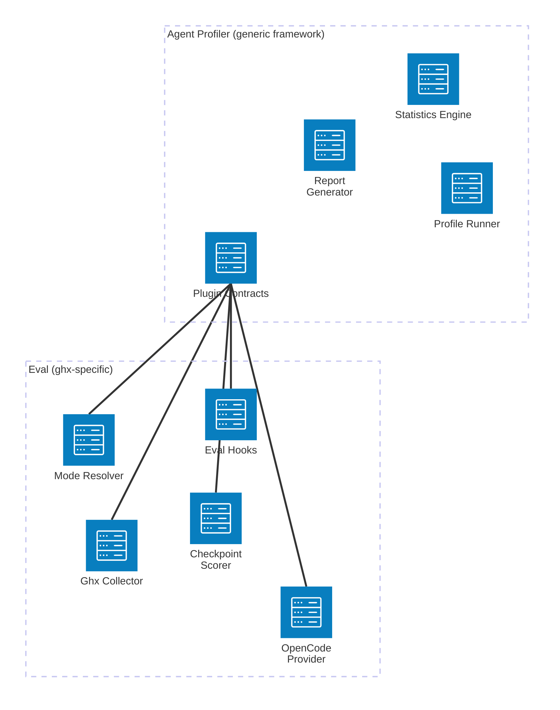

# Core Concepts

Understand the relationship between eval and the profiler, the three evaluation modes, fixtures, checkpoints, and the execution matrix.

## Eval vs Profiler

| Concern | Agent Profiler | Eval Package |
|---------|---------------|-------------|
| Primary question | How efficiently did the agent work? | How does ghx compare to MCP and baseline? |
| Scenarios | Generic `BaseScenario` | `EvalScenario` with fixtures, checkpoints, categories |
| Scoring | Generic `Scorer` contract | `CheckpointScorer` using ghx capabilities |
| Session provider | Generic `SessionProvider` contract | `OpenCodeProvider` via OpenCode SDK |
| Mode configuration | Generic `ModeResolver` | ghx/mcp/baseline with specific env and instructions |
| Fixture management | Not a concept | Managed GitHub state for reproducible tests |
| Statistical analysis | Built-in (bootstrap CI, Cohen's d, permutation tests) | Inherited from profiler |

The profiler is a generic framework for measuring agent efficiency across any domain. Eval is the ghx-specific consumer that implements the profiler's plugin contracts to answer a focused question: does structured capability routing (ghx) outperform MCP and raw CLI for GitHub tasks?

## Three Evaluation Modes

- **ghx** -- the agent uses `ghx run <capability>` commands with structured JSON input/output. System instructions come from SKILL.md. This is the mode we hypothesize will perform best.
- **mcp** -- the agent uses GitHub MCP server tools (`github_create_review`, `github_get_pr`, etc.). Tools are structured but more granular than ghx capabilities.
- **baseline** -- the agent uses raw `gh` CLI commands (`gh pr view`, `gh api`, etc.). Output is often unstructured text that requires parsing.

Each mode configures the agent differently via the `ModeResolver` -- setting environment variables, system instructions, and available tools. The scenario prompt remains identical across modes, isolating the routing mechanism as the independent variable.

## Fixtures

Fixtures are managed GitHub resources (PRs, issues, branches) in a dedicated benchmark repository. They exist because:

- Agent actions mutate GitHub state (push commits, add comments, merge PRs)
- Repeatable evaluations require identical starting conditions
- Each mode must operate on the same initial state for fair comparison

**Lifecycle:** seed (create resources) -> status (verify resources exist) -> reset (restore state between iterations) -> cleanup (remove resources after evaluation).

Fixture definitions live in the scenario JSON under the `fixture` key. The `requires` array declares which resource types are needed, and the `bindings` map connects template variables in the prompt to actual fixture values from the manifest.

## Checkpoints

Checkpoints verify that the agent actually completed the task. After each iteration, eval runs ghx capability calls to inspect the result:

- "Did the agent post a review comment?" -- run `pr.reviews.list`, check result is non-empty
- "Did the agent push a commit?" -- run `pr.commits.list`, check count >= 2
- "Did the agent add a label?" -- run `issues.labels.list`, check field equals expected value

Each checkpoint has a condition type that determines how the ghx capability result is evaluated. Supported condition types include `non_empty`, `count_gte`, and `field_equals`. The `CheckpointScorer` aggregates all checkpoint results into a single pass/fail score per iteration.

## Execution Matrix

The full evaluation expands: **models x modes x scenarios x repetitions**. For example, 1 model x 3 modes x 2 scenarios x 5 repetitions = 30 iterations.

The eval CLI handles models as the outer loop, invoking the profiler's `runProfileSuite()` once per model. The profiler handles the inner loops (modes x scenarios x repetitions), applying warmup, retry logic, and hook callbacks at each boundary.

For the full matrix diagram and design rationale, see [Evaluation Design](../methodology/evaluation-design.md).

## Template Variables

Scenario prompts use `{{variable}}` placeholders that are resolved from the fixture manifest before each run. For example, `"Review PR #{{pr_number}}"` becomes `"Review PR #42"` when the fixture manifest maps `pr_with_changes.number` to `42`.

Template resolution happens after fixture seeding and before the prompt is sent to the session provider. All declared `bindings` must resolve to non-null values -- the validator in `eval check` catches unresolvable references before execution begins.

## Key Types

| Type | Package | Purpose |
|------|---------|---------|
| `EvalScenario` | eval | Scenario with fixtures, checkpoints, category, difficulty |
| `EvalConfig` | eval | YAML configuration schema |
| `FixtureManifest` | eval | Maps fixture names to GitHub resources |
| `CheckpointCondition` | eval | Defines how to verify agent output |
| `ProfileRow` | profiler | One iteration's complete data record |
| `SessionTrace` | profiler | Full event trace from an agent session |

## Source Reference

- Eval scenario type: `packages/eval/src/scenario/`
- Checkpoint scorer: `packages/eval/src/scorer/`
- Mode resolver: `packages/eval/src/mode/`
- Fixture management: `packages/eval/src/fixture/`

## Related Documentation

- [Thesis](../methodology/thesis.md) -- the hypothesis eval is designed to test
- [Evaluation Design](../methodology/evaluation-design.md) -- full matrix design and statistical methodology
- [Architecture Overview](../architecture/overview.md) -- system design and component relationships
- [Plugin Implementations](../architecture/plugin-implementations.md) -- how eval implements profiler contracts
