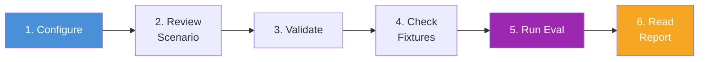

# Quick Start

Run your first evaluation in 6 steps -- from configuration to report.



## Step 1: Review the Configuration

The evaluation is configured via `config/eval.config.yaml`. This file has two sections: profiler config (modes, scenarios, execution, output) passed through to `@ghx-dev/agent-profiler`, and eval-specific config (provider, models, fixtures) that the eval package handles directly.

```yaml
# -- Profiler config (passed through to agent-profiler) --

# Execution modes to compare
modes:
  - ghx
  - baseline
  - mcp

# Scenario selection
scenarios:
  set: default
  # ids:                    # Or explicit scenario IDs (overrides set)
  #   - pr-fix-mixed-threads-wf-001

# Execution parameters
execution:
  repetitions: 5
  warmup: true
  timeout_default_ms: 120000

# Output configuration
output:
  results_dir: results
  reports_dir: reports
  session_export: true
  log_level: info

# -- Eval-specific config (extensions) --

# Provider configuration
provider:
  id: opencode
  port: 3001

# Models to evaluate (eval iterates over these, calling profiler per model)
models:
  - id: openai/gpt-5.3-codex
    label: Codex 5.3

# Fixture configuration
fixtures:
  repo: aryeko/ghx-bench-fixtures
  manifest: fixtures/latest.json
  seed_if_missing: false
  reseed_between_modes: false
```

The **profiler config** section defines which modes to compare (`ghx`, `baseline`, `mcp`), how scenarios are selected, and execution parameters like repetition count and timeouts. The **eval-specific config** section configures the session provider, the models to evaluate, and fixture management for reproducible GitHub state.

## Step 2: Review a Scenario

Scenarios live in `scenarios/` as JSON files. Each scenario describes a task the agent must perform, the GitHub fixtures it requires, and the assertions that verify success.

```json
{
  "id": "pr-review-comment-001",
  "name": "Review and Comment on PR",
  "description": "Agent must review a PR diff, identify issues, and leave a constructive review comment.",
  "category": "pr",
  "difficulty": "basic",
  "prompt": "Review the changes in PR #{{pr_number}} in {{repo}}. Examine the diff carefully and leave a review comment summarizing your findings -- mention any bugs, style issues, or improvements. Submit as a comment (not approval or request-changes).",
  "timeoutMs": 120000,
  "allowedRetries": 1,
  "tags": ["pr", "review", "comment"],
  "fixture": {
    "repo": "{{fixture_repo}}",
    "requires": ["pr_with_changes"],
    "bindings": {
      "pr_number": "pr_with_changes.number",
      "repo": "pr_with_changes.repo"
    },
    "reseedPerIteration": false
  },
  "assertions": {
    "checkpoints": [
      {
        "id": "review-comment-exists",
        "description": "A review comment was posted on the PR",
        "task": "pr.reviews.list",
        "input": {
          "owner": "{{owner}}",
          "repo": "{{repo_name}}",
          "pr_number": "{{pr_number}}"
        },
        "condition": { "type": "non_empty" }
      }
    ],
    "expectedCapabilities": ["pr.view", "pr.diff", "pr.reviews.create"]
  }
}
```

Key fields:

- **`prompt`** -- the task the agent will perform. `{{variable}}` placeholders are resolved from the fixture manifest before each run (see [Template Variables](concepts.md#template-variables)).
- **`fixture`** -- GitHub resources the scenario needs. The `requires` array lists fixture types, and `bindings` maps template variables to fixture values (e.g., `pr_with_changes.number` resolves to the actual PR number).
- **`assertions.checkpoints`** -- how eval verifies the agent succeeded. Each checkpoint runs a ghx capability call and applies a condition. Here, `pr.reviews.list` is called and the result must be non-empty -- confirming the agent posted a review comment.
- **`assertions.expectedCapabilities`** -- the ghx capabilities the agent should have used. This enables tool call classification in the generated report.

## Step 3: Validate Configuration and Scenarios

```bash
eval check
```

This validates: config schema, scenario schemas, checkpoint task validity, template variable completeness, and no duplicate scenario IDs. Fix any reported errors before proceeding.

## Step 4: Check Fixture Status

```bash
eval fixture status
```

Verifies all required GitHub resources (PRs, issues, branches) exist in the benchmark repository. If any fixtures are missing, they must be seeded before running the evaluation.

## Step 5: Run the Evaluation

For a quick single-scenario run:

```bash
eval run --mode ghx --scenario pr-review-comment-001 --repetitions 1
```

For a full comparison across all modes:

```bash
eval run --scenario pr-review-comment-001 --repetitions 3
```

This runs the scenario in all configured modes (ghx, mcp, baseline) with 3 repetitions each. The profiler handles the mode x scenario x repetition matrix internally.

## Step 6: Read the Report

Results are written to:

- **`results/`** -- raw JSONL data (one `ProfileRow` per iteration)
- **`reports/`** -- generated Markdown, CSV, and JSON reports
- **`reports/sessions/`** -- full session traces (if `session_export: true`)

Open the generated Markdown report to see per-mode metrics comparison, tool call classification, and checkpoint pass rates.

For how to interpret the statistical results (confidence intervals, effect sizes, significance tests), see [Interpreting Results](../methodology/interpreting-results.md).

## Source Reference

- Configuration schema: `packages/eval/src/config/`
- Scenario schema: `packages/eval/src/scenario/`
- CLI entry point: `packages/eval/src/cli/`

## Related Documentation

- [Installation](installation.md) -- prerequisites and package setup
- [Core Concepts](concepts.md) -- eval vs profiler, modes, fixtures, and checkpoints
- [Running Evaluations](../guides/running-evaluations.md) -- advanced CLI options and filtering
- [Configuration Guide](../guides/configuration.md) -- full reference for eval.config.yaml
