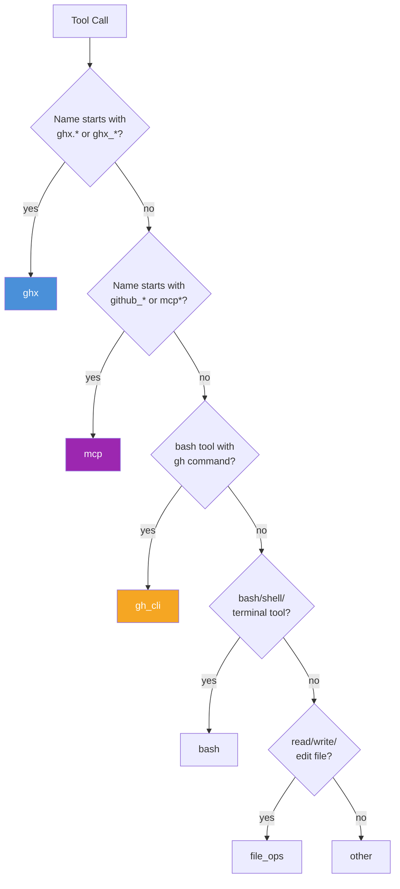

# Custom Collectors

How GhxCollector classifies tool calls and how to extend it with custom categories.

## How GhxCollector Works

The `GhxCollector` implements the profiler's `Collector` contract. It inspects every tool call from an agent session trace and classifies each one into one of six categories, emitting per-category count metrics on each `ProfileRow`.



The classifier uses both the tool name and (when available from session traces) the tool input to distinguish categories. For example, a `bash` tool call with a `gh pr view` command is classified as `gh_cli`, not `bash`.

## Classification Rules

| Category | Name Match | Input Check | Examples |
|----------|-----------|-------------|---------|
| `ghx` | `ghx`, `ghx.*`, `ghx_*` | -- | `ghx.pr.view`, `ghx_run` |
| `mcp` | `github_*`, `mcp_*`, `mcp__*` | -- | `github_create_review`, `mcp__github` |
| `gh_cli` | bash/shell tools | Command starts with `gh` | `bash` with `gh pr view` |
| `bash` | `bash`, `shell`, `terminal`, `Bash`, `run_terminal_cmd`, `computer` | Not a `gh` command | `bash` with `npm test` |
| `file_ops` | `read_file`, `write_file`, `edit_file`, `Read`, `Write`, `Edit`, `Glob`, etc. | -- | `Read`, `Edit` |
| `other` | Everything else | -- | `WebSearch`, `Task` |

## Emitted Metrics

Each category maps to a named custom metric on the `ProfileRow`:

| Category | Metric Name | Unit |
|----------|------------|------|
| `ghx` | `ghx.capabilities_used` | count |
| `mcp` | `ghx.mcp_tools_invoked` | count |
| `gh_cli` | `ghx.gh_cli_commands` | count |
| `bash` | `ghx.bash_commands` | count |
| `file_ops` | `ghx.file_ops` | count |
| `other` | `ghx.other_tools` | count |

These metrics are the foundation for comparing tool usage patterns across ghx, mcp, and baseline modes.

## Extending: Adding New Categories

To add a new classification category:

1. Add the category to the `ToolCategory` type in `tool-classifier.ts`:

```typescript
export type ToolCategory = "ghx" | "mcp" | "gh_cli" | "bash" | "file_ops" | "other" | "my_category"
```

2. Add the classification rule in `classifyToolCall()`, before the `return "other"` fallback.

3. Add the metric name mapping in `GhxCollector`:

```typescript
const CATEGORY_METRIC_NAMES: Readonly<Record<ToolCategory, string>> = {
  // ... existing entries
  my_category: "ghx.my_category_calls",
}
```

## Creating a Custom Collector

For entirely different metrics, implement the profiler's `Collector` interface:

```typescript
import type { Collector, CustomMetric, PromptResult, BaseScenario, SessionTrace } from "@ghx-dev/agent-profiler"

class MyCollector implements Collector {
  readonly id = "my-collector"

  async collect(
    result: PromptResult,
    scenario: BaseScenario,
    mode: string,
    trace: SessionTrace | null,
  ): Promise<readonly CustomMetric[]> {
    // Analyze result/trace and return metrics
    return [
      { name: "my.metric", value: 42, unit: "count" },
    ]
  }
}
```

Pass custom collectors to `runProfileSuite()` via the `collectors` array in the profiler configuration.

For the full `Collector` interface definition, see the [agent-profiler plugin contracts](../../../agent-profiler/docs/architecture/plugin-contracts.md).

Source: `packages/eval/src/collector/ghx-collector.ts`, `packages/eval/src/collector/tool-classifier.ts`

## Related Documentation

- [Guides Hub](./README.md) -- all available guides
- [Metrics Framework](../methodology/metrics-framework.md) -- how collector metrics feed into analysis
- [Plugin Implementations](../architecture/plugin-implementations.md) -- all six eval plugin implementations
- [Agent Profiler Plugin Contracts](../../../agent-profiler/docs/architecture/plugin-contracts.md) -- full Collector interface
