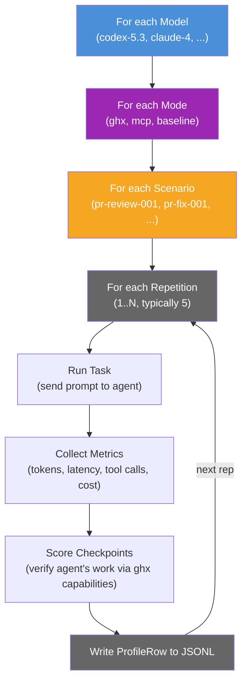

# Evaluation Design

Eval runs a controlled comparison: same task, same agent, three different toolsets. This page explains why the evaluation is structured this way and what design decisions ensure fair, repeatable results.

## Controlled Comparison

Three modes make this a fair test. The agent receives identical task prompts in every mode. The only differences are the system instructions (which describe the available tools) and the tools themselves. This isolates the toolset as the independent variable.

If ghx mode outperforms baseline and MCP modes on tool call count and token usage while maintaining correctness, the improvement is attributable to the toolset -- not to prompt engineering, model selection, or environmental factors.

## The Execution Matrix

The eval runs a nested loop over models, modes, scenarios, and repetitions:

The total number of iterations is the product of all dimensions. For example: 2 models x 3 modes x 5 scenarios x 5 repetitions = 150 iterations. Each iteration produces one `ProfileRow` written to JSONL, which the profiler's statistics engine then aggregates into descriptive stats, confidence intervals, and cross-mode comparisons.

## Why Repetitions Matter

LLM outputs are stochastic. A single run tells you nothing -- the agent might get lucky (finding the right command on the first try) or unlucky (hallucinating a nonexistent flag and spending tokens recovering). Multiple repetitions reveal the distribution: mean, variance, and confidence intervals.

Typically the eval uses 5 repetitions per combination. This is enough to compute bootstrap confidence intervals and detect medium-to-large effect sizes. High-variance scenarios may warrant more repetitions (10+) to narrow confidence intervals.

The key insight: without repetitions, you cannot distinguish signal from noise. An agent that uses 3 tool calls in one run and 9 in another is not reliably "better" -- you need the distribution to make that claim.

## Why Fixtures Must Reset

Agent actions mutate GitHub state. A PR review scenario might push commits, add review comments, approve the PR, or merge it. Without resetting, the second iteration sees different starting conditions than the first -- the PR already has comments, the branch is already merged, labels are already applied.

The `reseedPerIteration` flag triggers fixture reset before each iteration:

- Force-push branches to their original SHA
- Delete comments, reviews, and labels added during the previous iteration
- Reset any other mutable state defined by the scenario's fixture

Cost: approximately 3 seconds per reset (GitHub API calls to restore state). This is a small price for experimental validity -- without it, results across repetitions are not comparable.

## Why Multiple Scenarios

Different task complexities test different aspects of the hypothesis:

- **Basic** (e.g., list reviews on a PR): tests whether ghx reduces tool calls for simple, single-operation tasks. If ghx does not help here, the routing overhead may not be justified for simple operations.
- **Intermediate** (e.g., fix code based on review threads): tests whether ghx helps with multi-step workflows where the agent must read reviews, understand the feedback, edit code, and push changes. More steps means more opportunities for ghx to reduce plumbing overhead.
- **Advanced** (e.g., orchestrate a release with status checks): tests whether ghx scales to complex, multi-domain operations that span PRs, workflows, releases, and repository settings.

Scenario categories cover different GitHub domains: `pr`, `issue`, `workflow`, `release`, `repo`. Each domain exercises different capabilities and different baseline complexity, providing breadth to the evaluation.

## Why Multiple Models

If ghx helps across GPT-5, Claude, and other models, the claim is stronger. Model-specific results would suggest the benefit comes from prompt engineering or model-specific behavior rather than from the toolset itself.

The eval CLI handles models as an outer loop, running `runProfileSuite()` once per model with appropriate provider configuration. Cross-model results are compared in the final report to identify whether ghx benefits are model-independent.

If a particular model shows no benefit from ghx while others do, that is a useful finding -- it may indicate that the model is already efficient at discovering and chaining CLI commands, or that it struggles with ghx's structured input format.

## Statistical Approach

The profiler's statistics engine provides the mathematical rigor:

- **Multiple repetitions** produce a distribution of measurements for each metric
- **Bootstrap confidence intervals** give reliable ranges for metric values, even with small sample sizes (5 repetitions)
- **Cohen's d** measures the magnitude of difference between modes -- is the difference small, medium, or large?
- **Permutation tests** determine whether observed differences are statistically significant or could have arisen by chance

See [Interpreting Results](./interpreting-results.md) for a detailed explanation of each statistical method and how to read them in eval reports.

## Related Documentation

- [Thesis](./thesis.md) -- the claim eval is designed to test
- [Metrics](./metrics.md) -- every metric collected and why it matters
- [Interpreting Results](./interpreting-results.md) -- how to read eval reports as evidence
- [Fixtures Architecture](../architecture/fixtures.md) -- how fixture reset works
