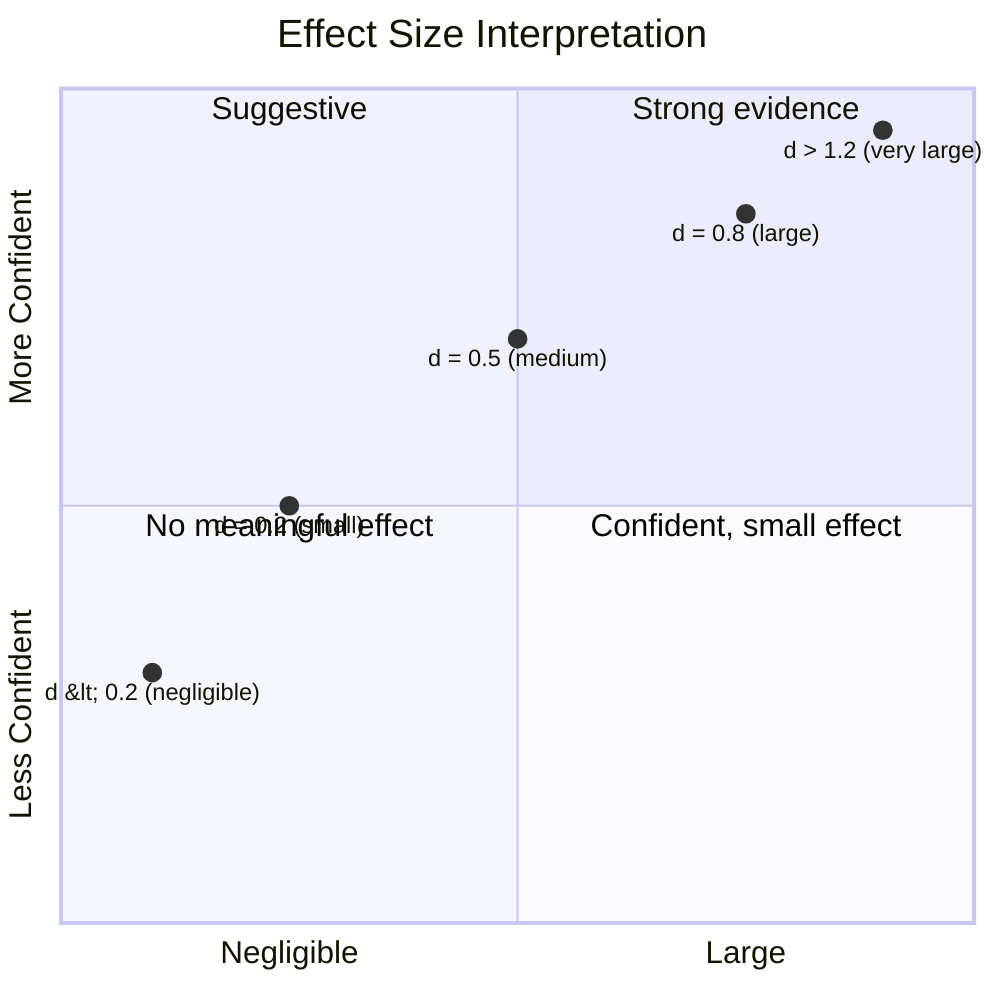

# Interpreting Results

This page teaches you to read eval reports as evidence for or against the ghx hypothesis. Understanding these statistical methods is essential for drawing valid conclusions from evaluation runs.

## Descriptive Statistics

Every metric in an eval report includes descriptive statistics computed across repetitions:

| Statistic | What It Tells You |
|-----------|------------------|
| Mean | Average value -- sensitive to outliers |
| Median | Middle value -- robust to outliers |
| Stddev | Spread of values -- higher means more variability |
| CV (Coefficient of Variation) | Relative variability (stddev/mean) -- useful for comparing metrics with different scales |
| IQR (Interquartile Range) | Spread of the middle 50% -- robust measure of dispersion |
| p90, p95 | 90th/95th percentile -- worst-case behavior ("90% of runs completed in under X") |

**When to use which:**

- Use **median** over mean when outliers are present. A single run that times out or triggers an unusual error path can skew the mean significantly. The median is unaffected.
- Use **CV** to compare variability across metrics with different units and scales. A CV of 0.1 on tool call count and 0.4 on latency tells you latency is far more variable, even though the raw stddev numbers are not directly comparable.
- Use **p90/p95** to understand worst-case performance. "90% of runs completed in under 45 seconds" is more actionable than "average latency was 30 seconds" because it captures tail behavior.
- Use **IQR** when you want a dispersion measure that ignores extreme values entirely.

## Bootstrap Confidence Intervals

Confidence intervals answer: "given the data we collected, where does the true metric value likely lie?"

**How they work:**

1. Take the N repetition measurements (e.g., 5 tool call counts: [2, 3, 2, 4, 2])
2. Resample with replacement many times (e.g., 10,000 bootstrap samples)
3. Compute the statistic (e.g., mean) for each resample
4. Take the middle 95% of resampled statistics as the confidence interval

**How to read them:** "[4.2, 6.8] tool calls at 95% CI" means we are 95% confident the true average tool call count lies between 4.2 and 6.8. The interval accounts for sampling variability -- with only 5 repetitions, any single mean estimate is imprecise.

**Key insight: when confidence intervals for two modes do not overlap, that is strong evidence of a real difference.** For example, if ghx shows [1.8, 2.4] tool calls and baseline shows [5.1, 7.3], the intervals are far apart -- ghx genuinely uses fewer tool calls. Overlapping intervals do not necessarily mean "no difference" (that is a common misconception), but non-overlapping intervals are a strong signal.

Bootstrap CIs are particularly valuable with small sample sizes (5--10 repetitions) where parametric methods (e.g., t-tests assuming normality) may not be valid.

## Cohen's d Effect Size

Cohen's d is a standardized measure of the difference between two groups. It answers: "how big is the difference, in standard deviation units?"

Magnitude classification:

| |d| Range | Classification | Interpretation |
|-----------|----------------|----------------|
| < 0.2 | Negligible | No practical difference |
| 0.2 -- 0.5 | Small | Detectable but modest |
| 0.5 -- 0.8 | Medium | Meaningful difference |
| > 0.8 | Large | Substantial difference |

For eval: a Cohen's d of 0.8+ on tool call count between ghx and baseline means ghx produces a large, meaningful reduction in tool calls. This is the threshold for a strong claim.

Why effect size matters more than raw numbers: "ghx uses 2 fewer tool calls" is ambiguous -- is that a lot? If baseline averages 3 calls, removing 2 is a 67% reduction (large effect). If baseline averages 20 calls, removing 2 is a 10% reduction (small effect). Cohen's d normalizes by standard deviation, making comparisons meaningful regardless of scale.

## Permutation Tests

Permutation tests answer: "could the observed difference between modes have arisen by chance?"

**How they work:**

1. Combine all measurements from both modes into a single pool
2. Randomly shuffle the mode labels across the combined pool
3. Compute the test statistic (e.g., difference in means) for the shuffled data
4. Repeat many times (e.g., 10,000 permutations)
5. Count how often the shuffled statistic is as extreme as the real one

**How to interpret:** p < 0.05 means the observed difference is unlikely due to chance alone -- less than 5% probability of seeing this difference if the modes were truly identical. Lower p-values indicate stronger evidence.

**Caveat: statistical significance does not imply practical significance.** A p < 0.01 difference of 0.3 tool calls is statistically significant but practically meaningless -- no one cares about a third of a tool call. Always pair p-values with effect sizes. A result is compelling only when it is both statistically significant (low p-value) and practically meaningful (large Cohen's d).

## Reading a Report End-to-End

An eval report contains several sections. Here is how to read each one as evidence:

### 1. Summary

Overall checkpoint pass rates per mode. **Look for:** ghx pass rate >= baseline pass rate. If ghx correctness drops, efficiency gains are not worth the trade-off. This is the first section to check -- if correctness is worse, the rest of the report is secondary.

### 2. Metrics Comparison

Means, confidence intervals, and effect sizes for each metric across modes. **Look for:** non-overlapping CIs on tool call count and token usage. Large Cohen's d values (> 0.8) on key metrics. This is the quantitative core of the report.

### 3. Tool Call Classification

The headline comparison. Shows how many calls of each category (ghx, mcp, gh_cli, bash, file_ops, other) each mode used. **Look for:** ghx mode using fewer total calls, with calls concentrated in the "ghx" category rather than spread across bash and gh_cli. Baseline mode should show higher gh_cli and bash counts.

### 4. Per-Scenario Breakdown

Where ghx helps most and least. **Look for:** consistent effects across scenarios (strengthens the claim) or specific scenarios where ghx shows no benefit (identifies capability gaps). Some scenarios may show larger effects than others -- complex multi-step tasks should show the largest ghx advantage.

### 5. Analysis Findings

Behavioral observations from the profiler's analyzers. **Look for:** differences in strategy patterns (e.g., baseline agents retrying more), error recovery frequency, and reasoning efficiency. These provide qualitative context for the quantitative metrics.

## What a "Win" Looks Like

- ghx shows statistically significant reduction in tool calls (large Cohen's d, non-overlapping CIs, p < 0.05)
- ghx shows lower token usage and cost
- ghx maintains equal or better checkpoint pass rate
- Effect is consistent across scenarios and models

## What an Inconclusive Result Looks Like

- Overlapping confidence intervals between modes
- Small effect sizes (d < 0.2)
- High CV (coefficient of variation > 0.5) -- too much run-to-run variance to draw conclusions
- Mixed results across scenarios (ghx helps on some, hurts on others)

When results are inconclusive, consider: increasing repetition count to narrow CIs, adding more scenarios for broader coverage, or investigating whether the scenarios test operations where ghx provides meaningful abstraction over raw CLI.

## What a "Loss" Looks Like

- ghx shows worse metrics on some dimension (higher tool calls, lower pass rate)
- Investigate why: is the scenario too simple for ghx to add value? Is the ghx capability not well-suited to this task? Is the agent not using ghx effectively (e.g., falling back to bash despite having ghx tools)?

Losses are valuable data. They identify where ghx needs improvement -- missing capabilities, poor error messages, or overly complex input schemas that confuse the agent.

## Related Documentation

- [Metrics](./metrics.md) -- detailed description of every metric
- [Evaluation Design](./evaluation-design.md) -- why the evaluation is structured this way
- [Reports Guide](../guides/reports.md) -- how to generate and customize reports
- [Statistics Engine (profiler)](../../../agent-profiler/docs/architecture/statistics.md) -- implementation details of bootstrap CI, Cohen's d, and permutation tests
