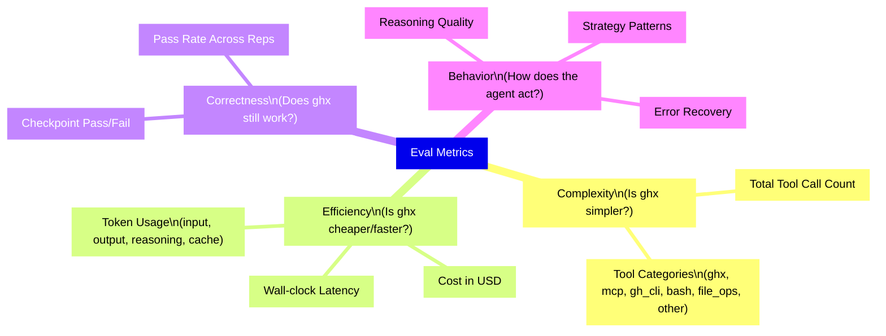
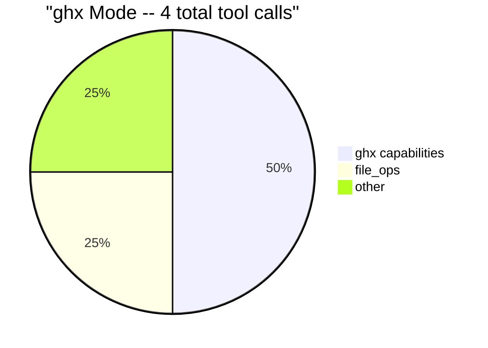
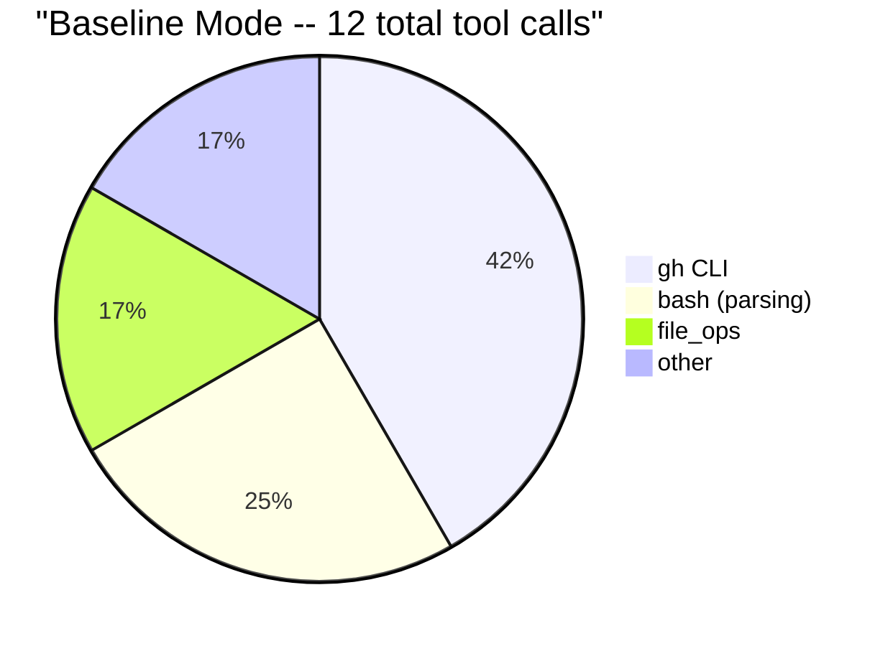

# Metrics Reference

Every metric collected by eval exists to answer a specific question about the ghx hypothesis. This page catalogs all metrics, explains what they measure, and describes why they matter.

## Complexity Metrics

### Tool Call Classification

This is the primary metric. `GhxCollector` classifies every tool call in a session trace into six categories based on the tool name and input content:

| Category | Pattern | Example |
|----------|---------|---------|
| ghx | `ghx.*` prefix (legacy traces may include `ghx_*`) | `ghx run pr.reviews.list` |
| mcp | `github_*` or `mcp*` prefix | `github_create_review` |
| gh_cli | bash tool containing `gh` command | `gh pr view 42 --json reviews` |
| bash | bash/shell/terminal (non-gh) | `ls`, `cat`, `jq` |
| file_ops | read/write/edit file tools | `read_file`, `write_file` |
| other | uncategorized | anything else |

The classifier inspects both the tool name and, for bash tools, the command string inside the input payload. A bash tool call containing `gh pr view ...` is classified as `gh_cli`, not `bash`. This distinction is important: it separates GitHub-specific CLI usage from general shell operations.

**What it shows:** if ghx mode uses 1--2 ghx capability calls while baseline uses 5--8 gh CLI calls plus parsing for the same task, that is a measurable complexity reduction. The tool call classification makes this comparison precise -- you can see exactly where calls are spent.

The following pie charts illustrate a hypothetical comparison. **These are illustrative examples, not real data.** Actual distributions depend on scenario complexity and agent behavior.

The GhxCollector emits one custom metric per category on each `ProfileRow`:

| Metric Name | Category |
|-------------|----------|
| `ghx.capabilities_used` | ghx |
| `ghx.mcp_tools_invoked` | mcp |
| `ghx.gh_cli_commands` | gh_cli |
| `ghx.bash_commands` | bash |
| `ghx.file_ops` | file_ops |
| `ghx.other_tools` | other |

**Source:** `packages/eval/src/collector/ghx-collector.ts`, `packages/eval/src/collector/tool-classifier.ts`

## Efficiency Metrics

### Token Usage

Token counts are broken down by category:

| Token Category | What It Measures |
|----------------|-----------------|
| Input | Context sent to the model (system instructions, conversation history) |
| Output | Response tokens generated by the model |
| Reasoning | Thinking/chain-of-thought tokens (model-dependent) |
| Cache | Tokens served from cache (lower cost) |

Why it matters: ghx's structured responses should require less output (no parsing code generated by the agent) and less input (simpler tool descriptions, fewer multi-turn conversations). Fewer tokens means lower cost and faster response times.

Token usage also reveals *where* the agent spends its reasoning budget. High output token counts in baseline mode may indicate the agent is generating parsing scripts or retry logic -- plumbing that ghx eliminates.

### Cost

Cost in USD per iteration, derived from token counts and model-specific pricing. Broken down by token category (input, output, reasoning, cache) to show where money is spent.

The cost metric makes the ROI argument concrete: if ghx saves $0.02 per task and an organization runs 10,000 agent tasks per month, that is $200/month in savings. At scale -- hundreds of thousands of tasks per month -- the savings become substantial.

### Latency

Wall-clock time per iteration in milliseconds. Includes agent reasoning time, tool execution time, and network overhead. Fewer tool calls should reduce total latency because each tool call incurs round-trip overhead (agent decides to call, tool executes, agent processes result).

Latency is the noisiest metric due to network variability and model response time fluctuations. Use median and p90 rather than mean for latency comparisons.

## Correctness Metrics

### Checkpoint Pass/Fail

Each scenario defines checkpoints -- verifiable conditions that must hold after the agent completes its task. Checkpoints are verified programmatically via ghx capabilities. For example:

- "PR has at least one review comment" -- verified by running `pr.reviews.list` and checking the result count
- "Fix commit pushed to branch" -- verified by checking the branch HEAD SHA changed
- "Label applied to issue" -- verified by listing issue labels

Each checkpoint produces a binary pass/fail result.

### Pass Rate

The percentage of checkpoints passed across all repetitions for a given mode and scenario. This is the critical constraint for the hypothesis: **ghx must show equal or better pass rate to claim "better."** Efficiency gains are meaningless if correctness drops.

A mode that uses fewer tool calls but fails checkpoints more often has not improved -- it has traded reliability for speed. The pass rate metric prevents this false conclusion.

## Behavioral Metrics

These come from the profiler's five built-in analyzers and provide qualitative insights that supplement the quantitative metrics:

| Analyzer | What It Captures |
|----------|-----------------|
| Reasoning | Quality and depth of the agent's chain-of-thought |
| Strategy | Approach patterns (trial-and-error vs. planned execution) |
| Efficiency | Token waste, unnecessary operations, redundant calls |
| Tool Pattern | Tool call sequences, repeated calls, anti-patterns |
| Error | Error types, recovery patterns, failure modes |

Behavioral metrics add context to the numbers. Two modes might show similar tool call counts but different strategy patterns -- for example, baseline agents may retry failed commands more often, while ghx agents follow a more direct path. These patterns are visible in the strategy and error analyzers even when aggregate counts are close.

## Related Documentation

- [Thesis](./thesis.md) -- the claim these metrics are designed to test
- [Interpreting Results](./interpreting-results.md) -- how to read these metrics in eval reports
- [Custom Collectors Guide](../guides/custom-collectors.md) -- how to add new metrics
- [Built-in Analyzers (profiler)](../../../agent-profiler/docs/architecture/built-in-analyzers.md) -- detailed documentation for each analyzer
