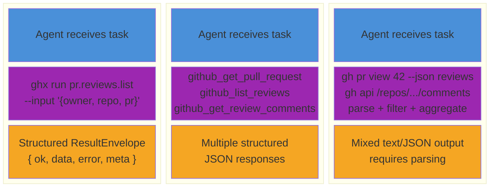

# The ghx Hypothesis

AI agents interacting with GitHub face a discovery and plumbing problem. To complete even a simple task -- listing review comments on a pull request -- an agent must figure out which CLI commands or API endpoints to call, chain multiple calls together, parse unstructured or semi-structured output, handle errors, and retry on failure. Every step in that chain costs tokens (reasoning about what to do next), adds latency (waiting for tool execution), and introduces failure opportunities (wrong flags, malformed JSON, unexpected output shape).

The result: agents spend more time on plumbing than on the actual task.

## The Hypothesis

A structured capability router (ghx) that wraps GitHub operations into single, typed capability calls will:

- **Reduce tool call count** -- fewer calls to accomplish the same task
- **Lower token usage** -- less parsing logic, less retry reasoning, less prompt engineering spent on plumbing
- **Reduce cost** -- fewer tokens consumed per task means lower API cost
- **Maintain or improve task success rate** -- structured input/output means fewer errors and less ambiguity

## How Eval Tests This

Eval runs identical GitHub tasks with the same AI agent using three different toolsets, then compares results with statistical rigor. The three modes represent three levels of abstraction available to agents today:

- **ghx mode**: the agent has access to `ghx run <capability>` with structured input schemas and `ResultEnvelope` output. One call per operation.
- **mcp mode**: the agent uses GitHub MCP server tools (`github_create_review`, `github_get_pr`, etc.). Structured but often requires multiple calls for composite operations.
- **baseline mode**: the agent uses raw `gh` CLI commands via bash. Maximum flexibility, but the agent must discover commands, construct flags, and parse output.

## What "Better" Means Concretely

Each metric maps to a concrete benefit:

- **Fewer tool calls** -- a simpler execution path with less chance of error mid-chain. An agent that completes a task in 2 calls instead of 8 has 4x fewer points of failure.
- **Lower token usage** -- less reasoning spent on plumbing (figuring out which flags to pass, parsing JSON output, retrying after errors) means more of the model's capacity is spent on the actual task.
- **Lower cost** -- practical savings at scale. An organization running thousands of agent tasks per day accumulates meaningful cost differences even from modest per-task savings.
- **Higher checkpoint pass rate** -- same or better correctness despite fewer calls. Structured output eliminates an entire class of parsing errors.
- **Fewer error recoveries** -- more reliable, predictable execution. When the agent does not need to retry failed commands or re-parse malformed output, the overall workflow is more deterministic.

## The Controlled Variable

The evaluation isolates the toolset as the single independent variable:

- **Same agent** -- identical agent framework and configuration across all modes
- **Same model** -- identical LLM (e.g., the same Claude or GPT model) for each comparison
- **Same task prompt** -- identical natural-language instructions describing the task
- **Same starting GitHub state** -- fixture reset before each iteration ensures the repository, branches, PRs, and comments are in a known state

Only the system instructions and available tools change between modes. This design ensures that measured differences in tool calls, tokens, cost, and correctness are attributable to the toolset -- not to prompt variation, model differences, or environmental drift.

## Related Documentation

- [Evaluation Design](./evaluation-design.md) -- why three modes, why repetitions, and what makes a fair comparison
- [Metrics](./metrics.md) -- every metric collected, what it measures, and why it matters
- [Core Concepts](../getting-started/concepts.md) -- foundational terminology and architecture overview
