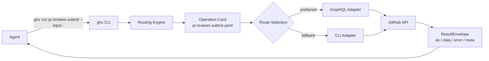
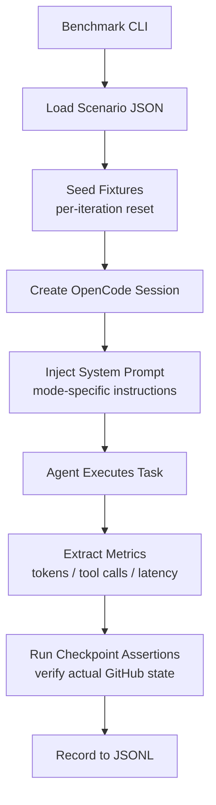
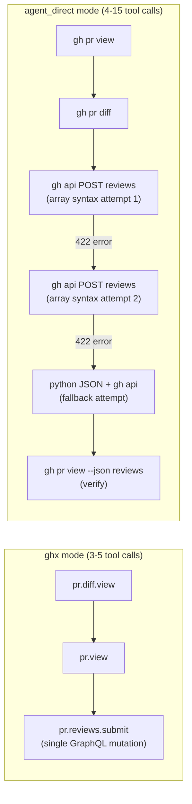
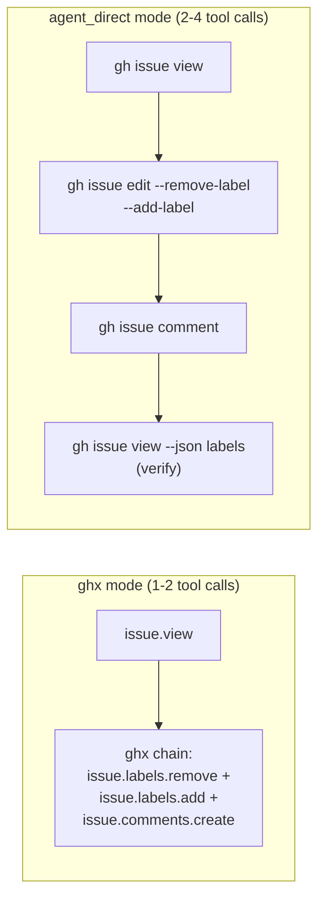
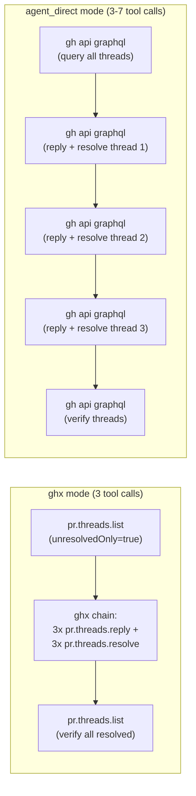

# Codex 5.3 Benchmark: agent_direct vs ghx

| Field | Value |
|-------|-------|
| Model | `gpt-5.3-codex` (OpenAI) |
| Date | 2026-02-25 |
| Scenarios | 4 workflow scenarios |
| Iterations | 5 per scenario per mode |
| Total runs | 40 |
| Modes compared | `agent_direct` (raw `gh` CLI) vs `ghx` (routed capabilities) |
| Success rate | 100% both modes |

---

## Background: Key Concepts

### What is an AI agent?

An AI agent is a large language model (LLM) running inside a coding assistant like OpenCode. The agent receives a task prompt describing what needs to be done, then autonomously decides what shell commands to run, reads the output, reasons about the results, and repeats until the task is complete.

The agent has no pre-programmed steps. It figures out the path on its own -- which commands to run, in what order, and how to handle errors. This flexibility is powerful but also means the agent can take wildly different paths to the same goal depending on how it's prompted.

### What are tool calls?

Each bash command the agent executes counts as one **tool call**. A tool call is the fundamental unit of agent work: the agent sends a command to the shell, waits for output, then reasons about what to do next.

Fewer tool calls mean the agent found a more direct path. More tool calls often indicate the agent is struggling -- retrying failed commands, trying different API syntaxes, or needing extra verification steps. Each tool call adds latency (network round-trip + API processing + reasoning time for the next step).

### What are tokens?

Tokens are the unit of text processing for LLMs -- roughly 0.75 words per token. Every message the agent sends and receives is measured in tokens, and tokens are the primary driver of both cost and latency.

There are two important token categories:

- **Active tokens** -- newly generated or newly read text that the model must process from scratch. These are expensive.
- **Cached tokens** -- text the model has seen before (like the system prompt) that can be served from a prefix cache. These are cheap or free.

Total tokens can be misleading because a larger system prompt (more cached tokens) inflates the total without adding real cost. Active tokens are the metric that matters for efficiency.

### How ghx routing works

ghx is a GitHub execution router with 70+ **operation cards** defined in YAML. Each card declares the input schema, output schema, preferred execution route (GraphQL or CLI), and fallback routes.

When the agent calls `ghx run pr.reviews.submit`, the routing engine loads the card, validates input against a JSON schema (catching errors before they hit GitHub), selects the optimal adapter (usually GraphQL for mutations), executes the operation, and returns a normalized `ResultEnvelope` with a consistent `{ ok, data, error, meta }` shape.

The agent never needs to figure out GraphQL syntax, worry about array parameter formatting, or handle GitHub API error shapes. It just passes structured JSON and gets structured JSON back.

---

## Executive Summary

| Scenario | ghx TC | ad TC | TC delta | ghx tokens | ad tokens | Token delta | Latency delta |
|----------|--------|-------|----------|------------|-----------|-------------|---------------|
| pr-review-comment | 4.2 | 9.4 | **-55%** | 58,355 | 122,155 | **-52%** | **-57%** |
| issue-triage-comment | 1.6 | 3.0 | **-47%** | 30,251 | 37,876 | **-20%** | **-1%** |
| pr-fix-mixed-threads | 3.0 | 4.2 | **-29%** | 59,795 | 55,233 | +8% | **-26%** |
| ci-diagnose-run | 3.6 | 4.6 | **-22%** | 55,035 | 62,151 | **-11%** | **-20%** |

Both modes achieved 100% success and 100% output validity across all 40 runs. ghx reduced tool calls in every scenario, with the largest gains on complex multi-step operations like PR review submission (-55%) and issue triage (-47%). Latency improved by up to 57% on the PR review scenario where agent_direct agents struggled with array parameter syntax.

---

## How ghx Works



### Walkthrough: `pr.reviews.submit`

When the agent needs to submit a PR review with inline comments, the two modes take very different paths.

**With ghx**, the agent runs a single command:

```bash
ghx run pr.reviews.submit --input - <<'EOF'
{
  "owner": "acme", "name": "repo", "prNumber": 42,
  "event": "REQUEST_CHANGES",
  "body": "Found blocking issues.",
  "comments": [
    {"path": "src/stats.ts", "line": 4, "body": "Empty array guard missing."},
    {"path": "src/stats.ts", "line": 8, "body": "Missing await on fetch."},
    {"path": "src/stats.ts", "line": 12, "body": "Hardcoded credential."}
  ]
}
EOF
```

The GraphQL adapter looks up the PR's node ID, then executes a single `addPullRequestReview` mutation that includes the review event, body, and all inline comments in one API call. The agent gets back a normalized envelope and is done.

**Without ghx**, the agent must figure out how to pass an array of comment objects to the GitHub REST API. The `gh api` CLI's array parameter syntax (`comments[][path]`, `comments[0][path]`) is notoriously fragile, and the agent typically tries 3-15 different syntaxes before finding one that works -- or falls back to writing a Python script to construct the JSON payload. In the worst case observed (iteration 5), the agent made 15 tool calls and spent over 2 minutes trying different approaches before succeeding.

---

## How the Benchmark Works



Each scenario is a JSON definition specifying a task prompt, expected capabilities, fixture requirements, and assertions. Before every iteration, fixtures are reseeded to a known state (fresh issues, PRs, workflow runs) so each run starts from identical conditions.

The only difference between `agent_direct` and `ghx` modes is the system prompt: `agent_direct` gets "Use GitHub CLI (`gh`) commands directly to complete the task," while `ghx` gets the full SKILL.md with 70+ capability definitions and the `ghx run` / `ghx chain` interface.

Assertions verify actual GitHub state after execution -- not just that the agent reported success, but that reviews were actually submitted, labels were actually changed, and threads were actually resolved.

---

## Per-Scenario Deep Dives

### 6.1 PR Review with Inline Comments (`pr-review-comment-wf-001`)

**Task:** Review a PR containing 3 intentional bugs. View the diff, then submit a `REQUEST_CHANGES` review with separate inline comments on each buggy line.



**Representative commands from iteration 5 (worst case for agent_direct):**

The ghx agent completed the task in 3 tool calls:
1. `ghx run pr.diff.view` -- read the diff
2. `ghx run pr.view` -- get PR metadata
3. `ghx run pr.reviews.submit` -- submit review with 3 inline comments

The agent_direct agent made 15 tool calls, trying:
1. `gh pr view` + `gh pr diff` (read phase -- same as ghx)
2. `gh api POST` with `comments[0][path]` syntax -- failed
3. `noglob gh api POST` with same syntax -- failed
4. `noglob gh api POST` without backticks -- failed
5. Python pipe to `gh api --input -` -- failed (python not found)
6. `python3` version check, then retry -- succeeded for review but no inline comments
7. `gh api` individual review comments (3 calls) + submit event -- succeeded
8. Cleanup: delete stale review, retry with GraphQL mutation
9. Final verification

**Per-iteration results:**

| Iter | ghx TC | ad TC | ghx tokens | ad tokens | ghx latency | ad latency |
|------|--------|-------|------------|-----------|-------------|------------|
| 1 | 5 | 10 | 12,919 | 24,680 | 34.5s | 88.8s |
| 2 | 4 | 9 | 12,894 | 15,671 | 32.9s | 57.6s |
| 3 | 5 | 4 | 13,229 | 11,770 | 36.1s | 38.8s |
| 4 | 4 | 9 | 12,998 | 25,090 | 30.6s | 64.4s |
| 5 | 3 | 15 | 12,683 | 19,362 | 25.7s | 126.3s |
| **Avg** | **4.2** | **9.4** | **12,945** | **19,315** | **31.97s** | **75.2s** |

**Analysis:** This scenario produces the largest ghx advantage. The core issue is that `gh api`'s array parameter syntax is fragile and underdocumented. The agent frequently tries 3-8 different quoting/escaping strategies before the review submission succeeds. ghx bypasses this entirely: the agent passes a JSON object with a `comments` array, and the GraphQL adapter handles the rest. Note that iteration 3 is an outlier where agent_direct happened to guess the right `--input` heredoc syntax on its first REST API attempt.

**Active token comparison:**

| Iter | ghx active | ad active |
|------|-----------|----------|
| 1 | 1,143 | 24,680 |
| 2 | 1,118 | 2,615 |
| 3 | 1,453 | 890 |
| 4 | 454 | 10,114 |
| 5 | 907 | 2,594 |
| **Avg** | **1,015** | **8,179** |

Active tokens (the real cost driver) show an **87.6% reduction** with ghx. The total token numbers from the summary table include cached tokens, which are inflated for ghx because SKILL.md adds ~2,000 tokens to the system prompt. But those cached tokens are essentially free.

---

### 6.2 Issue Triage (`issue-triage-comment-wf-001`)

**Task:** Read an issue, remove labels `triage` and `feature-request`, add label `enhancement`, and leave a comment "Triaged -- tracking as enhancement."



**Representative commands from iteration 2 (best case for ghx):**

The ghx agent completed everything in a single tool call using `ghx chain` to batch the view, label changes, and comment into one GraphQL round-trip:

```bash
ghx chain --steps - <<'EOF'
[
  {"task":"issue.labels.remove","input":{"owner":"aryeko","name":"ghx-bench-fixtures","issueNumber":369,"labels":["triage","feature-request"]}},
  {"task":"issue.labels.add","input":{"owner":"aryeko","name":"ghx-bench-fixtures","issueNumber":369,"labels":["enhancement"]}},
  {"task":"issue.comments.create","input":{"owner":"aryeko","name":"ghx-bench-fixtures","issueNumber":369,"body":"Triaged — tracking as enhancement."}}
]
EOF
```

The agent_direct agent needed 3 separate calls:
1. `gh issue view 369 --repo aryeko/ghx-bench-fixtures --json number,title,state,author,labels,body`
2. `gh issue edit 369 --remove-label triage --remove-label feature-request --add-label enhancement && gh issue comment 369 --body "Triaged — tracking as enhancement."`
3. `gh issue view 369 --json labels` (verification)

**Per-iteration results:**

| Iter | ghx TC | ad TC | ghx tokens | ad tokens | ghx latency | ad latency |
|------|--------|-------|------------|-----------|-------------|------------|
| 1 | 2 | 2 | 11,895 | 9,536 | 22.3s | 16.6s |
| 2 | 1 | 3 | 11,802 | 9,898 | 16.5s | 18.1s |
| 3 | 1 | 3 | 11,759 | 9,778 | 14.8s | 14.7s |
| 4 | 2 | 4 | 11,767 | 9,686 | 15.4s | 21.9s |
| 5 | 2 | 3 | 11,853 | 9,602 | 16.6s | 15.4s |
| **Avg** | **1.6** | **3.0** | **11,815** | **9,700** | **17.1s** | **17.3s** |

**Analysis:** ghx achieves a clean 47% reduction in tool calls. The `ghx chain` command is the key -- it batches label removal, label addition, and comment creation into a single tool call, while agent_direct needs at least 2 separate commands (edit + comment) and often adds a verification step.

Total tokens are actually higher for ghx here because of the larger system prompt cached overhead. But latency is roughly equivalent because ghx's single-call execution offsets the larger prompt size.

---

### 6.3 PR Thread Resolution (`pr-fix-mixed-threads-wf-001`)

**Task:** A PR has 7 review threads (4 resolved, 3 unresolved). List only unresolved threads, reply to each with "Acknowledged, will address.", then resolve each one.



**Representative commands from iteration 1:**

The ghx agent used `pr.threads.list` with `unresolvedOnly: true` to get just the 3 unresolved threads, then used `ghx chain` to batch all 6 mutations (3 replies + 3 resolves) into a single tool call, then verified.

The agent_direct agent queried all 100 threads via raw GraphQL, manually filtered to unresolved, then issued separate GraphQL mutations for each thread -- sometimes chaining reply+resolve per thread with `&&`, sometimes issuing them individually.

**Per-iteration results:**

| Iter | ghx TC | ad TC | ghx tokens | ad tokens | ghx latency | ad latency |
|------|--------|-------|------------|-----------|-------------|------------|
| 1 | 3 | 7 | 16,046 | 15,104 | 28.9s | 40.0s |
| 2 | 3 | 3 | 16,088 | 14,753 | 22.8s | 38.5s |
| 3 | 3 | 3 | 16,356 | 14,302 | 25.1s | 28.1s |
| 4 | 3 | 5 | 16,593 | 11,696 | 25.0s | 35.4s |
| 5 | 3 | 3 | 16,800 | 11,635 | 26.9s | 31.5s |
| **Avg** | **3.0** | **4.2** | **16,377** | **13,498** | **25.7s** | **34.7s** |

**Analysis:** ghx shows a consistent 3 tool calls across all iterations while agent_direct varies from 3 to 7. The latency advantage (-26%) is significant even when tool call counts are similar, because ghx's `chain` batches multiple GraphQL mutations into fewer API round-trips.

**The token cache artifact:** ghx shows +8% total tokens in the summary table. This is because ghx's system prompt (SKILL.md) adds ~2,000 cached tokens to every iteration. Since this scenario's active work is relatively small, the cached overhead is proportionally large. However, active tokens tell the real story:

| Iter | ghx active | ad active |
|------|-----------|----------|
| 1 | 1,198 | 1,152 |
| 2 | 472 | 929 |
| 3 | 484 | 1,246 |
| 4 | 465 | 944 |
| 5 | 416 | 883 |
| **Avg** | **607** | **1,031** |

Active tokens show a **41% reduction** with ghx. The total token metric is misleading here -- cached tokens are free/cheap, and ghx's larger cache is actually a feature (the model can reuse SKILL.md context without reprocessing it).

---

### 6.4 CI Diagnosis and Rerun (`ci-diagnose-run-wf-001`)

**Task:** A workflow run has failed. Get run details, identify the failed job, fetch its logs to find error lines, then rerun the failed jobs.

**Representative commands from iteration 4:**

The ghx agent:
1. `ghx run workflow.run.view` -- get run details and identify failed job
2. `ghx run workflow.job.logs.view` -- fetch and analyze job logs
3. `ghx run workflow.run.rerun.failed` -- rerun failed jobs

The agent_direct agent:
1. `gh run view <id> --json databaseId,status,conclusion,name,...` -- get run details
2. `gh run view <id> --job <jobId> --log` -- fetch raw job logs
3. `gh run rerun <id> --failed` -- rerun failed jobs
4. `gh run view <id> --json attempt,status,conclusion,...` -- verify rerun

**Per-iteration results:**

| Iter | ghx TC | ad TC | ghx tokens | ad tokens | ghx latency | ad latency |
|------|--------|-------|------------|-----------|-------------|------------|
| 1 | 3 | 7 | 12,290 | 13,462 | 31.7s | 42.9s |
| 2 | 4 | 4 | 12,746 | 11,112 | 27.6s | 35.4s |
| 3 | 4 | 4 | 12,703 | 12,517 | 32.1s | 32.8s |
| 4 | 3 | 4 | 12,216 | 12,209 | 22.8s | 30.5s |
| 5 | 4 | 4 | 12,645 | 12,355 | 24.1s | 30.6s |
| **Avg** | **3.6** | **4.6** | **12,520** | **12,331** | **27.7s** | **34.4s** |

**Analysis:** This scenario has the smallest delta between modes because `gh run view/rerun` commands are straightforward and well-documented. Both agents follow a similar 3-4 step pattern (view run, read logs, rerun). ghx saves about 1 tool call on average, primarily because:

1. `workflow.job.logs.view` returns pre-analyzed logs (error lines highlighted) vs. raw log output that the agent must parse
2. `workflow.run.view` returns structured job data, eliminating the need for the agent to construct `--json` field lists
3. agent_direct sometimes adds a verification step after rerun that ghx skips (the ResultEnvelope confirms success)

---

## Understanding Token Metrics: Active vs Cached

### How prefix caching works

OpenAI's gpt-5.3-codex uses automatic prefix caching. When the same token sequence appears at the start of multiple requests (like the system prompt), subsequent requests serve those tokens from cache. Cached tokens are free in the research preview and significantly cheaper in production.

### Why ghx has a larger system prompt

The ghx system prompt includes `SKILL.md` -- a ~600-token document listing all 70+ capabilities, the `ghx run` syntax, the `ghx chain` syntax, and usage examples. The agent_direct system prompt is a single sentence: "Use GitHub CLI (`gh`) commands directly to complete the task."

This means ghx adds ~2,000 tokens (SKILL.md + formatting overhead) to the cached prefix of every request. In total token counts, this makes ghx look less efficient -- but these tokens are served from cache and cost essentially nothing.

### Why total tokens mislead

Consider the `pr-fix-mixed-threads-wf-001` scenario where ghx shows +8% total tokens:

| Metric | ghx | agent_direct | Delta |
|--------|-----|-------------|-------|
| Total tokens (avg) | 16,377 | 13,498 | +21% |
| Active tokens (avg) | 607 | 1,031 | **-41%** |
| Cache read (avg) | 15,770 | 12,467 | +26% |

ghx uses 41% fewer active tokens (the tokens the model actually processes from scratch) while having 26% more cached tokens (essentially free). The total token metric is dominated by cache, which obscures the real efficiency gain.

### Per-scenario active token comparison

| Scenario | ghx active | ad active | Reduction |
|----------|-----------|----------|-----------|
| pr-review-comment | 1,015 | 8,179 | **-87.6%** |
| issue-triage-comment | 705 | 663 | +6.3% |
| pr-fix-mixed-threads | 607 | 1,031 | **-41.1%** |
| ci-diagnose-run | 667 | 3,064 | **-78.2%** |

The median active-token reduction across scenarios is **27.55%** (from the benchmark summary), with individual scenarios ranging from roughly neutral (issue-triage, where the task is simple enough that both modes are efficient) to 87.6% (PR review, where agent_direct wastes enormous active tokens on retry loops).

---

## Profiling Breakdown

The benchmark harness profiles each run's time allocation, breaking down the total wall time into phases:

| Phase | agent_direct (median ms) | ghx (median ms) | Delta |
|-------|-------------------------|-----------------|-------|
| **Reasoning** | 13,252 | 8,731 | **-34%** |
| **Between reasoning and tool** | 2,871 | 2,986 | +4% |
| **Tool execution (bash)** | 5,388 | 3,653 | **-32%** |
| **Post-tool processing** | 292 | 129 | **-56%** |
| **Assistant total** | 31,869 | 24,244 | **-24%** |

Key takeaways:

- **Reasoning time** is 34% lower with ghx. The agent spends less time figuring out what to do because the SKILL.md provides a clear menu of capabilities and their exact input schemas.
- **Tool execution** is 32% lower. Fewer tool calls + more efficient operations (batched GraphQL vs. sequential CLI calls) means less time waiting for bash to complete.
- **Post-tool processing** is 56% lower. Normalized ResultEnvelope output is easier for the model to parse than raw CLI output or GraphQL JSON responses.
- **Between reasoning and tool** is roughly equal -- this is API latency between the model finishing its reasoning and the tool call executing, which is independent of the mode.

---

## How to Reproduce

### Prerequisites

- Node.js >= 22
- `pnpm` package manager
- `gh` CLI authenticated with a GitHub token that has repo access
- OpenAI API key (set `OPENAI_API_KEY`)

### Setup

```bash
git clone https://github.com/aryeko/ghx.git
cd ghx
pnpm install
pnpm run build
```

### Seed fixtures

```bash
pnpm --filter @ghx-dev/benchmark run bench:fixture -- seed \
  --repo aryeko/ghx-bench-fixtures \
  --out fixtures/latest.json
```

### Run agent_direct mode

```bash
pnpm run benchmark -- agent_direct 5 \
  --scenario-set all \
  --fixture-manifest fixtures/latest.json \
  --skip-warmup \
  --output-jsonl "$(pwd)/reports/codex-5.3-benchmark/raw-data/2026-02-25-agent_direct-suite.jsonl"
```

### Run ghx mode

```bash
pnpm run benchmark -- ghx 5 \
  --scenario-set all \
  --fixture-manifest fixtures/latest.json \
  --skip-warmup \
  --output-jsonl "$(pwd)/reports/codex-5.3-benchmark/raw-data/2026-02-25-ghx-suite.jsonl"
```

**Note:** The `--output-jsonl` path must be absolute. pnpm shifts the working directory, so relative paths cause ENOENT errors.

### Generate comparison report

```bash
pnpm --filter @ghx-dev/benchmark run report
```

### Override model/provider

```bash
pnpm run benchmark -- ghx 5 \
  --scenario-set all \
  --provider openai \
  --model gpt-5.3-codex \
  --fixture-manifest fixtures/latest.json \
  --skip-warmup \
  --output-jsonl "$(pwd)/results.jsonl"
```

---

## Raw Data Reference

All raw data lives in `raw-data/`:

| File | Description |
|------|-------------|
| `2026-02-25-agent_direct-suite.jsonl` | 20 rows (4 scenarios x 5 iterations). One JSON object per line with: timestamp, mode, scenario_id, iteration, success, tokens breakdown (input/output/reasoning/cache_read), tool_calls, latency, timing_breakdown. |
| `2026-02-25-ghx-suite.jsonl` | Same structure as above, 20 rows for ghx mode. |
| `comparison.md` | Pre-computed iteration-by-iteration comparison with per-iteration metrics tables, exact bash commands used by agent_direct, and exact ghx capabilities invoked. |
| `profiling-snapshot.md` | Time-allocation breakdown by phase (reasoning, tool execution, post-tool). Extracted from the benchmark summary report with gate/threshold data removed (see note inside the file for why). |

**Reading JSONL:** Each line is a self-contained JSON object. Parse with `jq`:

```bash
# All PR review iterations for ghx
cat raw-data/2026-02-25-ghx-suite.jsonl | jq 'select(.scenario_id == "pr-review-comment-wf-001")'

# Average tool calls per mode
cat raw-data/*.jsonl | jq -s 'group_by(.mode) | map({mode: .[0].mode, avg_tc: (map(.tool_calls) | add / length)})'
```

---

## Methodology Notes

- **Fixture reseeding:** Every iteration starts from a freshly seeded fixture state. Issues get their original labels restored, PR review threads are reset, workflow runs are re-triggered. This eliminates state pollution between iterations.
- **Same model and provider:** Both modes use `gpt-5.3-codex` from OpenAI with identical temperature and configuration.
- **Warm-up excluded:** The `--skip-warmup` flag was used (canary run disabled). Since 5 iterations per scenario provide sufficient data, warm-up was unnecessary.
- **Assertions verify GitHub state:** Success is not self-reported. After each run, the harness uses ghx capabilities to query actual GitHub state -- checking that reviews exist, labels are correct, threads are resolved, and reruns were triggered.
- **Cost:** $0.00 for all runs. The gpt-5.3-codex research preview does not charge for API usage. In production, active token counts would determine cost.
- **System prompt difference:** The only variable between modes is the system prompt. agent_direct receives a 1-sentence instruction. ghx receives the full SKILL.md (~600 tokens of capability definitions + usage syntax).
